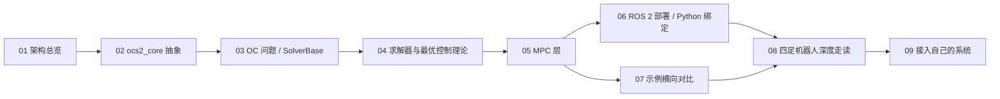

# OCS2 学习指南

本指南是一套面向 OCS2（`ros2` 分支，ROS 2 Jazzy / colcon / `ament_cmake`，C++17）的中文渐进式课程。OCS2（**O**ptimal **C**ontrol for **S**witched **S**ystems）是一个用于非线性最优控制与实时 MPC 的 C++ 工具箱，强调切换系统与机器人应用。课程主线是：架构总览 → 用示例贯穿"建模 → 求解 → MPC → 部署" → 扩展到自己的系统，并以四足机器人为重点深度走读。

读者画像：你熟悉现代 C++ 与 Eigen（相关内容略讲）；需要展开的是 ROS 2 工程化、最优控制理论、以及 Pinocchio/URDF 建模。本指南与仓库 `ros2` 分支严格对齐——构建用 `colcon`，启动用 `ros2 launch`，依赖通过 `ament_cmake` 组织。

> 分支确认：当前仓库分支为 `ros2`，目标平台 Ubuntu 24.04 + ROS 2 Jazzy。`main` 分支是旧的 ROS 1/catkin 版本，构建/启动指令不同，请勿混用。依据见 [README.md](README.md#L3) 与 [CLAUDE.md](CLAUDE.md#L7)。

## 这套文档怎么读

推荐按 01 → 09 顺序阅读：先建立整体架构认知，再逐层深入 core 抽象、最优控制问题、求解器与理论，然后上升到 MPC 层与 ROS 2 部署，最后通过示例横向对比与四足深度走读，落到"接入自己的系统"。每章独立成篇，但概念前后依赖；跳读时建议至少先读 01（架构总览）与 03（最优控制问题与 `SolverBase`），它们是后续所有章节的公共语言。



按目标跳读：

| 你的目标 | 推荐路径 |
| --- | --- |
| 想最快跑通一个 MPC 示例 | 01 → 06 |
| 想理解求解器原理 | 01 → 02 → 03 → 04 |
| 想做四足机器人 MPC | 01 → 02 → 03 → 08 |
| 想把 OCS2 接到自己的系统 | 01 → 02 → 03 → 09 |

## 前置准备

完整依赖与构建步骤见仓库根的 [installation.md](installation.md#L1)。要点：

- 操作系统与工具链：Ubuntu 24.04 + ROS 2 Jazzy，C++17 编译器，`colcon` 构建工具。
- 每个使用 `ros2` / `colcon` 的 shell 都要先 `source /opt/ros/jazzy/setup.bash`。
- Pinocchio 在 Jazzy 上通过 `rosdep` 会解析到未发布的 `ros-jazzy-pinocchio`，因此从 OpenRobots **robotpkg** 安装，并 `--skip-keys pinocchio` 跑 rosdep，同时导出 `CMAKE_PREFIX_PATH=/opt/openrobots:...`。
- 工作区除本仓库（`ros2` 分支）外，还需要：
  - `ocs2_robotic_assets`（`ros2` 分支）——多个示例/测试引用其资源。
  - `elevation_mapping_cupy` 的 `plane_segmentation`（`ros2` 分支，sparse-checkout 取 `plane_segmentation` 子目录）——感知类示例需要。
- 两个包尚未移植到 Jazzy，已通过 `COLCON_IGNORE` 跳过：`ocs2_mpcnet`、`ocs2_raisim`。`rqt_multiplot` 在 Jazzy 上未发布，多曲线绘图 launch 文件为可选。

典型构建（工作区根目录下，本仓库位于 `src/ocs2`）：

```bash
source /opt/ros/jazzy/setup.bash
colcon build --cmake-args -DCMAKE_BUILD_TYPE=RelWithDebInfo
source install/setup.bash
```

## 与官方文档的差异

官方在线文档托管于 https://leggedrobotics.github.io/ocs2/ ，描述的是 **ROS 1 / catkin** 工作流。本课程基于 `ros2` 分支（Jazzy / colcon / `ament_cmake`）。两者关系：

- **一致的**：求解器概念与 C++ API 基本一致——问题建模（`OptimalControlProblem`）、求解器接口（`SolverBase`）、各类 `*Settings` 配置、cost/constraint/dynamics 抽象在两套工作流中同名同语义。理论部分可直接参照官方文档。
- **不同的**：构建与启动指令。官方文档用 `catkin_make` / `roslaunch` / `.launch`；本课用 `colcon build` / `ros2 launch` / `.launch.py`。包管理从 catkin 换成 `ament_cmake`。
- `blasfeo_catkin` / `hpipm_catkin` 在本分支保留 `_catkin` 名字，但实际是 ROS 2 `ament_cmake` 包。
- `rqt_multiplot` 在 Jazzy 不可用；`ocs2_mpcnet`、`ocs2_raisim` 未移植（见上节）。

因此：遇到官方在线文档的 catkin/roslaunch 指令，请按本课程（及 [installation.md](installation.md#L56)）的 colcon/ros2 等价命令替换；遇到 API 与理论说明，则可放心对照。

## 符号约定

全文代码指针用相对仓库根的路径，链接文字为符号名（主锚），行号放在片段里（行号会漂移，以符号名为准）。所有 C++ 代码位于 [namespace ocs2](ocs2_core/include/ocs2_core/Types.h#L37)（Types.h 顶部声明）。

核心标量/向量/矩阵类型在 [Types.h](ocs2_core/include/ocs2_core/Types.h) 中统一定义一次，全仓库复用：

| 类型 | 定义 |
| --- | --- |
| [scalar_t](ocs2_core/include/ocs2_core/Types.h#L45) | `double` |
| [vector_t](ocs2_core/include/ocs2_core/Types.h#L54) | `Eigen::Matrix<scalar_t, -1, 1>`（列向量） |
| [matrix_t](ocs2_core/include/ocs2_core/Types.h#L66) | `Eigen::Matrix<scalar_t, -1, -1>` |
| [scalar_array_t](ocs2_core/include/ocs2_core/Types.h#L47) / [vector_array_t](ocs2_core/include/ocs2_core/Types.h#L56) / [matrix_array_t](ocs2_core/include/ocs2_core/Types.h#L68) | `std::vector<...>`，轨迹/序列容器 |

问题数学符号约定（贯穿全课程）：

- 状态 `x`，输入 `u`，时间 `t`。
- Taylor 展开/近似结构体同样定义于 [Types.h](ocs2_core/include/ocs2_core/Types.h)：
  - [ScalarFunctionLinearApproximation](ocs2_core/include/ocs2_core/Types.h#L78)：标量函数的一阶展开（`dfdx`、`dfdu` 行向量 + `f`）。
  - [ScalarFunctionQuadraticApproximation](ocs2_core/include/ocs2_core/Types.h#L145)：二阶展开（Hessian `dfdxx`/`dfdux`/`dfduu` + 一阶 `dfdx`/`dfdu` + `f`）。
  - [VectorFunctionLinearApproximation](ocs2_core/include/ocs2_core/Types.h#L234) / [VectorFunctionQuadraticApproximation](ocs2_core/include/ocs2_core/Types.h#L293)：向量函数的对应展开（雅可比/Hessian 形式）。
- 各求解器有自己的配置类 `*Settings`（从 `.info` 配置文件读取），例如 [SqpSettings](ocs2_sqp/ocs2_sqp/include/ocs2_sqp/SqpSettings.h#L40)（`struct Settings`）、[DDP_Settings](ocs2_ddp/include/ocs2_ddp/DDP_Settings.h#L63)（`struct Settings`）。后文统一写作"`*Settings`"。
- 配置文件统一为 Boost property-tree 的 `.info` 文件（如 `config/mpc/task.info`），其中 `ddp` / `slp` / `sqp` / `ipm` 等配置块读入对应 `*Settings`。

## 章节速查表

以下 9 章按推荐顺序排列，文件均位于 `docs/learning/` 下（已全部完成）。

| 文件 | 主题 | 一句话 |
| --- | --- | --- |
| [01-architecture.md](docs/learning/01-architecture.md) | 架构总览 | OCS2 自底向上的分层与各包职责，建立全局地图。 |
| [02-core-abstractions.md](docs/learning/02-core-abstractions.md) | ocs2_core 抽象 | 动力学/代价/约束/积分/自动微分等数学原语与数据模型。 |
| [03-oc-problem.md](docs/learning/03-oc-problem.md) | 最优控制问题与 SolverBase | `OptimalControlProblem` 如何组装问题、`SolverBase` 统一求解器接口。 |
| [04-solvers.md](docs/learning/04-solvers.md) | 求解器与最优控制理论 | SLQ/iLQR/SQP/SLP/IPM 的原理差异与 DDP/SQP 等理论回顾。 |
| [05-mpc.md](docs/learning/05-mpc.md) | MPC 层 | `MPC_BASE`/`MRT_BASE` 如何把求解器包成实时滚动 MPC。 |
| [06-deploy-ros-python.md](docs/learning/06-deploy-ros-python.md) | ROS 2 部署与 Python 绑定 | `ocs2_ros_interfaces` 的节点/话题与 `CREATE_ROBOT_PYTHON_BINDINGS`。 |
| [07-examples-survey.md](docs/learning/07-examples-survey.md) | 各示例横向对比 | ballbot/cartpole/quadrotor/legged 等示例的共性与差异。 |
| [08-quadruped-deep-dive.md](docs/learning/08-quadruped-deep-dive.md) | 四足机器人深度走读 | 质心模型 + 运动学 + 步态约束在四足 MPC 上的完整拼装。 |
| [09-extend-your-own.md](docs/learning/09-extend-your-own.md) | 接入自己的系统 | 从 URDF + `.info` 出发，仿照 `ocs2_<robot>` / `ocs2_<robot>_ros` 模式接入新机器人。 |
