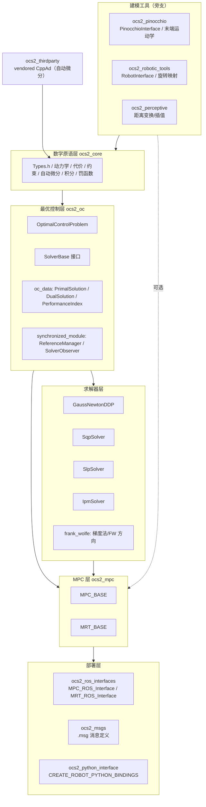
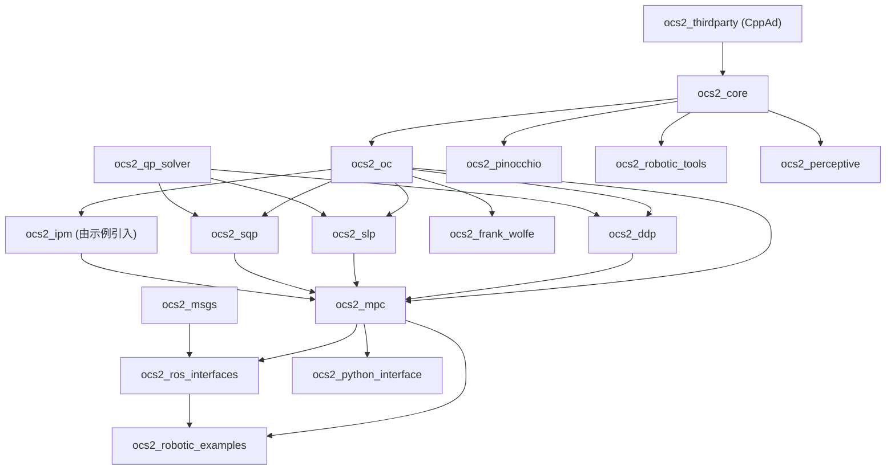

# 第 1 章：架构总览

本章建立 OCS2 的全局地图。读完你应该能在脑中画出"从数学原语到 ROS 2 节点"的分层，并知道每个包大致负责什么——为后续章节（core 抽象、OCP/SolverBase、求解器、MPC、部署）提供坐标系。本章只做宏观俯瞰，子系统的内部细节留给 ch02，求解器算法留给 ch04。

## 学习目标

学完本章，你应该能回答：

1. OCS2 解决哪一类问题？它和"一个通用的非线性优化器"有什么不同？
2. OCS2 自底向上的分层有哪些？每一层（`ocs2_core` / `ocs2_oc` / 求解器 / `ocs2_mpc` / ROS 接口）各承担什么职责？
3. 顶层包 `ocs2` 的 `package.xml` 声明了哪些 `exec_depend`？它们之间的依赖方向是怎样的？
4. `ocs2_core/include/ocs2_core/Types.h` 里那些贯穿全仓库的标量/向量/矩阵类型和 Taylor 展开结构体分别是什么？
5. 一次 MPC 求解的高层心智模型是什么？从传感器观测到下发控制，数据如何流经 `ReferenceManager` → `SolverBase` → `PrimalSolution`？

## OCS2 解决什么问题

OCS2（**O**ptimal **C**ontrol for **S**witched **S**ystems）面向的是 **连续时间非线性最优控制问题（OCP）+ 实时 MPC**：给定动力学 `dx/dt = f(x, u, t)`、代价泛函、初末约束与路径约束，在每个 MPC 周期内（通常毫秒级）求出一段有限时域上的最优轨迹与反馈策略。

它和"通用的非线性优化器"区别在于三点工程取向，这些取向直接决定了架构分层：

- **切换系统（switched systems）是一等公民**。许多机器人问题天然分模式：四足的"支撑相/摆动相"、接触/无接触。OCS2 把"何时切换模式"显式建模为 **模式调度** [ModeSchedule](ocs2_core/include/ocs2_core/reference/ModeSchedule.h#L42)——一组事件时间 `eventTimes` 和模式序列 `modeSequence`，动力学/约束按模式分段。求解器据此在模式之间做"预跳跃（pre-jump）"处理。
- **路径约束用松弛化方法而非硬约束**。硬的不等式约束在迭代求解里不可微、易卡死，OCS2 用两类手段把约束转成可微的罚项/拉格朗日项：
  - **增广拉格朗日（Augmented Lagrangian）**：见 [AugmentedPenaltyBase](ocs2_core/include/ocs2_core/penalties/augmented/AugmentedPenaltyBase.h#L44)，在 [OptimalControlProblem](ocs2_oc/include/ocs2_oc/oc_problem/OptimalControlProblem.h#L48) 内作为 `*LagrangianPtr` 成员挂载（见文件 L89–L105）。
  - **松弛障碍（relaxed barrier）等罚函数**：见 [RelaxedBarrierPenalty](ocs2_core/include/ocs2_core/penalties/penalties/RelaxedBarrierPenalty.h#L50)（继承 [PenaltyBase](ocs2_core/include/ocs2_core/penalties/penalties/PenaltyBase.h#L42)），用于不等式路径约束的软约束化。
- **实时性**。求解器被设计成可在固定时延内给出一组反馈控制（不只是开环轨迹），从而能塞进闭环 MPC。这也是为什么 `SolverBase` 的输出是带控制器策略的 [PrimalSolution](ocs2_oc/include/ocs2_oc/oc_data/PrimalSolution.h#L43)，而不只是一串 `u` 序列。

> 理论展开（KKT、增广拉格朗日的对偶更新、各罚函数的收敛性）留给 ch04。本章只需记住：**问题 = 动力学 + 代价 + 约束（等式/不等式，中间/预跳跃/末端）+ 模式调度 + 软约束罚**。

## 分层架构

OCS2 自底向上可分五层。下层不依赖上层；上层把下层组装成可用产品。



要点：

- [ocs2_core](ocs2_core/include/ocs2_core/Types.h#L37) 是地基：所有数学原语（类型、动力学、代价、约束、自动微分、积分器、罚函数）都在这里，全仓库复用 [Types.h](ocs2_core/include/ocs2_core/Types.h) 的别名。ch02 专门讲它。
- [ocs2_oc](ocs2_oc/include/ocs2_oc/oc_problem/OptimalControlProblem.h#L48) 把 core 的原语**组装成一个 OCP**：代价集合、约束集合、增广拉格朗日集合、动力学指针、预计算模块、目标轨迹指针。同时定义统一的求解器接口 [SolverBase](ocs2_oc/include/ocs2_oc/oc_solver/SolverBase.h#L54)，以及求解/同步所需的 [ReferenceManager](ocs2_oc/include/ocs2_oc/synchronized_module/ReferenceManager.h#L41)、解数据结构（[PrimalSolution](ocs2_oc/include/ocs2_oc/oc_data/PrimalSolution.h#L43)/[PerformanceIndex](ocs2_oc/include/ocs2_oc/oc_data/PerformanceIndex.h#L42)）。ch03 专门讲它。
- **求解器层**是 `SolverBase` 的若干实现：DDP 类 [GaussNewtonDDP](ocs2_ddp/include/ocs2_ddp/GaussNewtonDDP.h#L60)、SLP 类 [SlpSolver](ocs2_slp/include/ocs2_slp/SlpSolver.h#L49)、SQP 类 [SqpSolver](ocs2_sqp/ocs2_sqp/include/ocs2_sqp/SqpSolver.h#L51)、IPM 类 [IpmSolver](ocs2_ipm/include/ocs2_ipm/IpmSolver.h#L51)；`ocs2_frank_wolfe` 提供 NLP 式的梯度下降 / Frank-Wolfe 方向（[GradientDescent](ocs2_frank_wolfe/include/ocs2_frank_wolfe/GradientDescent.h#L57)、[FrankWolfeDescentDirection](ocs2_frank_wolfe/include/ocs2_frank_wolfe/FrankWolfeDescentDirection.h#L48)），算法差异留到 ch04。
- [ocs2_mpc](ocs2_mpc/include/ocs2_mpc/MPC_BASE.h#L44) 把单个求解器包成**滚动时域 MPC**：[MPC_BASE](ocs2_mpc/include/ocs2_mpc/MPC_BASE.h#L44) 负责调度与重置、[MRT_BASE](ocs2_mpc/include/ocs2_mpc/MRT_BASE.h#L58) 提供"模型参考跟踪（MRT）"的缓冲与协调。ch05 专门讲它。
- **部署层**：[ocs2_ros_interfaces](ocs2_ros_interfaces/include/ocs2_ros_interfaces/mpc/MPC_ROS_Interface.h#L64) 把 MPC/MRT 暴露为 ROS 2 节点（[MPC_ROS_Interface](ocs2_ros_interfaces/include/ocs2_ros_interfaces/mpc/MPC_ROS_Interface.h#L64)、[MRT_ROS_Interface](ocs2_ros_interfaces/include/ocs2_ros_interfaces/mrt/MRT_ROS_Interface.h#L58)、[RosReferenceManager](ocs2_ros_interfaces/include/ocs2_ros_interfaces/synchronized_module/RosReferenceManager.h#L48)）；[ocs2_msgs](ocs2_msgs/msg/MpcFlattenedController.msg) 定义跨进程消息（如 [MpcObservation.msg](ocs2_msgs/msg/MpcObservation.msg)、[MpcTargetTrajectories.msg](ocs2_msgs/msg/MpcTargetTrajectories.msg)、[ModeSchedule.msg](ocs2_msgs/msg/ModeSchedule.msg)）；[ocs2_python_interface](ocs2_python_interface/include/ocs2_python_interface/PybindMacros.h#L67) 用宏 [CREATE_ROBOT_PYTHON_BINDINGS](ocs2_python_interface/include/ocs2_python_interface/PybindMacros.h#L67) 一键生成 Python 绑定。ch06 专门讲它。
- **旁支建模工具**不参与求解循环，但常被上层引用：[ocs2_pinocchio](ocs2_pinocchio/ocs2_pinocchio_interface/include/ocs2_pinocchio_interface/PinocchioInterface.h#L60) 封装 Pinocchio（[PinocchioInterfaceTpl](ocs2_pinocchio/ocs2_pinocchio_interface/include/ocs2_pinocchio_interface/PinocchioInterface.h#L60)、[PinocchioEndEffectorKinematics](ocs2_pinocchio/ocs2_pinocchio_interface/include/ocs2_pinocchio_interface/PinocchioEndEffectorKinematics.h#L54)），用于刚体动力学/运动学与 URDF 解析；[ocs2_robotic_tools](ocs2_robotic_tools/include/ocs2_robotic_tools/common/RobotInterface.h#L48) 提供通用机器人接口（[RobotInterface](ocs2_robotic_tools/include/ocs2_robotic_tools/common/RobotInterface.h#L48)）与旋转/角速度等数学小工具；[ocs2_perceptive](ocs2_perceptive/include/ocs2_perceptive/) 提供距离变换、末端插值等感知相关工具。
- [ocs2_thirdparty](ocs2_thirdparty/include/cppad) 内嵌了 CppAd，为全仓库提供自动微分（见下文 `ad_scalar_t`）。

## 包依赖图

顶层元包 [ocs2](ocs2/package.xml) 用 `ament_cmake` 组织，其 `exec_depend` 列出本课程关心的全部顶层包。下面这张表**严格对应** [ocs2/package.xml](ocs2/package.xml#L12) 的 `exec_depend`（L13–L27），按依赖方向分层：

| 层 | 包 | 说明（依据 package.xml exec_depend） |
| --- | --- | --- |
| 原语 | `ocs2_core` | 数学原语层，所有上层的基础 |
| OCP/接口 | `ocs2_oc` | `OptimalControlProblem` + `SolverBase` + 共享机制 |
| 求解器 | `ocs2_ddp` `ocs2_slp` `ocs2_sqp` | `SolverBase` 的 DDP/SLP/SQP 实现 |
| 求解器(后端) | `ocs2_qp_solver` | QP 后端（被 slp/sqp/ddp/ipm 依赖；包体位于 `ocs2_test_tools/ocs2_qp_solver/`） |
| 求解器(NLP) | `ocs2_frank_wolfe` | 梯度/Frank-Wolfe 式 NLP 方法 |
| MPC | `ocs2_mpc` | `MPC_BASE`/`MRT_BASE`，把求解器包成滚动 MPC |
| 部署 | `ocs2_ros_interfaces` | ROS 2 节点封装 |
| 部署 | `ocs2_python_interface` | Python 绑定宏 |
| 建模 | `ocs2_pinocchio` | Pinocchio 动力学/运动学封装 |
| 建模 | `ocs2_robotic_tools` | 通用机器人接口与数学小工具 |
| 感知 | `ocs2_perceptive` | 距离变换/插值等感知工具 |
| 示例 | `ocs2_robotic_examples` | ballbot/cartpole/quadrotor/legged 等示例 |
| 第三方 | `ocs2_thirdparty` | vendored CppAd |

两点需要特别说明，免得读者对着目录列表犯糊涂：

1. **`ocs2_qp_solver` vs `ocs2_ipm`**。元包 [ocs2](ocs2/package.xml#L16) 的 `exec_depend` 列的是 `ocs2_qp_solver`（一个 QP 后端，源码在 `ocs2_test_tools/ocs2_qp_solver/`），**并未**列出 `ocs2_ipm`。但 `ocs2_ipm` 是一个真实存在的顶层包，提供 [IpmSolver](ocs2_ipm/include/ocs2_ipm/IpmSolver.h#L51)（`SolverBase` 的内点法实现），它由 `ocs2_robotic_examples/ocs2_legged_robot` 等示例包按需 `depend` 引入（见 `ocs2_robotic_examples/ocs2_legged_robot/package.xml`）。所以：要做内点法求解，请直接 `depend ocs2_ipm`；`ocs2/package.xml` 的元包清单不覆盖它。
2. **`ocs2_msgs` 不在元包 `exec_depend`**，而是被 [ocs2_ros_interfaces](ocs2_ros_interfaces/package.xml) 以 `<depend>ocs2_msgs</depend>` 引入。它是部署层消息契约的来源，后续章节会反复用到其中的 `.msg`。

依赖方向（简化）：



## 关键类型 Types.h

全仓库的标量/向量/矩阵类型在 [ocs2_core/include/ocs2_core/Types.h](ocs2_core/include/ocs2_core/Types.h) 中定义一次，统一置于 [namespace ocs2](ocs2_core/include/ocs2_core/Types.h#L37)。后续所有代码都用这些别名，不再裸写 `Eigen::Matrix<double,-1,-1>`。

| 别名 | 定义 | 用途 |
| --- | --- | --- |
| [scalar_t](ocs2_core/include/ocs2_core/Types.h#L45) | `double` | 标量 |
| [scalar_array_t](ocs2_core/include/ocs2_core/Types.h#L47) | `std::vector<scalar_t>` | 时间轴等标量序列 |
| [vector_t](ocs2_core/include/ocs2_core/Types.h#L54) | `Eigen::Matrix<scalar_t,-1,1>` | 列向量（状态 `x`、输入 `u`） |
| [vector_array_t](ocs2_core/include/ocs2_core/Types.h#L56) | `std::vector<vector_t>` | 状态/输入**轨迹** |
| [row_vector_t](ocs2_core/include/ocs2_core/Types.h#L63) | `Eigen::Matrix<scalar_t,1,-1>` | 行向量（梯度写作行向量） |
| [matrix_t](ocs2_core/include/ocs2_core/Types.h#L66) | `Eigen::Matrix<scalar_t,-1,-1>` | 一般矩阵（雅可比、Hessian） |
| [matrix_array_t](ocs2_core/include/ocs2_core/Types.h#L68) | `std::vector<matrix_t>` | 沿时间轴的矩阵序列 |

另有 `scalar_array2_t`/`array3_t`、`vector_array2_t`/`array3_t`、`matrix_array2_t`/`array3_t`（嵌套 `std::vector`）与 [size_array_t](ocs2_core/include/ocs2_core/Types.h#L40)/[size_array2_t](ocs2_core/include/ocs2_core/Types.h#L42)，用于模式序列等离散索引结构。

求解器反复处理的是函数在某工作点附近的 **Taylor 展开**。OCS2 用 POD 结构体承载这些展开，同样定义在 Types.h：

| 结构体 | 阶数 | 数学形式（`x,u` 为状态/输入） |
| --- | --- | --- |
| [ScalarFunctionLinearApproximation](ocs2_core/include/ocs2_core/Types.h#L78) | 标量一阶 | `f ≈ dfdx'·dx + dfdu'·du + f`（`dfdx`/`dfdu` 为向量） |
| [ScalarFunctionQuadraticApproximation](ocs2_core/include/ocs2_core/Types.h#L145) | 标量二阶 | `f ≈ ½dx'dfdxx·dx + du'dfdux·dx + ½du'dfduu·du + dfdx'·dx + dfdu'·du + f` |
| [VectorFunctionLinearApproximation](ocs2_core/include/ocs2_core/Types.h#L234) | 向量一阶 | `f ≈ dfdx·dx + dfdu·du + f`（`dfdx`/`dfdu` 为矩阵，即雅可比） |
| [VectorFunctionQuadraticApproximation](ocs2_core/include/ocs2_core/Types.h#L293) | 向量二阶 | 逐分量二阶展开，Hessian 存为 [matrix_array_t](ocs2_core/include/ocs2_core/Types.h#L68) |

这些结构体都带 `resize()/setZero()/Zero()` 与复合算术，便于求解器在每一步重置工作区。C++/Eigen 基础此处略过；后续章节遇到 `dfdx`/`dfdxx` 等成员时回来查这张表即可。

**自动微分类型**另置一份 [automatic_differentiation/Types.h](ocs2_core/include/ocs2_core/automatic_differentiation/Types.h)：[ad_base_t = CppAD::cg::CG<scalar_t>](ocs2_core/include/ocs2_core/automatic_differentiation/Types.h#L43)、[ad_scalar_t = CppAD::AD<ad_base_t>](ocs2_core/include/ocs2_core/automatic_differentiation/Types.h#L45)、[ad_vector_t](ocs2_core/include/ocs2_core/automatic_differentiation/Types.h#L48)、[ad_matrix_t](ocs2_core/include/ocs2_core/automatic_differentiation/Types.h#L50)。统一封装在 [CppAdInterface](ocs2_core/include/ocs2_core/automatic_differentiation/CppAdInterface.h#L48) 里，底层 CppAd 来自 vendored 的 [ocs2_thirdparty/include/cppad](ocs2_thirdparty/include/cppad)。建模时常用同一份代码以 `scalar_t` 跑运行时、以 `ad_scalar_t` 编译生成导数（Pinocchio 接口也据此做了双模板实例化，见 [PinocchioInterfaceTpl](ocs2_pinocchio/ocs2_pinocchio_interface/include/ocs2_pinocchio_interface/PinocchioInterface.h#L60) 的 `scalar_t`/`ad_scalar_t` 两个 `extern template`）。

## 一次 MPC 的高层心智模型

把上面的层串成一次闭环求解的时序（高层，省略线程/缓存细节）：

```
   传感器观测                ReferenceManager                 SolverBase.run()                  部署
 ┌────────────┐  x(t0)   ┌──────────────────────┐  目标/模式  ┌───────────────────────┐  PrimalSolution  ┌─────────────┐
 │ 机器人状态 │ ───────▶ │ 更新 TargetTrajectories│ ─────────▶ │ preRun: 同步模块/参考  │ ──────────────▶ │ 控制器下发  │
 │/外部参考   │          │ 推导 ModeSchedule     │            │ runImpl: 迭代求解 OCP │  控制器+轨迹    │ (控制器/话题)│
 └────────────┘          └──────────────────────┘            │ postRun: 观测/后处理  │                 └─────────────┘
                                                                └───────────────────────┘
```

逐步解释：

1. **观测**：当前状态 `x(t0)`（与可选的外部参考）进入 MPC。在 ROS 2 部署里这来自 [MpcObservation.msg](ocs2_msgs/msg/MpcObservation.msg) 话题。
2. **ReferenceManager 更新目标/步态**：[ReferenceManager](ocs2_oc/include/ocs2_oc/synchronized_module/ReferenceManager.h#L41) 同时管 `TargetTrajectories`（期望状态/输入/时间）与 `ModeSchedule`（模式序列），在求解前刷新。它由 [SolverBase::setReferenceManager](ocs2_oc/include/ocs2_oc/oc_solver/SolverBase.h#L108) 注入；ROS 侧可用 [RosReferenceManager](ocs2_ros_interfaces/include/ocs2_ros_interfaces/synchronized_module/RosReferenceManager.h#L48) 从话题接收参考。
3. **SolverBase.run()**：[SolverBase::run](ocs2_oc/include/ocs2_oc/oc_solver/SolverBase.h#L78) 是对外的入口，内部经 `preRun` → 纯虚 [runImpl](ocs2_oc/include/ocs2_oc/oc_solver/SolverBase.h#L256)（各求解器实现）→ `postRun`。`runImpl` 拿到的是 `initTime/initState/finalTime` 与一个 `OptimalControlProblem`，迭代产出最优轨迹。
4. **取解**：[SolverBase::getPrimalSolution](ocs2_oc/include/ocs2_oc/oc_solver/SolverBase.h#L183) 输出一个 [PrimalSolution](ocs2_oc/include/ocs2_oc/oc_data/PrimalSolution.h#L43)：时间轴、状态轨迹、输入轨迹、`modeSchedule`，以及一个可前馈+反馈的 [ControllerBase](ocs2_core/include/ocs2_core/control/ControllerBase.h#L40)（不是裸 `u` 序列，这是实时 MPC 的关键）。性能指标见 [PerformanceIndex](ocs2_oc/include/ocs2_oc/oc_data/PerformanceIndex.h#L42)。
5. **部署**：[MPC_BASE::run](ocs2_mpc/include/ocs2_mpc/MPC_BASE.h#L68) 在每个周期触发上述流程；ROS 侧由 [MPC_ROS_Interface](ocs2_ros_interfaces/include/ocs2_ros_interfaces/mpc/MPC_ROS_Interface.h#L64) 把 `PrimalSolution` 打包成 [MpcFlattenedController.msg](ocs2_msgs/msg/MpcFlattenedController.msg) 下发，或在 MRT 模式下由 [MRT_BASE](ocs2_mpc/include/ocs2_mpc/MRT_BASE.h#L58)/[MRT_ROS_Interface](ocs2_ros_interfaces/include/ocs2_ros_interfaces/mrt/MRT_ROS_Interface.h#L58) 在客户端侧应用。

> 记住这条主线即可：**观测 → ReferenceManager（目标+模式）→ SolverBase.run（解 OCP）→ PrimalSolution（控制器+轨迹）→ 下发**。后续章节会把每一步拆开讲。

## 速查表

| 包 | 一句话职责 |
| --- | --- |
| [ocs2_core](ocs2_core/include/ocs2_core/Types.h) | 数学原语：类型别名、动力学/代价/约束基类、自动微分、积分器、罚函数 |
| [ocs2_oc](ocs2_oc/include/ocs2_oc/oc_problem/OptimalControlProblem.h#L48) | 把原语组装成 `OptimalControlProblem`；定义 `SolverBase` 接口与解数据结构 |
| [ocs2_ddp](ocs2_ddp/include/ocs2_ddp/GaussNewtonDDP.h#L60) | DDP 类求解器 `GaussNewtonDDP`（SLQ/iLQR 族） |
| [ocs2_slp](ocs2_slp/include/ocs2_slp/SlpSolver.h#L49) | 序列线性规划类求解器 `SlpSolver` |
| [ocs2_sqp](ocs2_sqp/ocs2_sqp/include/ocs2_sqp/SqpSolver.h#L51) | 序列二次规划类求解器 `SqpSolver` |
| [ocs2_ipm](ocs2_ipm/include/ocs2_ipm/IpmSolver.h#L51) | 内点法类求解器 `IpmSolver`（由示例包引入，非元包 exec_depend） |
| ocs2_frank_wolfe | NLP 式梯度法 / Frank-Wolfe 下降方向 |
| ocs2_qp_solver | QP 后端（被 slp/sqp/ddp/ipm 依赖，源码在 `ocs2_test_tools/`） |
| [ocs2_mpc](ocs2_mpc/include/ocs2_mpc/MPC_BASE.h#L44) | `MPC_BASE`/`MRT_BASE`：把求解器包成滚动时域 MPC |
| [ocs2_ros_interfaces](ocs2_ros_interfaces/include/ocs2_ros_interfaces/mpc/MPC_ROS_Interface.h#L64) | ROS 2 节点封装：`MPC_ROS_Interface`/`MRT_ROS_Interface`/`RosReferenceManager` |
| [ocs2_msgs](ocs2_msgs/msg/MpcFlattenedController.msg) | 跨进程 `.msg` 消息定义（观测/目标/控制器/模式调度） |
| [ocs2_python_interface](ocs2_python_interface/include/ocs2_python_interface/PybindMacros.h#L67) | `CREATE_ROBOT_PYTHON_BINDINGS` 宏，一键生成 Python 绑定 |
| [ocs2_pinocchio](ocs2_pinocchio/ocs2_pinocchio_interface/include/ocs2_pinocchio_interface/PinocchioInterface.h#L60) | Pinocchio 封装：刚体动力学/运动学、末端运动学、URDF 解析 |
| [ocs2_robotic_tools](ocs2_robotic_tools/include/ocs2_robotic_tools/common/RobotInterface.h#L48) | `RobotInterface` 与旋转/角速度等数学小工具 |
| [ocs2_perceptive](ocs2_perceptive/include/ocs2_perceptive/) | 距离变换、末端插值等感知相关工具 |
| [ocs2_thirdparty](ocs2_thirdparty/include/cppad) | vendored CppAd，全仓库自动微分的底层 |
| ocs2_robotic_examples | ballbot/cartpole/quadrotor/legged 等示例（贯穿课程用） |

下一章 `02-core-abstractions.md` 将下钻 `ocs2_core`，逐一讲动力学/代价/约束/积分/自动微分的基类与数据模型。
