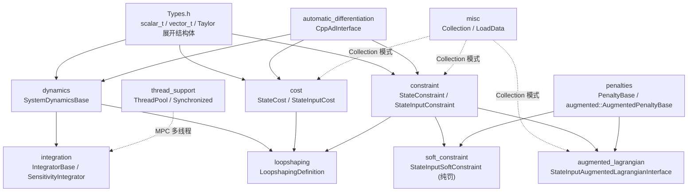

# 第 2 章：ocs2_core 抽象

本章下钻 [ocs2_core](ocs2_core/include/ocs2_core/Types.h#L37)，把第 1 章提到的"数学原语层"拆开讲。`ocs2_core` 是全仓库的地基——动力学、代价、约束、积分、罚函数、自动微分等所有建模原语都在这里，且都复用 [Types.h](ocs2_core/include/ocs2_core/Types.h) 的标量/向量/矩阵别名与 Taylor 展开结构体。读完本章，你应该能在脑中画出"一个 OCP 项由哪些基类组合而成"，并知道实现自定义动力学/代价/约束时该继承谁、改哪些方法。

本章只讲 `ocs2_core` 范围内的基类与数据模型；如何把它们组装成 `OptimalControlProblem` 留给 ch03，求解器算法留给 ch04。

## 学习目标

学完本章，你应该能回答：

1. `ocs2_core` 的 10 个子目录各承担什么职责？它们之间的依赖方向是怎样的？
2. 实现一个自定义连续动力学，要继承哪个基类、实现哪几个方法（流图 `computeFlowMap`、跳跃映射 `computeJumpMap`、线性化 `linearApproximation`）？`SystemDynamicsBaseAD` 又帮你省了什么？
3. 代价/约束基类的核心方法名是什么（`getValue`/`getQuadraticApproximation`/`getLinearApproximation`）？`Collection<T>` 模式怎么把多个项求和/拼接？
4. 硬约束如何被两种方式松弁化成可微项——`StateInputSoftConstraint`（纯罚）与 `StateInputAugmentedLagrangianInterface`（增广拉格朗日）？两者的罚函数基类（`PenaltyBase` 与 `augmented::AugmentedPenaltyBase`）签名差在哪？
5. `CppAdInterface` 如何把一份 `ad_scalar_t` 代码编译成运行时 `.so`？`recompileLibraries` 何时该设 true？

## 关键概念

### ocs2_core 的 10 个子系统

`ocs2_core/include/ocs2_core/` 下的子目录按职责可分为三组：数学原语（dynamics/cost/constraint）、约束松弁化（penalties/soft_constraint/augmented_lagrangian）、工程支撑（integration/loopshaping/thread_support/automatic_differentiation/misc）。下图给出它们之间的依赖与组合关系：



要点：dynamics/cost/constraint 三大原语直接构建在 `Types.h` 上，并可借助 `automatic_differentiation` 免去手写导数；约束可以通过 penalties + soft_constraint（变成可微成本）或 penalties + augmented_lagrangian（变成增广拉格朗日项）两条路松弁化；integration 消费 dynamics 做前向 rollout 与灵敏度离散；loopshaping 把原系统的动力学/代价/约束整体增广出滤波器；thread_support 为上层 MPC 多线程提供原语。

### 约束松弁化：两条路

OCS2 把硬的不等式/等式约束转成可微项，避免迭代求解里卡死。两条路的对照（理论细节留给 ch04）：

```
硬约束 h(x,u) ──┬── (1) 纯罚路径：StateInputSoftConstraint = constraint + PenaltyBase
                │        质心模型/四足常见，把违反量直接加进 cost，无对偶变量
                │
                └── (2) 增广拉格朗日路径：StateInputAugmentedLagrangianInterface = constraint + augmented::AugmentedPenaltyBase
                         带 Lagrange 乘子 λ 与惩罚 μ，updateLagrangian 做对偶更新
```

两条路共用同一个 `constraint` 对象（`StateInputConstraint`/`StateConstraint`），只是套的罚函数不同：纯罚用 `penalties/` 下的 `PenaltyBase`（`p(t,h)` 两参），增广用 `augmented/` 下的 `AugmentedPenaltyBase`（`p(t,l,h)` 三参，多了乘子）。

### 统一命名约定

全章方法名以源码为准（任务文本里出现的 `cost`/`linearApproximation` 等是占位写法，实际签名见下）：

- **cost** 基类要实现的是 [getValue](ocs2_core/include/ocs2_core/cost/StateCost.h#L51) / [getQuadraticApproximation](ocs2_core/include/ocs2_core/cost/StateCost.h#L55)（不是 `cost`/`quadraticApproximation`）。
- **constraint** 基类要实现的是 [getValue](ocs2_core/include/ocs2_core/constraint/StateConstraint.h#L57) / [getLinearApproximation](ocs2_core/include/ocs2_core/constraint/StateConstraint.h#L60)（不是 `linearApproximation`）。
- 所有基类都带 `clone()`（深拷贝，供 `Collection` 复制与求解器重置工作区）与 `isActive(time)`（按时间激活/失活）。

## 代码走读

### dynamics

动力学是 OCP 的"被积对象"。继承链是 [OdeBase](ocs2_core/include/ocs2_core/integration/OdeBase.h#L39) → [ControlledSystemBase](ocs2_core/include/ocs2_core/dynamics/ControlledSystemBase.h#L45) → [SystemDynamicsBase](ocs2_core/include/ocs2_core/dynamics/SystemDynamicsBase.h#L44)：

- [OdeBase](ocs2_core/include/ocs2_core/integration/OdeBase.h#L39) 是最底层的自治系统接口，只有 [computeFlowMap(t, x)](ocs2_core/include/ocs2_core/integration/OdeBase.h#L62)（无外部输入）、[computeJumpMap](ocs2_core/include/ocs2_core/integration/OdeBase.h#L71)、[computeGuardSurfaces](ocs2_core/include/ocs2_core/integration/OdeBase.h#L80) 三个虚方法，并记录函数调用计数。
- [ControlledSystemBase](ocs2_core/include/ocs2_core/dynamics/ControlledSystemBase.h#L45) 在其上引入"受控"概念：真正要实现的纯虚方法是带输入的 [computeFlowMap(t, x, u, preComp)](ocs2_core/include/ocs2_core/dynamics/ControlledSystemBase.h#L93) 与 [computeJumpMap(time, state, preComp)](ocs2_core/include/ocs2_core/dynamics/ControlledSystemBase.h#L104)；并持有 `PreComputation` 模块指针与一个 `ControllerBase` 指针（供 rollout 用反馈策略驱动）。
- [SystemDynamicsBase](ocs2_core/include/ocs2_core/dynamics/SystemDynamicsBase.h#L44) 再叠加线性化能力：核心要实现的纯虚方法是 [linearApproximation(t, x, u, preComp)](ocs2_core/include/ocs2_core/dynamics/SystemDynamicsBase.h#L70)（返回 `VectorFunctionLinearApproximation`，即雅可比 `A=∂f/∂x`、`B=∂f/∂u`）；另有 [jumpMapLinearApproximation(t, x, preComp)](ocs2_core/include/ocs2_core/dynamics/SystemDynamicsBase.h#L81) 处理模式切换的预跳跃线性化、[guardSurfacesLinearApproximation](ocs2_core/include/ocs2_core/dynamics/SystemDynamicsBase.h#L84)、[flowMapDerivativeTime](ocs2_core/include/ocs2_core/dynamics/SystemDynamicsBase.h#L92)（∂f/∂t，供灵敏度积分）。

> 注意：任务文本里写的 `jumpMap`/`computeFlowMap` 实际在 `ControlledSystemBase` 这层（签名见上），`SystemDynamicsBase` 自身只新增线性化方法。

三个常用派生：

- [LinearSystemDynamics](ocs2_core/include/ocs2_core/dynamics/LinearSystemDynamics.h#L45)：线性时不变系统 `ẋ = A·x + B·u`、`x⁺ = G·x⁻`，构造时给 `A`/`B`/`G`，自动给出 [computeFlowMap](ocs2_core/include/ocs2_core/dynamics/LinearSystemDynamics.h#L53)/[computeJumpMap](ocs2_core/include/ocs2_core/dynamics/LinearSystemDynamics.h#L55)/[linearApproximation](ocs2_core/include/ocs2_core/dynamics/LinearSystemDynamics.h#L57)/[jumpMapLinearApproximation](ocs2_core/include/ocs2_core/dynamics/LinearSystemDynamics.h#L59)。
- [SystemDynamicsBaseAD](ocs2_core/include/ocs2_core/dynamics/SystemDynamicsBaseAD.h#L45)：自动微分基类。你只实现 [systemFlowMap(time, state, input, parameters)](ocs2_core/include/ocs2_core/dynamics/SystemDynamicsBaseAD.h#L101)（`ad_scalar_t` 版本），它在 [initialize(...)](ocs2_core/include/ocs2_core/dynamics/SystemDynamicsBaseAD.h#L63) 后用 CppAd 编译出雅可比，并把 [computeFlowMap](ocs2_core/include/ocs2_core/dynamics/SystemDynamicsBaseAD.h#L66)/[linearApproximation](ocs2_core/include/ocs2_core/dynamics/SystemDynamicsBaseAD.h#L72)/[jumpMapLinearApproximation](ocs2_core/include/ocs2_core/dynamics/SystemDynamicsBaseAD.h#L75) 全部标 `final`。这是四足等示例最常用的写法——手写流图、导数交给 AD。
- [SystemDynamicsLinearizer](ocs2_core/include/ocs2_core/dynamics/SystemDynamicsLinearizer.h#L46)：用一个 `ControlledSystemBase` 非线性系统对象，通过有限差分（[FiniteDifferenceMethods](ocs2_core/include/ocs2_core/automatic_differentiation/FiniteDifferenceMethods.h)）在线数值微分出 [linearApproximation](ocs2_core/include/ocs2_core/dynamics/SystemDynamicsLinearizer.h#L60)，适合快速试验、不想写 AD 的场合。

### cost

代价项分"只依赖状态"与"依赖状态+输入"两支，基类都只要求值与二阶近似（求解器统一用二次近似做 QP）：

- [StateCost](ocs2_core/include/ocs2_core/cost/StateCost.h#L41)：要实现 [getValue(time, state, target, preComp)](ocs2_core/include/ocs2_core/cost/StateCost.h#L51) 与 [getQuadraticApproximation(...)](ocs2_core/include/ocs2_core/cost/StateCost.h#L55)，另有默认实现的 [isActive](ocs2_core/include/ocs2_core/cost/StateCost.h#L48)。
- [StateInputCost](ocs2_core/include/ocs2_core/cost/StateInputCost.h#L41)：同上，但方法签名多了 `input`（[getValue](ocs2_core/include/ocs2_core/cost/StateInputCost.h#L51)/[getQuadraticApproximation](ocs2_core/include/ocs2_core/cost/StateInputCost.h#L55)）。两者都带 `TargetTrajectories` 参数，可按目标轨迹构造偏差代价。

现成的二次项：

- [QuadraticStateCost](ocs2_core/include/ocs2_core/cost/QuadraticStateCost.h#L37)：`l = 0.5·(x−xₙ)'Q(x−xₙ)`。
- [QuadraticStateInputCost](ocs2_core/include/ocs2_core/cost/QuadraticStateInputCost.h#L39)：`L = 0.5·(x−xₙ)'Q(x−xₙ) + 0.5·(u−uₙ)'R(u−uₙ) + (u−uₙ)'P(x−xₙ)`，支持交叉项 `P`。

**Collection 模式**：多个代价项用 [StateCostCollection](ocs2_core/include/ocs2_core/cost/StateCostCollection.h#L47) / [StateInputCostCollection](ocs2_core/include/ocs2_core/cost/StateInputCostCollection.h#L47) 聚合，它们继承自 [Collection<T>](ocs2_core/include/ocs2_core/misc/Collection.h#L46)（见 misc 节），并在 [getValue](ocs2_core/include/ocs2_core/cost/StateCostCollection.h#L54)/[getQuadraticApproximation](ocs2_core/include/ocs2_core/cost/StateCostCollection.h#L58) 里把所有激活项求和。`add(name, term)` 按名字注册、`get<Derived>(name)` 取回。

**`*CppAd` 变体**：[StateCostCppAd](ocs2_core/include/ocs2_core/cost/StateCostCppAd.h#L42) / [StateInputCostCppAd](ocs2_core/include/ocs2_core/cost/StateInputCostCppAd.h#L42) 让你只写 [costFunction(time, state[, input], parameters)](ocs2_core/include/ocs2_core/cost/StateCostCppAd.h#L75)（`ad_scalar_t`），其余由 AD 生成。

### constraint

约束同样分两支，基类比代价多一个"阶数"和 `getNumConstraints`：

- [StateConstraint](ocs2_core/include/ocs2_core/constraint/StateConstraint.h#L41)：构造时指定 [ConstraintOrder](ocs2_core/include/ocs2_core/constraint/ConstraintOrder.h#L34)（`Linear` 或 `Quadratic`），要实现 [getNumConstraints(time)](ocs2_core/include/ocs2_core/constraint/StateConstraint.h#L54) 与 [getValue(time, state, preComp)](ocs2_core/include/ocs2_core/constraint/StateConstraint.h#L57)；一阶/二阶近似 [getLinearApproximation](ocs2_core/include/ocs2_core/constraint/StateConstraint.h#L60)/[getQuadraticApproximation](ocs2_core/include/ocs2_core/constraint/StateConstraint.h#L70) 按阶数选择性覆盖（默认抛错引导你调用对应方法）。
- [StateInputConstraint](ocs2_core/include/ocs2_core/constraint/StateInputConstraint.h#L41)：方法签名多 `input`（[getValue](ocs2_core/include/ocs2_core/constraint/StateInputConstraint.h#L57)/[getLinearApproximation](ocs2_core/include/ocs2_core/constraint/StateInputConstraint.h#L60)）。

现成线性项：[LinearStateConstraint](ocs2_core/include/ocs2_core/constraint/LinearStateConstraint.h#L39)（`F·x + h = 0`）、[LinearStateInputConstraint](ocs2_core/include/ocs2_core/constraint/LinearStateInputConstraint.h#L39)（`C·x + D·u + e = 0`）。

**Collection 模式**：[StateConstraintCollection](ocs2_core/include/ocs2_core/constraint/StateConstraintCollection.h#L46)（继承 `Collection<StateConstraint>`）把多项约束**拼接**（不是求和）成单个向量，提供 [getNumConstraints](ocs2_core/include/ocs2_core/constraint/StateConstraintCollection.h#L53)、[getTermsSize](ocs2_core/include/ocs2_core/constraint/StateConstraintCollection.h#L56)（每项大小，失活项为 0）、[getValue](ocs2_core/include/ocs2_core/constraint/StateConstraintCollection.h#L59)（返回 `vector_array_t`）、[getLinearApproximation](ocs2_core/include/ocs2_core/constraint/StateConstraintCollection.h#L62)。StateInputConstraintCollection 同构。

**`*CppAd` 变体**：[StateConstraintCppAd](ocs2_core/include/ocs2_core/constraint/StateConstraintCppAd.h#L42) / [StateInputConstraintCppAd](ocs2_core/include/ocs2_core/constraint/StateInputConstraintCppAd.h#L42) 让你只写 [constraintFunction(time, state[, input], parameters)](ocs2_core/include/ocs2_core/constraint/StateInputConstraintCppAd.h#L73)，导数交给 AD。

### augmented_lagrangian

把硬约束包装成**带对偶变量**的增广拉格朗日项。接口分两支：

- [StateInputAugmentedLagrangianInterface](ocs2_core/include/ocs2_core/augmented_lagrangian/StateInputAugmentedLagrangianInterface.h#L41)：要实现 [getValue(time, state, input, lagrangian, preComp)](ocs2_core/include/ocs2_core/augmented_lagrangian/StateInputAugmentedLagrangianInterface.h#L54)（返回 [LagrangianMetrics](ocs2_core/include/ocs2_core/model_data/Metrics.h#L38)，内含 `penalty` 标量与 `constraint` 向量）、[getQuadraticApproximation(...)](ocs2_core/include/ocs2_core/augmented_lagrangian/StateInputAugmentedLagrangianInterface.h#L58)、[updateLagrangian(time, state, input, constraint, lagrangian)](ocs2_core/include/ocs2_core/augmented_lagrangian/StateInputAugmentedLagrangianInterface.h#L63)（返回 `pair<Multiplier, scalar_t>`：更新后的乘子与新惩罚值）、[initializeLagrangian(time)](ocs2_core/include/ocs2_core/augmented_lagrangian/StateInputAugmentedLagrangianInterface.h#L67)。乘子结构体是 [Multiplier](ocs2_core/include/ocs2_core/model_data/Multiplier.h#L44)（`penalty` + `lagrangian` 向量）。
- [StateAugmentedLagrangianInterface](ocs2_core/include/ocs2_core/augmented_lagrangian/StateAugmentedLagrangianInterface.h#L41)：去掉 `input` 的对应版本。

**具体实现**：[StateInputAugmentedLagrangian](ocs2_core/include/ocs2_core/augmented_lagrangian/StateInputAugmentedLagrangian.h#L40) `final` 把一个 `StateInputConstraint` + 一组 `augmented::AugmentedPenaltyBase` 组合起来（构造期注入），用链式法则做二阶近似。`StateAugmentedLagrangian` 同构。

**Collection 模式**：[StateInputAugmentedLagrangianCollection](ocs2_core/include/ocs2_core/augmented_lagrangian/StateInputAugmentedLagrangianCollection.h#L47)（继承 `Collection<StateInputAugmentedLagrangianInterface>`）求和各项，提供 [getNumberOfActiveConstraints](ocs2_core/include/ocs2_core/augmented_lagrangian/StateInputAugmentedLagrangianCollection.h#L54)、[getValue](ocs2_core/include/ocs2_core/augmented_lagrangian/StateInputAugmentedLagrangianCollection.h#L57)（返回 `vector<LagrangianMetrics>`）、[getQuadraticApproximation](ocs2_core/include/ocs2_core/augmented_lagrangian/StateInputAugmentedLagrangianCollection.h#L61)，以及批量对偶更新 [updateLagrangian](ocs2_core/include/ocs2_core/augmented_lagrangian/StateInputAugmentedLagrangianCollection.h#L66)/[initializeLagrangian](ocs2_core/include/ocs2_core/augmented_lagrangian/StateInputAugmentedLagrangianCollection.h#L70)。

### soft_constraint & penalties

**纯罚路径**：[StateInputSoftConstraint](ocs2_core/include/ocs2_core/soft_constraint/StateInputSoftConstraint.h#L55)（继承 `StateInputCost`）把 `StateInputConstraint` + 一组 `PenaltyBase` 包成一个代价项 `penalty(t,x,u) = Σ p(t, h_i(x,u))`，用链式法则做二阶近似（约束只有一阶时退化到 Gauss-Newton）。[StateSoftConstraint](ocs2_core/include/ocs2_core/soft_constraint/StateSoftConstraint.h#L55) 是纯状态版。它们内部用一个 [MultidimensionalPenalty](ocs2_core/include/ocs2_core/penalties/MultidimensionalPenalty.h#L51) 管理逐分量罚函数。

**罚函数基类**——两套，分别对应纯罚与增广：

- 纯罚：[PenaltyBase](ocs2_core/include/ocs2_core/penalties/penalties/PenaltyBase.h#L42)，签名是 `p(t, h)`，要实现 [getValue](ocs2_core/include/ocs2_core/penalties/penalties/PenaltyBase.h#L63)/[getDerivative](ocs2_core/include/ocs2_core/penalties/penalties/PenaltyBase.h#L72)/[getSecondDerivative](ocs2_core/include/ocs2_core/penalties/penalties/PenaltyBase.h#L81)（对 `h` 的一二阶导，供链式法则）。
- 增广：[augmented::AugmentedPenaltyBase](ocs2_core/include/ocs2_core/penalties/augmented/AugmentedPenaltyBase.h#L44)，签名是 `p(t, l, h)`（多了 Lagrange 乘子 `l`），要实现 [getValue(t,l,h)](ocs2_core/include/ocs2_core/penalties/augmented/AugmentedPenaltyBase.h#L66)/getDerivative/getSecondDerivative，外加对偶侧的 [updateMultiplier(t,l,h)](ocs2_core/include/ocs2_core/penalties/augmented/AugmentedPenaltyBase.h#L96)/[initializeMultiplier()](ocs2_core/include/ocs2_core/penalties/augmented/AugmentedPenaltyBase.h#L103)。

[Penalties.h](ocs2_core/include/ocs2_core/penalties/Penalties.h) 是统一收纳头文件，按"软等式/软不等式/硬等式/硬不等式"四类组织（注释见 L32/L36/L41/L45），并提供 [loadData::loadPenaltyConfig](ocs2_core/include/ocs2_core/penalties/Penalties.h#L54) 从 `.info` 读罚函数配置。

**罚函数形状**（以不等式 `h ≥ 0` 为例）：

- 软不等式 [RelaxedBarrierPenalty](ocs2_core/include/ocs2_core/penalties/penalties/RelaxedBarrierPenalty.h#L50)：`h > δ` 时 `p = −μ·ln(h)`，否则用二次延拓 `−μ·ln(δ) + (μ/2)·(((h−2δ)/δ)²−1)`，参数 `mu`/`delta`（[Config](ocs2_core/include/ocs2_core/penalties/penalties/RelaxedBarrierPenalty.h#L57)）。
- 软不等式 [SquaredHingePenalty](ocs2_core/include/ocs2_core/penalties/penalties/SquaredHingePenalty.h#L50)：`h < δ` 时 `p = (μ/2)·(h−δ)²`，否则 `0`（铰链）。
- 硬不等式 [augmented::ModifiedRelaxedBarrierPenalty](ocs2_core/include/ocs2_core/penalties/augmented/ModifiedRelaxedBarrierPenalty.h#L57)：smooth-PHR 形式 `p(h,λ) = (λ²/ρ)·ψ(ρh/λ)`，定义域 `x > −1`，配 [Config](ocs2_core/include/ocs2_core/penalties/augmented/ModifiedRelaxedBarrierPenalty.h#L65)（`scale`/`relaxation`/`stepSize`）。
- 硬不等式 [augmented::SlacknessSquaredHingePenalty](ocs2_core/include/ocs2_core/penalties/augmented/SlacknessSquaredHingePenalty.h#L59)：PHR 形式 `p(h,λ) = (1/(2ρ))·(max{0, λ−ρh}² − λ²)`，乘子做梯度上升更新。

软等式侧（`h = 0`）有 `penalties/QuadraticPenalty`、`penalties/SmoothAbsolutePenalty`，硬等式侧有 `augmented/QuadraticPenalty`、`augmented/SmoothAbsolutePenalty`，均在 `Penalties.h` 中统一收录。

### integration

积分器消费 `OdeBase` 做前向 rollout 与（对 DDP）灵敏度离散。

- [IntegratorBase](ocs2_core/include/ocs2_core/integration/IntegratorBase.h#L46) 是积分器抽象，对外三种入口：等步长 [integrateConst](ocs2_core/include/ocs2_core/integration/IntegratorBase.h#L72)、自适应 [integrateAdaptive](ocs2_core/include/ocs2_core/integration/IntegratorBase.h#L87)、按给定时间轴 [integrateTimes](ocs2_core/include/ocs2_core/integration/IntegratorBase.h#L103)；派生类实现三个 `runIntegrate*` 私有虚方法。它接受一个 [OdeBase](ocs2_core/include/ocs2_core/integration/OdeBase.h#L39) 与一个 `Observer`（回调采样状态）。
- [Integrator.h](ocs2_core/include/ocs2_core/integration/Integrator.h) 提供 [IntegratorType](ocs2_core/include/ocs2_core/integration/Integrator.h#L43) 枚举（`EULER`/`ODE45`/`RK4`/`BULIRSCH_STOER` 等）与工厂 [newIntegrator(integratorType, eventHandler)](ocs2_core/include/ocs2_core/integration/Integrator.h#L77)。
- [RungeKuttaDormandPrince5](ocs2_core/include/ocs2_core/integration/RungeKuttaDormandPrince5.h#L42)（ode45）是基于 boost::odeint `runge_kutta_dopri5` 的 5 阶 RK 自适应实现，是最常用的前向 rollout 积分器。
- **灵敏度积分器** [SensitivityIntegrator.h](ocs2_core/include/ocs2_core/integration/SensitivityIntegrator.h) 不是类，而是函数句柄接口：[SensitivityIntegratorType](ocs2_core/include/ocs2_core/integration/SensitivityIntegrator.h#L37)（`EULER`/`RK2`/`RK4`）；[DynamicsDiscretizer](ocs2_core/include/ocs2_core/integration/SensitivityIntegrator.h#L64) 把连续 `SystemDynamicsBase` 离散成 `x_{k+1}`，[DynamicsSensitivityDiscretizer](ocs2_core/include/ocs2_core/integration/SensitivityIntegrator.h#L82) 同时给出离散化的线性近似 `x_{k+1} = A_k·dx_k + B_k·du_k + b_k`，供 DDP 类求解器构造前向 sweep。选择函数 [selectDynamicsDiscretization](ocs2_core/include/ocs2_core/integration/SensitivityIntegrator.h#L69)/[selectDynamicsSensitivityDiscretization](ocs2_core/include/ocs2_core/integration/SensitivityIntegrator.h#L88)。
- **事件处理**：[SystemEventHandler](ocs2_core/include/ocs2_core/integration/SystemEventHandler.h#L53) 提供积分中断接口 [checkEvent](ocs2_core/include/ocs2_core/integration/SystemEventHandler.h#L70)/[handleEvent](ocs2_core/include/ocs2_core/integration/SystemEventHandler.h#L79)（含 `killIntegration`/`maxCall` 等系统事件 ID）；[StateTriggeredEventHandler](ocs2_core/include/ocs2_core/integration/StateTriggeredEventHandler.h#L39) 在其上实现基于 guard surfaces 变号的状态触发事件，用于切换系统的模式切换时刻检测。

### loopshaping

Loopshaping 把一个原系统增广出滤波器状态，做输入整形（常见于力控/柔顺控制）。核心是 [LoopshapingDefinition](ocs2_core/include/ocs2_core/loopshaping/LoopshapingDefinition.h#L49)，它在构造期接受 [LoopshapingType](ocs2_core/include/ocs2_core/loopshaping/LoopshapingDefinition.h#L44)（两种模式）与一个 `Filter`（来自 [LoopshapingFilter.h](ocs2_core/include/ocs2_core/loopshaping/LoopshapingFilter.h#L38)）：

- `outputpattern`：系统输入仍是增广系统输入，滤波器输入是状态+系统输入的线性组合。
- `eliminatepattern`：滤波器输入成为增广系统输入，原系统输入由状态+增广输入反解。

`LoopshapingDefinition` 提供原系统/滤波器之间状态切片与增广映射：[getSystemState](ocs2_core/include/ocs2_core/loopshaping/LoopshapingDefinition.h#L81)、[getFilterState](ocs2_core/include/ocs2_core/loopshaping/LoopshapingDefinition.h#L98)、[getSystemInput](ocs2_core/include/ocs2_core/loopshaping/LoopshapingDefinition.h#L91)、[getFilteredInput](ocs2_core/include/ocs2_core/loopshaping/LoopshapingDefinition.h#L106)、滤波器动力学 [filterFlowMap(filterState, input)](ocs2_core/include/ocs2_core/loopshaping/LoopshapingDefinition.h#L114)、以及滤波器输入的二次代价 [loopshapingCost(filteredInput)](ocs2_core/include/ocs2_core/loopshaping/LoopshapingDefinition.h#L69)。

真正"把原系统的动力学/代价/约束/拉格朗日整体增广"由 [Loopshaping.h](ocs2_core/include/ocs2_core/loopshaping/Loopshaping.h) 收纳的一组包装类完成（`LoopshapingDynamics`/`LoopshapingCost`/`LoopshapingConstraint`/`LoopshapingAugmentedLagrangian`/`LoopshapingSoftConstraint`/`LoopshapingInitializer`）：它们各持一个 `LoopshapingDefinition`，把用户给的原始项包成作用于"增广状态（系统状态 ⊕ 滤波器状态）"的新项。`isDiagonal()` 为真时可走对角快速路径。

### thread_support

MPC 在线程间共享求解器状态/参考，需要无锁友好的原语：

- [ThreadPool](ocs2_core/include/ocs2_core/thread_support/ThreadPool.h#L44)：固定线程数的池，对外 [run(taskFunction)](ocs2_core/include/ocs2_core/thread_support/ThreadPool.h#L68)（返回 `std::future`，task 接收一个 `workerIndex` 供索引线程局部资源）与阻塞式的 [runParallel(taskFunction, N)](ocs2_core/include/ocs2_core/thread_support/ThreadPool.h#L81)（N 个任务里 1 个跑在调用线程、N−1 个跑在池上）；[numThreads()](ocs2_core/include/ocs2_core/thread_support/ThreadPool.h#L84) 查线程数。
- [BufferedValue<T>](ocs2_core/include/ocs2_core/thread_support/BufferedValue.h#L46)：单生产者缓冲。活动值 [get()](ocs2_core/include/ocs2_core/thread_support/BufferedValue.h#L55) 无锁读；[setBuffer(value)](ocs2_core/include/ocs2_core/thread_support/BufferedValue.h#L61) 写缓冲（互斥保护）；[updateFromBuffer()](ocs2_core/include/ocs2_core/thread_support/BufferedValue.h#L72) 在安全时机把缓冲换入活动值。适合"参考只在求解答间更新"的 MPC 模式。
- [Synchronized<T>](ocs2_core/include/ocs2_core/thread_support/Synchronized.h#L111)：`unique_ptr<T>` + 互斥，[operator->()](ocs2_core/include/ocs2_core/thread_support/Synchronized.h#L167) 持锁调用、[lock()](ocs2_core/include/ocs2_core/thread_support/Synchronized.h#L158) 返回持锁的 [LockedPtr<T>](ocs2_core/include/ocs2_core/thread_support/Synchronized.h#L46)；多对象同时加锁用 [synchronizeLock(...)](ocs2_core/include/ocs2_core/thread_support/Synchronized.h#L183)（内部 `std::lock` 防死锁）。

### automatic_differentiation

目录名是 `automatic_differentiation`（含 i，注意拼写）。核心是 [CppAdInterface](ocs2_core/include/ocs2_core/automatic_differentiation/CppAdInterface.h#L48)，基于 vendored 的 [CppAd/CppAD-CG](ocs2_thirdparty/include/cppad)，把一段 `ad_scalar_t` 代码**运行时编译成 `.so`** 动态库再加载。

关键点：

- 类型见 [automatic_differentiation/Types.h](ocs2_core/include/ocs2_core/automatic_differentiation/Types.h)：`ad_base_t = CppAD::cg::CG<scalar_t>`、`ad_scalar_t = CppAD::AD<ad_base_t>`。
- 构造期注入一个 `ad_function_t`（`y=f(x)`）或 `ad_parameterized_function_t`（`y=f(x,p)`，带参数 p），并提供 [ApproximationOrder](ocs2_core/include/ocs2_core/automatic_differentiation/CppAdInterface.h#L50)（`Zero`/`First`/`Second`）。
- 编译/加载时机三选一：[createModels](ocs2_core/include/ocs2_core/automatic_differentiation/CppAdInterface.h#L108)（总是重新编译并落盘）、[loadModels](ocs2_core/include/ocs2_core/automatic_differentiation/CppAdInterface.h#L100)（从盘加载已存在的）、[loadModelsIfAvailable](ocs2_core/include/ocs2_core/automatic_differentiation/CppAdInterface.h#L116)（有则加载、无则编译）。
- 求值接口：[getFunctionValue](ocs2_core/include/ocs2_core/automatic_differentiation/CppAdInterface.h#L123)、[getJacobian](ocs2_core/include/ocs2_core/automatic_differentiation/CppAdInterface.h#L132)、[getHessian](ocs2_core/include/ocs2_core/automatic_differentiation/CppAdInterface.h#L156)、以及 Gauss-Newton 形式的 [getGaussNewtonApproximation](ocs2_core/include/ocs2_core/automatic_differentiation/CppAdInterface.h#L146)（`f=0.5|y|²`、一阶 `dy/dx'·y`、二阶 `dy/dx'·dy/dx`）。

**`*CppAd` 类的用法**与 `recompileLibraries` 时机：所有 `*CppAd` 派生类（如 [StateCostCppAd](ocs2_core/include/ocs2_core/cost/StateCostCppAd.h#L42)、[StateInputConstraintCppAd](ocs2_core/include/ocs2_core/constraint/StateInputConstraintCppAd.h#L42)、[SystemDynamicsBaseAD](ocs2_core/include/ocs2_core/dynamics/SystemDynamicsBaseAD.h#L45)）都遵循同一模式——你只实现一个返回 `ad_vector_t` 的纯函数（`costFunction`/`constraintFunction`/`systemFlowMap`），再在构造后调一次 `initialize(stateDim[, inputDim], parameterDim, modelName, modelFolder, recompileLibraries, verbose)`。`recompileLibraries=true` 强制重新编译生成 `.so`（模型逻辑改了就要设 true）；`false` 则尝试复用 `/tmp/ocs2`（默认文件夹）下已编译的同名库以省启动时间。第一次构建或修改了 AD 逻辑后必须设 true。

### misc

两个被全 core 反复用的工具：

- **[Collection.h](ocs2_core/include/ocs2_core/misc/Collection.h#L46)**：cost/constraint/augmented_lagrangian 的 Collection 全继承自这个模板 `Collection<T>`。它提供 [add(name, term)](ocs2_core/include/ocs2_core/misc/Collection.h#L64)（按唯一名注册 `unique_ptr<T>`）、[extract(name)](ocs2_core/include/ocs2_core/misc/Collection.h#L80)（移除并交还所有权）、模板化的 [get<Derived>(name)](ocs2_core/include/ocs2_core/misc/Collection.h#L89)（取回并向下转型）、[getTermIndex(name, index)](ocs2_core/include/ocs2_core/misc/Collection.h#L98)、[clear()](ocs2_core/include/ocs2_core/misc/Collection.h#L56)/[empty()](ocs2_core/include/ocs2_core/misc/Collection.h#L53)。拷贝构造会逐项 `clone()`，这是为什么每个基类都要实现 `clone()`。求解器据此在每步重置工作区、按名字激活/失活单项。
- **[LoadData.h](ocs2_core/include/ocs2_core/misc/LoadData.h)**：从 Boost property_tree 的 `.info` 文件读配置，统一在 `namespace loadData` 下：标量/简单类型 [loadCppDataType(filename, dataName, value)](ocs2_core/include/ocs2_core/misc/LoadData.h#L104)、Eigen 矩阵 [loadEigenMatrix(filename, matrixName, matrix)](ocs2_core/include/ocs2_core/misc/LoadData.h#L132)（支持 `scaling` 与 `(i,j) value` 稀疏写法、缺省 0）、`std::vector<T>` [loadStdVector(filename, topicName, vec)](ocs2_core/include/ocs2_core/misc/LoadData.h#L170)，以及直接作用于已初始化 `ptree` 的 [loadPtreeValue](ocs2_core/include/ocs2_core/misc/LoadData.h#L80)。各 `*Settings` 与 `loadPenaltyConfig` 都建立在这些函数之上。

## 速查表

| 子系统 | 关键基类 / 工具 | 要实现的核心方法（源码为准） |
| --- | --- | --- |
| dynamics | [SystemDynamicsBase](ocs2_core/include/ocs2_core/dynamics/SystemDynamicsBase.h#L44)（← [ControlledSystemBase](ocs2_core/include/ocs2_core/dynamics/ControlledSystemBase.h#L45) ← [OdeBase](ocs2_core/include/ocs2_core/integration/OdeBase.h#L39)） | [computeFlowMap](ocs2_core/include/ocs2_core/dynamics/ControlledSystemBase.h#L93)(t,x,u,preComp)、[computeJumpMap](ocs2_core/include/ocs2_core/dynamics/ControlledSystemBase.h#L104)、[linearApproximation](ocs2_core/include/ocs2_core/dynamics/SystemDynamicsBase.h#L70)、[jumpMapLinearApproximation](ocs2_core/include/ocs2_core/dynamics/SystemDynamicsBase.h#L81)；AD 版只写 [systemFlowMap](ocs2_core/include/ocs2_core/dynamics/SystemDynamicsBaseAD.h#L101) |
| cost | [StateCost](ocs2_core/include/ocs2_core/cost/StateCost.h#L41) / [StateInputCost](ocs2_core/include/ocs2_core/cost/StateInputCost.h#L41) | [getValue](ocs2_core/include/ocs2_core/cost/StateCost.h#L51)、[getQuadraticApproximation](ocs2_core/include/ocs2_core/cost/StateCost.h#L55)、[isActive](ocs2_core/include/ocs2_core/cost/StateCost.h#L48)；现成 [QuadraticStateCost](ocs2_core/include/ocs2_core/cost/QuadraticStateCost.h#L37)/[QuadraticStateInputCost](ocs2_core/include/ocs2_core/cost/QuadraticStateInputCost.h#L39) |
| constraint | [StateConstraint](ocs2_core/include/ocs2_core/constraint/StateConstraint.h#L41) / [StateInputConstraint](ocs2_core/include/ocs2_core/constraint/StateInputConstraint.h#L41) | [getNumConstraints](ocs2_core/include/ocs2_core/constraint/StateConstraint.h#L54)、[getValue](ocs2_core/include/ocs2_core/constraint/StateConstraint.h#L57)、[getLinearApproximation](ocs2_core/include/ocs2_core/constraint/StateConstraint.h#L60)/[getQuadraticApproximation](ocs2_core/include/ocs2_core/constraint/StateConstraint.h#L70)；[ConstraintOrder](ocs2_core/include/ocs2_core/constraint/ConstraintOrder.h#L34) |
| augmented_lagrangian | [StateInputAugmentedLagrangianInterface](ocs2_core/include/ocs2_core/augmented_lagrangian/StateInputAugmentedLagrangianInterface.h#L41) | [getValue](ocs2_core/include/ocs2_core/augmented_lagrangian/StateInputAugmentedLagrangianInterface.h#L54)、[getQuadraticApproximation](ocs2_core/include/ocs2_core/augmented_lagrangian/StateInputAugmentedLagrangianInterface.h#L58)、[updateLagrangian](ocs2_core/include/ocs2_core/augmented_lagrangian/StateInputAugmentedLagrangianInterface.h#L63)、[initializeLagrangian](ocs2_core/include/ocs2_core/augmented_lagrangian/StateInputAugmentedLagrangianInterface.h#L67) |
| soft_constraint & penalties | [StateInputSoftConstraint](ocs2_core/include/ocs2_core/soft_constraint/StateInputSoftConstraint.h#L55) + [PenaltyBase](ocs2_core/include/ocs2_core/penalties/penalties/PenaltyBase.h#L42) | 纯罚 [getValue/getDerivative/getSecondDerivative](ocs2_core/include/ocs2_core/penalties/penalties/PenaltyBase.h#L63)(t,h)；增广 [augmented::AugmentedPenaltyBase](ocs2_core/include/ocs2_core/penalties/augmented/AugmentedPenaltyBase.h#L44) 多 `l` 与 [updateMultiplier](ocs2_core/include/ocs2_core/penalties/augmented/AugmentedPenaltyBase.h#L96)/[initializeMultiplier](ocs2_core/include/ocs2_core/penalties/augmented/AugmentedPenaltyBase.h#L103) |
| integration | [IntegratorBase](ocs2_core/include/ocs2_core/integration/IntegratorBase.h#L46) / [SensitivityIntegrator.h](ocs2_core/include/ocs2_core/integration/SensitivityIntegrator.h) | [integrateConst](ocs2_core/include/ocs2_core/integration/IntegratorBase.h#L72)/[integrateAdaptive](ocs2_core/include/ocs2_core/integration/IntegratorBase.h#L87)/[integrateTimes](ocs2_core/include/ocs2_core/integration/IntegratorBase.h#L103)；灵敏度 [DynamicsSensitivityDiscretizer](ocs2_core/include/ocs2_core/integration/SensitivityIntegrator.h#L82) |
| loopshaping | [LoopshapingDefinition](ocs2_core/include/ocs2_core/loopshaping/LoopshapingDefinition.h#L49) | [filterFlowMap](ocs2_core/include/ocs2_core/loopshaping/LoopshapingDefinition.h#L114)、[getFilteredInput](ocs2_core/include/ocs2_core/loopshaping/LoopshapingDefinition.h#L106)、[getSystemInput](ocs2_core/include/ocs2_core/loopshaping/LoopshapingDefinition.h#L91)；[LoopshapingType](ocs2_core/include/ocs2_core/loopshaping/LoopshapingDefinition.h#L44) |
| thread_support | [ThreadPool](ocs2_core/include/ocs2_core/thread_support/ThreadPool.h#L44) / [BufferedValue](ocs2_core/include/ocs2_core/thread_support/BufferedValue.h#L46) / [Synchronized](ocs2_core/include/ocs2_core/thread_support/Synchronized.h#L111) | [run](ocs2_core/include/ocs2_core/thread_support/ThreadPool.h#L68)/[runParallel](ocs2_core/include/ocs2_core/thread_support/ThreadPool.h#L81)、[setBuffer](ocs2_core/include/ocs2_core/thread_support/BufferedValue.h#L61)/[updateFromBuffer](ocs2_core/include/ocs2_core/thread_support/BufferedValue.h#L72)、[lock](ocs2_core/include/ocs2_core/thread_support/Synchronized.h#L158) |
| automatic_differentiation | [CppAdInterface](ocs2_core/include/ocs2_core/automatic_differentiation/CppAdInterface.h#L48) | [createModels](ocs2_core/include/ocs2_core/automatic_differentiation/CppAdInterface.h#L108)/[loadModelsIfAvailable](ocs2_core/include/ocs2_core/automatic_differentiation/CppAdInterface.h#L116)、[getJacobian](ocs2_core/include/ocs2_core/automatic_differentiation/CppAdInterface.h#L132)/[getGaussNewtonApproximation](ocs2_core/include/ocs2_core/automatic_differentiation/CppAdInterface.h#L146) |
| misc | [Collection](ocs2_core/include/ocs2_core/misc/Collection.h#L46) / [loadData](ocs2_core/include/ocs2_core/misc/LoadData.h) | [Collection::add](ocs2_core/include/ocs2_core/misc/Collection.h#L64)/[get](ocs2_core/include/ocs2_core/misc/Collection.h#L89)；[loadEigenMatrix](ocs2_core/include/ocs2_core/misc/LoadData.h#L132)/[loadCppDataType](ocs2_core/include/ocs2_core/misc/LoadData.h#L104)/[loadStdVector](ocs2_core/include/ocs2_core/misc/LoadData.h#L170) |

下一章 `03-oc-problem.md` 将把本章这些原语组装进 [OptimalControlProblem](ocs2_oc/include/ocs2_oc/oc_problem/OptimalControlProblem.h#L48)，并定义统一的求解器接口 [SolverBase](ocs2_oc/include/ocs2_oc/oc_solver/SolverBase.h#L54)。
