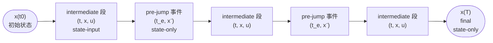
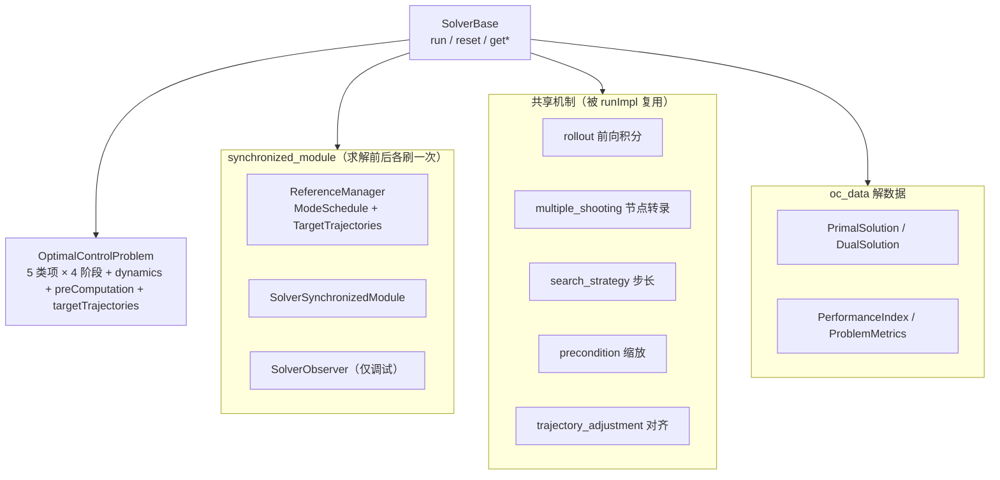

# 第 3 章：最优控制问题与 SolverBase

本章承接 ch01 的分层地图与 ch02 的 core 原语，下钻到 [ocs2_oc](ocs2_oc/include/ocs2_oc/oc_problem/OptimalControlProblem.h#L48)。`ocs2_oc` 把 ch02 的动力学/代价/约束/拉格朗日原语组装成一个完整的 [OptimalControlProblem](ocs2_oc/include/ocs2_oc/oc_problem/OptimalControlProblem.h#L48)，并定义所有求解器共用的抽象基类 [SolverBase](ocs2_oc/include/ocs2_oc/oc_solver/SolverBase.h#L54)、解的数据结构（[PrimalSolution](ocs2_oc/include/ocs2_oc/oc_data/PrimalSolution.h#L43)/[DualSolution](ocs2_oc/include/ocs2_oc/oc_data/DualSolution.h#L37)/[PerformanceIndex](ocs2_oc/include/ocs2_oc/oc_data/PerformanceIndex.h#L42)/[ProblemMetrics](ocs2_oc/include/ocs2_oc/oc_data/ProblemMetrics.h#L37)），以及一组被各求解器复用的"共享机制"（`rollout`/`multiple_shooting`/`search_strategy`/`precondition`/`trajectory_adjustment`/`synchronized_module`）。读完本章，你应该能看懂任意一个 OCS2 求解器（DDP/SLP/SQP/IPM）的骨架：它们都是 `SolverBase` 的派生，`runImpl` 里按各自算法拼装这些共享件。

本章只讲 `ocs2_oc` 范围内的问题组装、求解器接口与共享机制；求解器算法本身（SLQ/iLQR/SQP/IPM 的迭代细节、增广拉格朗日对偶更新的收敛性）留给 ch04，MPC 调度留给 ch05。

## 学习目标

学完本章，你应该能回答：

1. [OptimalControlProblem](ocs2_oc/include/ocs2_oc/oc_problem/OptimalControlProblem.h#L48) 这个结构体怎么把 cost / softConstraint / equality / inequality / Lagrangian 五类项铺到 intermediate（state-input 与 state-only 两个桶）、pre-jump、final 三个阶段？为什么 pre-jump 与 final 一律 state-only？
2. [SolverBase](ocs2_oc/include/ocs2_oc/oc_solver/SolverBase.h#L54) 对外暴露了哪些方法（`run` 的三个重载、`reset`、各类 `get*`）？[runImpl](ocs2_oc/include/ocs2_oc/oc_solver/SolverBase.h#L256) 为什么是纯虚、各求解器在哪一层实现它？
3. 一次 `run()` 的内部数据流是怎样的：[preRun](ocs2_oc/src/oc_solver/SolverBase.cpp#L93)（先刷新 [ReferenceManager](ocs2_oc/include/ocs2_oc/synchronized_module/ReferenceManager.h#L41)，再刷新各 [SolverSynchronizedModule](ocs2_oc/include/ocs2_oc/synchronized_module/SolverSynchronizedModule.h#L42)）→ `runImpl`（求解）→ [postRun](ocs2_oc/src/oc_solver/SolverBase.cpp#L104)（回灌模块、触发 [SolverObserver](ocs2_oc/include/ocs2_oc/synchronized_module/SolverObserver.h#L48)）？
4. `ocs2_oc` 提供的六组共享机制（`rollout` / `multiple_shooting` / `search_strategy` / `precondition` / `trajectory_adjustment` / `synchronized_module`）各自解决什么工程问题？
5. 求解一次后能拿到哪些数据结构——[PrimalSolution](ocs2_oc/include/ocs2_oc/oc_data/PrimalSolution.h#L43)（带控制器的轨迹）、[DualSolution](ocs2_oc/include/ocs2_oc/oc_data/DualSolution.h#L37)（乘子）、[PerformanceIndex](ocs2_oc/include/ocs2_oc/oc_data/PerformanceIndex.h#L42)（cost/merit/约束违反 SSE）、[ProblemMetrics](ocs2_oc/include/ocs2_oc/oc_data/ProblemMetrics.h#L37)（逐项 metrics）——它们分别给谁用？

## 关键概念

### 一个 OCP 沿时间轴的结构

切换系统的 OCP 沿时间轴被模式切换事件切成若干段。每个"段内"是连续动力学 `ẋ = f(x,u,t)`（intermediate，依赖状态+输入）；每个"事件时刻"状态发生跳跃 `x⁺ = jumpMap(x⁻)`（pre-jump，仅依赖状态）；末端还有一个 final 项（仅状态）。OCS2 据此把代价/约束/拉格朗日按"阶段"分桶，下图给出沿时间轴的布局：



四个阶段（对应 `OptimalControlProblem` 里的四组指针槽位）：

- **Intermediate（state-input）**：段内连续时间项，依赖 `(t, x, u)`。只有这个阶段带输入，是 OCP 的主体（运行代价、输入约束、动力学都在这里）。
- **Intermediate（state-only）**：段内但只依赖 `(t, x)`（如纯状态代价/纯状态约束），与上一项并列、独立分桶。
- **Pre-jump**：模式切换事件时刻，仅依赖事件**前**状态 `x⁻`。源码里 [setupEventNode](ocs2_oc/include/ocs2_oc/multiple_shooting/Transcription.h#L129) 接收 `x`（pre-event）与 `x_next`（post-event），跳跃约束 `x_next = jumpMap(x)` 把前后状态串起来；pre-jump 的代价/约束在 `x⁻` 上求值（见 [Transcription.cpp](ocs2_oc/src/multiple_shooting/Transcription.cpp#L170) 的 `jumpMapLinearApproximation(t, x)` 与同文件 [L175](ocs2_oc/src/multiple_shooting/Transcription.cpp#L175)/[L181](ocs2_oc/src/multiple_shooting/Transcription.cpp#L181) 的 `approximateEventCost(... t, x)` / `preJumpEqualityConstraintPtr->getLinearApproximation(t, x, ...)`）。state-only。
- **Final**：末端时刻 `x(T)`，state-only（到达代价、末端约束）。

> 关键：只有 intermediate 有 state-input 桶；pre-jump 与 final 一律 state-only。这也是为什么 ch02 的基类成对出现：[StateInputCost](ocs2_core/include/ocs2_core/cost/StateInputCost.h#L41)/[StateCost](ocs2_core/include/ocs2_core/cost/StateCost.h#L41)、[StateInputConstraint](ocs2_core/include/ocs2_core/constraint/StateInputConstraint.h#L41)/[StateConstraint](ocs2_core/include/ocs2_core/constraint/StateConstraint.h#L41)、[StateInputAugmentedLagrangianInterface](ocs2_core/include/ocs2_core/augmented_lagrangian/StateInputAugmentedLagrangianInterface.h#L41)/[StateAugmentedLagrangianInterface](ocs2_core/include/ocs2_core/augmented_lagrangian/StateAugmentedLagrangianInterface.h#L41)。

### ocs2_oc 的内部组成与数据流

`ocs2_oc` 把问题定义、求解器接口、同步模块、共享机制、解数据五件事放在一起，彼此由 `SolverBase` 的 `run()` 串起来：



数据流（高层，细节见"一次 run() 的调用序列"）：`run()` 先在 `preRun` 里用 [ReferenceManager](ocs2_oc/include/ocs2_oc/synchronized_module/ReferenceManager.h#L41) 刷新目标/模式、用各 [SolverSynchronizedModule](ocs2_oc/include/ocs2_oc/synchronized_module/SolverSynchronizedModule.h#L42) 做求解前准备；随后纯虚 `runImpl` 由具体求解器（DDP/SLP/SQP/IPM）实现，内部复用 `rollout`/`multiple_shooting`/`search_strategy`/`precondition` 等件去迭代求解 `OptimalControlProblem`；最后 `postRun` 把解回灌给同步模块、按需触发 [SolverObserver](ocs2_oc/include/ocs2_oc/synchronized_module/SolverObserver.h#L48)。解本身存放在求解器内部，通过 `get*` 以 `oc_data` 的结构返回。

## 代码走读

### OptimalControlProblem 结构体

[OptimalControlProblem](ocs2_oc/include/ocs2_oc/oc_problem/OptimalControlProblem.h#L48) 是一个普通聚合结构体（非类、无方法，仅构造/拷贝/交换），成员全是一组 `std::unique_ptr<...Collection>` 指针 + 动力学指针 + 预计算模块 + 目标轨迹裸指针。五类项 × 阶段分桶的全貌如下（行号均经 `grep -n` 核对）：

| 类别 \ 阶段 | Intermediate (state-input) | Intermediate (state-only) | Pre-jump (state-only) | Final (state-only) |
| --- | --- | --- | --- | --- |
| **Cost** | [costPtr](ocs2_oc/include/ocs2_oc/oc_problem/OptimalControlProblem.h#L51) | [stateCostPtr](ocs2_oc/include/ocs2_oc/oc_problem/OptimalControlProblem.h#L53) | [preJumpCostPtr](ocs2_oc/include/ocs2_oc/oc_problem/OptimalControlProblem.h#L55) | [finalCostPtr](ocs2_oc/include/ocs2_oc/oc_problem/OptimalControlProblem.h#L57) |
| **SoftConstraint** | [softConstraintPtr](ocs2_oc/include/ocs2_oc/oc_problem/OptimalControlProblem.h#L61) | [stateSoftConstraintPtr](ocs2_oc/include/ocs2_oc/oc_problem/OptimalControlProblem.h#L63) | [preJumpSoftConstraintPtr](ocs2_oc/include/ocs2_oc/oc_problem/OptimalControlProblem.h#L65) | [finalSoftConstraintPtr](ocs2_oc/include/ocs2_oc/oc_problem/OptimalControlProblem.h#L67) |
| **Equality** | [equalityConstraintPtr](ocs2_oc/include/ocs2_oc/oc_problem/OptimalControlProblem.h#L71) | [stateEqualityConstraintPtr](ocs2_oc/include/ocs2_oc/oc_problem/OptimalControlProblem.h#L73) | [preJumpEqualityConstraintPtr](ocs2_oc/include/ocs2_oc/oc_problem/OptimalControlProblem.h#L75) | [finalEqualityConstraintPtr](ocs2_oc/include/ocs2_oc/oc_problem/OptimalControlProblem.h#L77) |
| **Inequality** | [inequalityConstraintPtr](ocs2_oc/include/ocs2_oc/oc_problem/OptimalControlProblem.h#L81) | [stateInequalityConstraintPtr](ocs2_oc/include/ocs2_oc/oc_problem/OptimalControlProblem.h#L83) | [preJumpInequalityConstraintPtr](ocs2_oc/include/ocs2_oc/oc_problem/OptimalControlProblem.h#L85) | [finalInequalityConstraintPtr](ocs2_oc/include/ocs2_oc/oc_problem/OptimalControlProblem.h#L87) |
| **Lagrangian (eq)** | [equalityLagrangianPtr](ocs2_oc/include/ocs2_oc/oc_problem/OptimalControlProblem.h#L91) | [stateEqualityLagrangianPtr](ocs2_oc/include/ocs2_oc/oc_problem/OptimalControlProblem.h#L93) | [preJumpEqualityLagrangianPtr](ocs2_oc/include/ocs2_oc/oc_problem/OptimalControlProblem.h#L99) | [finalEqualityLagrangianPtr](ocs2_oc/include/ocs2_oc/oc_problem/OptimalControlProblem.h#L103) |
| **Lagrangian (ineq)** | [inequalityLagrangianPtr](ocs2_oc/include/ocs2_oc/oc_problem/OptimalControlProblem.h#L95) | [stateInequalityLagrangianPtr](ocs2_oc/include/ocs2_oc/oc_problem/OptimalControlProblem.h#L97) | [preJumpInequalityLagrangianPtr](ocs2_oc/include/ocs2_oc/oc_problem/OptimalControlProblem.h#L101) | [finalInequalityLagrangianPtr](ocs2_oc/include/ocs2_oc/oc_problem/OptimalControlProblem.h#L105) |

指针类型对照（ch02 的 Collection）：

- Cost / SoftConstraint 槽用 `*CostCollection`：state-input 列是 [StateInputCostCollection](ocs2_core/include/ocs2_core/cost/StateInputCostCollection.h#L47)，其余列是 [StateCostCollection](ocs2_core/include/ocs2_core/cost/StateCostCollection.h#L47)。
- Equality / Inequality 槽用 `*ConstraintCollection`：state-input 列是 [StateInputConstraintCollection](ocs2_core/include/ocs2_core/constraint/StateInputConstraintCollection.h#L46)，其余列是 [StateConstraintCollection](ocs2_core/include/ocs2_core/constraint/StateConstraintCollection.h#L46)。
- Lagrangian 槽用 `*AugmentedLagrangianCollection`：state-input 列是 [StateInputAugmentedLagrangianCollection](ocs2_core/include/ocs2_core/augmented_lagrangian/StateInputAugmentedLagrangianCollection.h#L47)，其余列是 [StateAugmentedLagrangianCollection](ocs2_core/include/ocs2_core/augmented_lagrangian/StateAugmentedLagrangianCollection.h#L47)。

> 注意 Lagrangian 行没有"state-only intermediate"之外的进一步细分——它**复用**同一列的 Constraint 对象。即：你先把约束加进 `equalityConstraintPtr`，再把对应的增广拉格朗日项加进 `equalityLagrangianPtr`（两者按同一 `name` 关联）。这与 ch02 的两条松弛化路径一致：纯罚走 SoftConstraint 槽（把约束包成代价），增广走 Lagrangian 槽（带对偶变量）。

剩余三个非分桶成员：

- [dynamicsPtr](ocs2_oc/include/ocs2_oc/oc_problem/OptimalControlProblem.h#L109)：`unique_ptr<SystemDynamicsBase>`，被积对象（ch02 的 [SystemDynamicsBase](ocs2_core/include/ocs2_core/dynamics/SystemDynamicsBase.h#L44)）。提供流图 `computeFlowMap`、跳跃映射 `computeJumpMap`、线性化 `linearApproximation`/`jumpMapLinearApproximation`。
- [preComputationPtr](ocs2_oc/include/ocs2_oc/oc_problem/OptimalControlProblem.h#L113)：`unique_ptr<PreComputation>`，预计算模块（[PreComputation](ocs2_core/include/ocs2_core/PreComputation.h#L48)）。求解器在每次迭代、每个节点前调用它，缓存本节点 cost/constraint/dynamics 都要用的中间量（如 Pinocchio 的数据缓冲），避免重复计算。
- [targetTrajectoriesPtr](ocs2_oc/include/ocs2_oc/oc_problem/OptimalControlProblem.h#L116)：`const TargetTrajectories*`（裸指针），代价项求值时按它取目标点。注释明确写着"will be substitute by ReferenceManager"——即这个指针实际由 [ReferenceManager](ocs2_oc/include/ocs2_oc/synchronized_module/ReferenceManager.h#L41) 在 `preRun` 里设置/更新，OCP 自己不拥有它。

复制语义：拷贝构造逐项 `clone()`（见 `OptimalControlProblem.cpp` 的拷贝实现），这是 ch02 `Collection::add`/`clone` 模式的延续——求解器据此在每步重置工作区。[swap](ocs2_oc/include/ocs2_oc/oc_problem/OptimalControlProblem.h#L137) 提供无拷贝交换。

### SolverBase 接口

[SolverBase](ocs2_oc/include/ocs2_oc/oc_solver/SolverBase.h#L54) 是所有求解器（[GaussNewtonDDP](ocs2_ddp/include/ocs2_ddp/GaussNewtonDDP.h#L60)/[SlpSolver](ocs2_slp/include/ocs2_slp/SlpSolver.h#L49)/[SqpSolver](ocs2_sqp/ocs2_sqp/include/ocs2_sqp/SqpSolver.h#L51)/[IpmSolver](ocs2_ipm/include/ocs2_ipm/IpmSolver.h#L51)）的抽象基类。它把"求解器外部协议"与"算法内部实现"切开：`run`/`preRun`/`postRun` 是写死在基类里的固定流程（非虚），各求解器只实现纯虚的 [runImpl](ocs2_oc/include/ocs2_oc/oc_solver/SolverBase.h#L256) 与若干 `get*`。

对外方法（按职责分组，行号指向 [SolverBase.h](ocs2_oc/include/ocs2_oc/oc_solver/SolverBase.h)）：

| 分组 | 方法 | 说明 |
| --- | --- | --- |
| 求解入口 | [run](ocs2_oc/include/ocs2_oc/oc_solver/SolverBase.h#L78)(initTime, initState, finalTime) | 主入口，无外部控制器（MPC 热启动时用上次解） |
| | [run](ocs2_oc/include/ocs2_oc/oc_solver/SolverBase.h#L92)(..., externalControllerPtr) | 带外部初始控制器；传 `nullptr` 等价于上一个重载 |
| | [run](ocs2_oc/include/ocs2_oc/oc_solver/SolverBase.h#L103)(..., primalSolution) | 带完整初始 `PrimalSolution` 启动 |
| | [reset](ocs2_oc/include/ocs2_oc/oc_solver/SolverBase.h#L69)() | 纯虚，把求解器重置成构造后状态（清对偶变量/工作区） |
| 注入同步模块 | [setReferenceManager](ocs2_oc/include/ocs2_oc/oc_solver/SolverBase.h#L108) | 注入 `ReferenceManagerInterface`（不可为空） |
| | [setSynchronizedModules](ocs2_oc/include/ocs2_oc/oc_solver/SolverBase.h#L124) / [addSynchronizedModule](ocs2_oc/include/ocs2_oc/oc_solver/SolverBase.h#L132) | 装配 `SolverSynchronizedModule` 列表 |
| | [addSolverObserver](ocs2_oc/include/ocs2_oc/oc_solver/SolverBase.h#L140) | 装配 `SolverObserver`（仅调试，会拖慢 MPC，见注释 L138） |
| 取问题/迭代 | [getOptimalControlProblem](ocs2_oc/include/ocs2_oc/oc_solver/SolverBase.h#L147) | 返回内部 OCP 引用（纯虚） |
| | [getNumIterations](ocs2_oc/include/ocs2_oc/oc_solver/SolverBase.h#L161) / [getIterationsLog](ocs2_oc/include/ocs2_oc/oc_solver/SolverBase.h#L168) | 上次求解迭代数与历史日志 |
| | [getFinalTime](ocs2_oc/include/ocs2_oc/oc_solver/SolverBase.h#L175) | 优化的末端时间 |
| 取解 | [getPrimalSolution](ocs2_oc/include/ocs2_oc/oc_solver/SolverBase.h#L183)(finalTime, out) | 纯虚，写出 `PrimalSolution`；[primalSolution](ocs2_oc/include/ocs2_oc/oc_solver/SolverBase.h#L191) 是返回值包装 |
| | [getDualSolution](ocs2_oc/include/ocs2_oc/oc_solver/SolverBase.h#L198) | 虚（默认返回 `nullptr`），支持对偶的求解器才覆写 |
| | [getSolutionMetrics](ocs2_oc/include/ocs2_oc/oc_solver/SolverBase.h#L205) | 纯虚，返回 `ProblemMetrics`（逐项 metrics） |
| 性能 | [getPerformanceIndeces](ocs2_oc/include/ocs2_oc/oc_solver/SolverBase.h#L154) | 纯虚，返回上次解的 `PerformanceIndex`（注意源码拼写是 `Indeces`） |
| 函数值查询 | [getValueFunction](ocs2_oc/include/ocs2_oc/oc_solver/SolverBase.h#L214)(t, x) | 纯虚，价值函数 `V(t,x)` 的二次近似 |
| | [getHamiltonian](ocs2_oc/include/ocs2_oc/oc_solver/SolverBase.h#L224)(t, x, u) | 纯虚，哈密顿量 `H(t,x,u)` 的二次近似 |
| | [getStateInputEqualityConstraintLagrangian](ocs2_oc/include/ocs2_oc/oc_solver/SolverBase.h#L233)(t, x) | 纯虚，state-input 等式约束的拉格朗日乘子 `λ(t,x)` |
| | [getIntermediateDualSolution](ocs2_oc/include/ocs2_oc/oc_solver/SolverBase.h#L241)(t) | 纯虚，中间时刻的对偶解 `MultiplierCollection` |

> 命名约定提示：方法名一律以源码为准——`getPrimalSolution`/`getDualSolution`/`getSolutionMetrics`/`getValueFunction`/`getHamiltonian`/`getStateInputEqualityConstraintLagrangian`，与 ch02 的"`getValue`/`getQuadraticApproximation`"约定一脉相承（都是 `get*` 而非裸 `cost`/`value`）。`getPerformanceIndeces` 的拼写（`Indeces`）是源码原样，使用时照抄即可。

### 一次 run() 的调用序列

`run` 的三个重载都走同一条 `preRun → runImpl → postRun` 流水线（非虚、写死在 [SolverBase.cpp](ocs2_oc/src/oc_solver/SolverBase.cpp)）。以无控制器重载 [SolverBase::run](ocs2_oc/src/oc_solver/SolverBase.cpp#L49) 为例，三步分别是 [preRun](ocs2_oc/src/oc_solver/SolverBase.cpp#L93)、[runImpl](ocs2_oc/src/oc_solver/SolverBase.cpp#L51)、[postRun](ocs2_oc/src/oc_solver/SolverBase.cpp#L104)：

```
 run(initTime, initState, finalTime[, controller/primalSolution])
 │
 ├─ preRun(initTime, initState, finalTime)                  [SolverBase.cpp L93]
 │    │
 │    │  (1) referenceManagerPtr_->preSolverRun(initTime, finalTime, initState)   [L94]
 │    │      └─ ReferenceManager: 把缓冲的 ModeSchedule/TargetTrajectories 换入活动值，
 │    │         再调 modifyReferences() 让子类按 (initTime,finalTime,initState) 改写参考
 │    │
 │    └─ (2) for module in synchronizedModules_:
 │            module->preSolverRun(initTime, finalTime, initState, *referenceManagerPtr_)  [L96-L98]
 │            └─ 各 SolverSynchronizedModule 做求解前准备（如更新末端运动学目标、刷新步态）
 │
 ├─ runImpl(initTime, initState, finalTime[, ...])          [SolverBase.h L256 纯虚]
 │    │
 │    └─ 具体求解器（DDP/SLP/SQP/IPM）实现：内部复用 rollout / multiple_shooting /
 │       search_strategy / precondition 等共享件，迭代求解 OptimalControlProblem，
 │       把解与 metrics 存进求解器内部成员
 │
 └─ postRun()                                               [SolverBase.cpp L104]
      │
      │  if (modules 或 observers 非空):
      │    solution = primalSolution(getFinalTime())         [L106]
      │
      ├─ (a) for module in synchronizedModules_:
      │       module->postSolverRun(solution)                [L107-L109]
      │       └─ 把解回灌给同步模块做后处理
      │
      └─ (b) for observer in solverObservers_:
             observer->extractTermConstraint(ocp, solution, metrics)        [L111]
             observer->extractTermLagrangianMetrics(ocp, solution, metrics)  [L112]
             if (getDualSolution() != nullptr)
               observer->extractTermMultipliers(ocp, *getDualSolution())     [L114]
             └─ 按注册的 term 名抽取该约束/拉格朗日项的值/乘子，回调给用户
```

要点：

- **ReferenceManager 永远最先刷新**。基类构造函数 [SolverBase()](ocs2_oc/src/oc_solver/SolverBase.cpp#L44) 默认 `new` 了一个 [ReferenceManager](ocs2_oc/include/ocs2_oc/synchronized_module/ReferenceManager.h#L41)，所以即使你不调 `setReferenceManager` 也有一个空的默认实例。`preRun` 先刷新它（L94），再刷新其他 `SolverSynchronizedModule`（L96）——后者还能拿到 `referenceManagerPtr_` 引用去读最新目标/模式。这与 [ReferenceManagerInterface](ocs2_oc/include/ocs2_oc/synchronized_module/ReferenceManagerInterface.h#L41) 注释一致："called right before the solver runs and before any other `SolverSynchronizedModule::preSolverRun()`"。
- **postRun 是惰性的**。只有当 `synchronizedModules_` 或 `solverObservers_` 非空时才构造 `solution` 并回灌（L105 判空）。因此生产部署里若不挂任何模块/观察者，`postRun` 几乎零开销。
- **Observer 只在 postRun 触发**，且会逐项 `extract*`——这是 [SolverBase.h L138](ocs2_oc/include/ocs2_oc/oc_solver/SolverBase.h#L138) 警告"Observers will slow down the MPC"的由来：上线前务必 `addSolverObserver` 留空。

### 共享机制

`ocs2_oc` 把若干求解器都要用到的公共能力抽成六组共享件，各求解器在 `runImpl` 里按需组合。它们是"工程共享层"，不是算法本身（算法差异留 ch04）。

#### rollout

前向积分系统动力学、把一个控制器策略展成轨迹。[RolloutBase](ocs2_oc/include/ocs2_oc/rollout/RolloutBase.h#L46) 是抽象基类，核心方法是 [run(initTime, initState, finalTime, controller*, modeSchedule&, ...)](ocs2_oc/include/ocs2_oc/rollout/RolloutBase.h#L107)：用给定控制器在 `[initTime, finalTime]` 上积分动力学，输出 `timeTrajectory`/`stateTrajectory`/`inputTrajectory`/`postEventIndices`（注意 `modeSchedule` 对时间触发是输入、对状态触发是输出）。两个具体派生：

- [TimeTriggeredRollout](ocs2_oc/include/ocs2_oc/rollout/TimeTriggeredRollout.h#L46)：按 `ModeSchedule` 给定的事件时间切换模式（时间触发），是最常用的前向 rollout，内部用一个 [IntegratorBase](ocs2_core/include/ocs2_core/integration/IntegratorBase.h#L46)（默认 ODE45，见设置）配 [SystemEventHandler](ocs2_core/include/ocs2_core/integration/SystemEventHandler.h#L53) 处理事件。
- [StateTriggeredRollout](ocs2_oc/include/ocs2_oc/rollout/StateTriggeredRollout.h#L46)：用 guard surfaces 在积分中检测状态触发事件，`modeSchedule` 是输出（事件时间由状态变号决定），配 [StateTriggeredEventHandler](ocs2_core/include/ocs2_core/integration/StateTriggeredEventHandler.h#L39)。

配置在 [rollout::Settings](ocs2_oc/include/ocs2_oc/rollout/RolloutSettings.h#L45)：积分容差 [absTolODE](ocs2_oc/include/ocs2_oc/rollout/RolloutSettings.h#L47)/[relTolODE](ocs2_oc/include/ocs2_oc/rollout/RolloutSettings.h#L49)、积分器类型 [integratorType](ocs2_oc/include/ocs2_oc/rollout/RolloutSettings.h#L55)（默认 `ODE45`），从 `.info` 的 `rollout` 块读入 [loadSettings](ocs2_oc/include/ocs2_oc/rollout/RolloutSettings.h#L96)。DDP 类求解器用它做前向 sweep，SQP/SLP/IPM 也可用它做初始/暖启动 rollout。

#### multiple_shooting

多重打靶的"节点转录"层——把连续 OCP 在每个离散节点上装配成一个二次代价 + 线性约束的子问题，供 SQP/SLP/IPM 拼 KKT/QP。全在 `namespace multiple_shooting`（[Transcription.h](ocs2_oc/include/ocs2_oc/multiple_shooting/Transcription.h#L39)）下，三个转录函数对应三种节点：

- [setupIntermediateNode](ocs2_oc/include/ocs2_oc/multiple_shooting/Transcription.h#L78)(ocp, sensitivityDiscretizer, t, dt, x, x_next, u)：返回 [Transcription](ocs2_oc/include/ocs2_oc/multiple_shooting/Transcription.h#L54)，含离散动力学（线性近似 `x_next ≈ A·x + B·u + b`）、cost 二次近似、四类约束线性近似、约束投影。`sensitivityDiscretizer` 是 ch02 的 [DynamicsSensitivityDiscretizer](ocs2_core/include/ocs2_core/integration/SensitivityIntegrator.h#L82)，负责把连续动力学离散化。
- [setupEventNode](ocs2_oc/include/ocs2_oc/multiple_shooting/Transcription.h#L129)(ocp, t, x, x_next)：返回 [EventTranscription](ocs2_oc/include/ocs2_oc/multiple_shooting/Transcription.h#L112)，含跳跃约束 `x_next = jumpMap(x)`（线性近似）、pre-jump cost/约束。这就是上面"pre-jump 在 `x⁻` 上求值"的装配点。
- [setupTerminalNode](ocs2_oc/include/ocs2_oc/multiple_shooting/Transcription.h#L107)(ocp, t, x)：返回 [TerminalTranscription](ocs2_oc/include/ocs2_oc/multiple_shooting/Transcription.h#L92)，含 final cost/约束。

[projectTranscription](ocs2_oc/include/ocs2_oc/multiple_shooting/Transcription.h#L87) 对中间节点施加 state-input 等式约束的投影（消去相关约束、提取投影乘子）。目录下还有 [Initialization.h](ocs2_oc/include/ocs2_oc/multiple_shooting/Initialization.h)、[LagrangianEvaluation.h](ocs2_oc/include/ocs2_oc/multiple_shooting/LagrangianEvaluation.h)、[MetricsComputation.h](ocs2_oc/include/ocs2_oc/multiple_shooting/MetricsComputation.h)、[PerformanceIndexComputation.h](ocs2_oc/include/ocs2_oc/multiple_shooting/PerformanceIndexComputation.h)、[Helpers.h](ocs2_oc/include/ocs2_oc/multiple_shooting/Helpers.h) 等辅助件，分别负责初值构造、拉格朗日项求值、metrics 计算、性能指标计算。这层是 SQP/SLP/IPM 共享的"装配车间"；DDP 类不直接用节点转录，走自己的前向/后向 sweep。

#### search_strategy

步长/线搜索策略。目前目录下只有一个实现 [FilterLinesearch](ocs2_oc/include/ocs2_oc/search_strategy/FilterLinesearch.h#L44)，基于 filter line-search（引用 IPOPT 论文）。核心方法 [acceptStep](ocs2_oc/include/ocs2_oc/search_strategy/FilterLinesearch.h#L59)(baselinePerformance, stepPerformance, armijoDescentMetric) 返回 `{是否接受, StepType}`，[StepType](ocs2_oc/include/ocs2_oc/search_strategy/FilterLinesearch.h#L45) 取 `CONSTRAINT`/`DUAL`/`COST`/`ZERO`。判据用 `c = cost`、`g = 约束违反范数`（[totalConstraintViolation](ocs2_oc/include/ocs2_oc/search_strategy/FilterLinesearch.h#L63) = `sqrt(dynamicsViolationSSE + equalityConstraintsSSE)`，取自 [PerformanceIndex](ocs2_oc/include/ocs2_oc/oc_data/PerformanceIndex.h#L42)）。[armijoDescentMetric](ocs2_oc/include/ocs2_oc/search_strategy/FilterLinesearch.h#L80) 计算代价下降度量供 Armijo 条件用。SQP/SLP/IPM 在每步解出 QP 方向后用它决定是否接受该步。

#### precondition

问题缩放（preconditioning），改善 KKT/QP 矩阵的条件数以利数值稳定。全在 `namespace precondition`（[Ruzi.h](ocs2_oc/include/ocs2_oc/precondition/Ruzi.h#L40)）下，采用 modified Ruiz equilibration。主入口 [ocpDataInPlaceInParallel](ocs2_oc/include/ocs2_oc/precondition/Ruzi.h#L92)(threadPool, x0, ocpSize, iteration, dynamics&, cost&, D&, E&, scalingVectors&, c&)：在线程池上并行缩放各节点的动力学与代价数组，输出对角缩放阵 `D`（决策变量侧）、`E`（约束侧）、标量 `c`。[OcpSize](ocs2_oc/include/ocs2_oc/oc_problem/OcpSize.h#L49) 描述各节点状态/输入/约束维数。另有 [kktMatrixInPlace](ocs2_oc/include/ocs2_oc/precondition/Ruzi.h#L145) 直接缩放稀疏 KKT 矩阵 `H,h,G,g`、[scaleOcpData](ocs2_oc/include/ocs2_oc/precondition/Ruzi.h#L161)/[descaleSolution](ocs2_oc/include/ocs2_oc/precondition/Ruzi.h#L173) 应用/反解缩放。被 QP 后端与 IPM/SQP 等在求解前调用。

#### trajectory_adjustment

时间网格/轨迹调整，主要服务 MPC 暖启动。当步态（`ModeSchedule`）在两次求解间变化时，旧解的时间轴与事件位置不再对齐，直接复用会错位。[TrajectorySpreading](ocs2_oc/include/ocs2_oc/trajectory_adjustment/TrajectorySpreading.h#L37) 用"轨迹铺开"策略把旧轨迹对齐到新 `ModeSchedule`：先 [set(oldModeSchedule, newModeSchedule, oldTimeTrajectory)](ocs2_oc/include/ocs2_oc/trajectory_adjustment/TrajectorySpreading.h#L58) 计算对齐策略（返回 [Status](ocs2_oc/include/ocs2_oc/trajectory_adjustment/TrajectorySpreading.h#L39)），再 [adjustTrajectory](ocs2_oc/include/ocs2_oc/trajectory_adjustment/TrajectorySpreading.h#L70) 把丢失的模式段用相邻值铺开、[adjustTimeTrajectory](ocs2_oc/include/ocs2_oc/trajectory_adjustment/TrajectorySpreading.h#L87) 修正时间戳、[getPostEventIndices](ocs2_oc/include/ocs2_oc/trajectory_adjustment/TrajectorySpreading.h#L94) 重算事件索引。常与状态触发 rollout 的 `useTrajectorySpreadingController`（见 [RolloutSettings.h L73](ocs2_oc/include/ocs2_oc/rollout/RolloutSettings.h#L73)）配合。

#### synchronized_module

求解前后需要"同步"的外部状态。三种角色：

- [ReferenceManager](ocs2_oc/include/ocs2_oc/synchronized_module/ReferenceManager.h#L41)（实现 [ReferenceManagerInterface](ocs2_oc/include/ocs2_oc/synchronized_module/ReferenceManagerInterface.h#L41)）：同时管 [ModeSchedule](ocs2_core/include/ocs2_core/reference/ModeSchedule.h#L42)（事件时间 `eventTimes` + 模式序列 `modeSequence`）与 [TargetTrajectories](ocs2_core/include/ocs2_core/reference/TargetTrajectories.h#L41)（期望状态/输入/时间）。两者各用一个 [BufferedValue](ocs2_core/include/ocs2_core/thread_support/BufferedValue.h#L46) 线程安全缓冲：[setModeSchedule](ocs2_oc/include/ocs2_oc/synchronized_module/ReferenceManager.h#L51)/[setTargetTrajectories](ocs2_oc/include/ocs2_oc/synchronized_module/ReferenceManager.h#L55) 写缓冲，[preSolverRun](ocs2_oc/include/ocs2_oc/synchronized_module/ReferenceManager.h#L48) 在求解前把缓冲换入活动值并调受保护的 [modifyReferences](ocs2_oc/include/ocs2_oc/synchronized_module/ReferenceManager.h#L74)（子类可覆写做自定义目标推导，如按当前状态生成末端参考）。它在 `preRun` 中**最先**被刷新（见上节），刷出来的 `targetTrajectoriesPtr` 正是 [OptimalControlProblem.targetTrajectoriesPtr](ocs2_oc/include/ocs2_oc/oc_problem/OptimalControlProblem.h#L116) 指向的对象。
- [SolverSynchronizedModule](ocs2_oc/include/ocs2_oc/synchronized_module/SolverSynchronizedModule.h#L42)：钩子接口，两个纯虚方法 [preSolverRun(initTime, finalTime, initState, referenceManager)](ocs2_oc/include/ocs2_oc/synchronized_module/SolverSynchronizedModule.h#L57)（求解前，能拿 `referenceManager` 读最新目标/模式）与 [postSolverRun(primalSolution)](ocs2_oc/include/ocs2_oc/synchronized_module/SolverSynchronizedModule.h#L65)（求解后，拿解做后处理）。典型用途：求解前更新末端运动学目标、求解后做轨迹后处理或记录。求解前后各调一次。
- [SolverObserver](ocs2_oc/include/ocs2_oc/synchronized_module/SolverObserver.h#L48)：**仅调试用**。构造走工厂：[ConstraintTermObserver](ocs2_oc/include/ocs2_oc/synchronized_module/SolverObserver.h#L83)(type, termName, callback) 抽约束值、[LagrangianTermObserver](ocs2_oc/include/ocs2_oc/synchronized_module/SolverObserver.h#L99)(...) 抽拉格朗日项 metrics/乘子；`type` 取 [Type::Final/PreJump/Intermediate](ocs2_oc/include/ocs2_oc/synchronized_module/SolverObserver.h#L60)。`postRun` 里调它的 [extractTermConstraint](ocs2_oc/include/ocs2_oc/synchronized_module/SolverObserver.h#L125)/[extractTermLagrangianMetrics](ocs2_oc/include/ocs2_oc/synchronized_module/SolverObserver.h#L134)/[extractTermMultipliers](ocs2_oc/include/ocs2_oc/synchronized_module/SolverObserver.h#L143)（它是 [SolverBase](ocs2_oc/include/ocs2_oc/oc_solver/SolverBase.h#L54) 的友元，[L155](ocs2_oc/include/ocs2_oc/synchronized_module/SolverObserver.h#L155)）。注释明确警告会拖慢 MPC（[SolverBase.h L138](ocs2_oc/include/ocs2_oc/oc_solver/SolverBase.h#L138)），部署前移除。

### 解的数据结构

求解一次后，结果分原始解、对偶解、性能指标、逐项 metrics 四类，均定义在 `ocs2_oc/oc_data/`。

**PrimalSolution**（[PrimalSolution.h](ocs2_oc/include/ocs2_oc/oc_data/PrimalSolution.h#L43)）：原始解，OCS2 实时 MPC 的核心产出（不只是开环 `u` 序列）。

| 成员 | 类型 | 含义 |
| --- | --- | --- |
| [timeTrajectory_](ocs2_oc/include/ocs2_oc/oc_data/PrimalSolution.h#L101) | `scalar_array_t` | 时间轴 |
| [stateTrajectory_](ocs2_oc/include/ocs2_oc/oc_data/PrimalSolution.h#L102) | `vector_array_t` | 状态轨迹 |
| [inputTrajectory_](ocs2_oc/include/ocs2_oc/oc_data/PrimalSolution.h#L103) | `vector_array_t` | 输入轨迹 |
| [postEventIndices_](ocs2_oc/include/ocs2_oc/oc_data/PrimalSolution.h#L104) | `size_array_t` | 各事件"之后"的索引（标记跳跃点） |
| [modeSchedule_](ocs2_oc/include/ocs2_oc/oc_data/PrimalSolution.h#L105) | `ModeSchedule` | 解对应的模式调度 |
| [controllerPtr_](ocs2_oc/include/ocs2_oc/oc_data/PrimalSolution.h#L106) | `unique_ptr<ControllerBase>` | 前馈+反馈控制器策略 |

注意成员名带尾下划线（私有）。[controllerPtr_](ocs2_oc/include/ocs2_oc/oc_data/PrimalSolution.h#L106) 是一个 [ControllerBase](ocs2_core/include/ocs2_core/control/ControllerBase.h#L40)（核心方法 [computeInput(t, x)](ocs2_core/include/ocs2_core/control/ControllerBase.h#L55)），这就是"实时 MPC 给的是反馈策略而非裸输入"的落点——部署时直接用当前状态查控制器。拷贝时对控制器做 `clone()`（[L57](ocs2_oc/include/ocs2_oc/oc_data/PrimalSolution.h#L57)）。

**DualSolution**（[DualSolution.h](ocs2_oc/include/ocs2_oc/oc_data/DualSolution.h#L37)）：对偶解，按阶段存 [MultiplierCollection](ocs2_core/include/ocs2_core/model_data/Multiplier.h#L68)（含四类项各自的 `vector<Multiplier>`：`stateEq`/`stateIneq`/`stateInputEq`/`stateInputIneq`，每个 [Multiplier](ocs2_core/include/ocs2_core/model_data/Multiplier.h#L44) = `penalty` + `lagrangian` 乘子向量）。

| 成员 | 含义 |
| --- | --- |
| [timeTrajectory](ocs2_oc/include/ocs2_oc/oc_data/DualSolution.h#L38) | 时间轴 |
| [postEventIndices](ocs2_oc/include/ocs2_oc/oc_data/DualSolution.h#L39) | 事件索引 |
| [final](ocs2_oc/include/ocs2_oc/oc_data/DualSolution.h#L41) | 末端的乘子集合 |
| [preJumps](ocs2_oc/include/ocs2_oc/oc_data/DualSolution.h#L42) | 各 pre-jump 事件的乘子集合序列 |
| [intermediates](ocs2_oc/include/ocs2_oc/oc_data/DualSolution.h#L43) | 各中间时刻的乘子集合序列 |

[getDualSolution](ocs2_oc/include/ocs2_oc/oc_solver/SolverBase.h#L198) 默认返回 `nullptr`，只有实现了对偶的求解器（如 IPM/SQP）才覆写；[getIntermediateDualSolution](ocs2_oc/include/ocs2_oc/oc_solver/SolverBase.h#L241)(t) 按时间插值返回 `MultiplierCollection`。

**PerformanceIndex**（[PerformanceIndex.h](ocs2_oc/include/ocs2_oc/oc_data/PerformanceIndex.h#L42)）：一次 rollout 的性能指标，供收敛判断与步长搜索。

| 成员 | 含义 |
| --- | --- |
| [merit](ocs2_oc/include/ocs2_oc/oc_data/PerformanceIndex.h#L44) | merit 函数值 |
| [cost](ocs2_oc/include/ocs2_oc/oc_data/PerformanceIndex.h#L47) | 总代价 |
| [dualFeasibilitiesSSE](ocs2_oc/include/ocs2_oc/oc_data/PerformanceIndex.h#L54) | 对偶可行性违反的平方和 |
| [dynamicsViolationSSE](ocs2_oc/include/ocs2_oc/oc_data/PerformanceIndex.h#L57) | 动力学违反的平方和 |
| [equalityConstraintsSSE](ocs2_oc/include/ocs2_oc/oc_data/PerformanceIndex.h#L64) | 等式约束违反的平方和（intermediate 为积分，final/pre-jump 为求和） |
| [inequalityConstraintsSSE](ocs2_oc/include/ocs2_oc/oc_data/PerformanceIndex.h#L71) | 不等式约束违反的平方和（同上分阶段口径） |
| [equalityLagrangian](ocs2_oc/include/ocs2_oc/oc_data/PerformanceIndex.h#L78) | 等式拉格朗日罚项之和 |
| [inequalityLagrangian](ocs2_oc/include/ocs2_oc/oc_data/PerformanceIndex.h#L85) | 不等式拉格朗日罚项之和 |

SSE 即"Sum of Squared Error"，各字段分 final/pre-jump/intermediate 三种口径求和（注释 L49–L70 详述）。[getPerformanceIndeces](ocs2_oc/include/ocs2_oc/oc_solver/SolverBase.h#L154) 返回上次解的 `PerformanceIndex`，[getIterationsLog](ocs2_oc/include/ocs2_oc/oc_solver/SolverBase.h#L168) 返回历次迭代的历史。它可由连续/离散 [Metrics](ocs2_core/include/ocs2_core/model_data/Metrics.h#L69) 经 [toPerformanceIndex](ocs2_oc/include/ocs2_oc/oc_data/PerformanceIndex.h#L119) 换算。

**ProblemMetrics**（[ProblemMetrics.h](ocs2_oc/include/ocs2_oc/oc_data/ProblemMetrics.h#L37)）：逐项 metrics，比 `PerformanceIndex` 更细。按阶段存 [Metrics](ocs2_core/include/ocs2_core/model_data/Metrics.h#L69)：[final](ocs2_oc/include/ocs2_oc/oc_data/ProblemMetrics.h#L38)、[preJumps](ocs2_oc/include/ocs2_oc/oc_data/ProblemMetrics.h#L39) 序列、[intermediates](ocs2_oc/include/ocs2_oc/oc_data/ProblemMetrics.h#L40) 序列。每个 `Metrics` 含 `cost`、`dynamicsViolation` 向量、四类约束向量数组、四类 [LagrangianMetrics](ocs2_core/include/ocs2_core/model_data/Metrics.h#L38)（`penalty` + `constraint` 向量）数组。[getSolutionMetrics](ocs2_oc/include/ocs2_oc/oc_solver/SolverBase.h#L205) 返回它，`SolverObserver` 的 `extract*` 也消费它来按 `termName` 抽取单项指标。

## 速查表

按"想做什么 → 用哪个字段/类"组织：

| 场景 | 用的字段 / 类 | 阶段 / 类别 |
| --- | --- | --- |
| 给运行加二次代价 `½(x-xₙ)'Q(x-xₙ)+½(u-uₙ)'R(u-uₙ)` | [costPtr](ocs2_oc/include/ocs2_oc/oc_problem/OptimalControlProblem.h#L51) | intermediate / cost (state-input) |
| 给段内加纯状态代价（如位姿跟踪） | [stateCostPtr](ocs2_oc/include/ocs2_oc/oc_problem/OptimalControlProblem.h#L53) | intermediate / cost (state-only) |
| 末端到达代价 | [finalCostPtr](ocs2_oc/include/ocs2_oc/oc_problem/OptimalControlProblem.h#L57) | final / cost |
| 跳跃前瞬间的代价（如触地前状态） | [preJumpCostPtr](ocs2_oc/include/ocs2_oc/oc_problem/OptimalControlProblem.h#L55) | pre-jump / cost |
| 把一个不等式路径约束**软化为罚**（纯罚路径） | [inequalityConstraintPtr](ocs2_oc/include/ocs2_oc/oc_problem/OptimalControlProblem.h#L81) + [softConstraintPtr](ocs2_oc/include/ocs2_oc/oc_problem/OptimalControlProblem.h#L61) | intermediate / inequality + softConstraint |
| 把一个约束做成**增广拉格朗日**（带对偶变量） | [equalityConstraintPtr](ocs2_oc/include/ocs2_oc/oc_problem/OptimalControlProblem.h#L71) + [equalityLagrangianPtr](ocs2_oc/include/ocs2_oc/oc_problem/OptimalControlProblem.h#L91) | intermediate / equality + Lagrangian |
| 末端等式约束（如末端落点） | [finalEqualityConstraintPtr](ocs2_oc/include/ocs2_oc/oc_problem/OptimalControlProblem.h#L77) | final / equality |
| 跳跃前状态约束 | [preJumpEqualityConstraintPtr](ocs2_oc/include/ocs2_oc/oc_problem/OptimalControlProblem.h#L75) | pre-jump / equality |
| 提供系统动力学 | [dynamicsPtr](ocs2_oc/include/ocs2_oc/oc_problem/OptimalControlProblem.h#L109) | dynamics |
| 缓存节点共用中间量 | [preComputationPtr](ocs2_oc/include/ocs2_oc/oc_problem/OptimalControlProblem.h#L113) | misc |
| 设置目标轨迹（由 ReferenceManager 注入） | [targetTrajectoriesPtr](ocs2_oc/include/ocs2_oc/oc_problem/OptimalControlProblem.h#L116) | misc |

求解器接口与共享机制速查：

| 要做 | 用什么 |
| --- | --- |
| 触发一次求解 | [SolverBase::run](ocs2_oc/include/ocs2_oc/oc_solver/SolverBase.h#L78)（三个重载）→ 内部 [preRun](ocs2_oc/src/oc_solver/SolverBase.cpp#L93)/[runImpl](ocs2_oc/include/ocs2_oc/oc_solver/SolverBase.h#L256)/[postRun](ocs2_oc/src/oc_solver/SolverBase.cpp#L104) |
| 取控制器+轨迹 | [getPrimalSolution](ocs2_oc/include/ocs2_oc/oc_solver/SolverBase.h#L183) → [PrimalSolution](ocs2_oc/include/ocs2_oc/oc_data/PrimalSolution.h#L43) |
| 取对偶乘子 | [getDualSolution](ocs2_oc/include/ocs2_oc/oc_solver/SolverBase.h#L198) → [DualSolution](ocs2_oc/include/ocs2_oc/oc_data/DualSolution.h#L37) |
| 看收敛/步长判据 | [getPerformanceIndeces](ocs2_oc/include/ocs2_oc/oc_solver/SolverBase.h#L154) → [PerformanceIndex](ocs2_oc/include/ocs2_oc/oc_data/PerformanceIndex.h#L42) |
| 查逐项约束违反 | [getSolutionMetrics](ocs2_oc/include/ocs2_oc/oc_solver/SolverBase.h#L205) → [ProblemMetrics](ocs2_oc/include/ocs2_oc/oc_data/ProblemMetrics.h#L37) |
| 注入目标/步态 | [setReferenceManager](ocs2_oc/include/ocs2_oc/oc_solver/SolverBase.h#L108) → [ReferenceManager](ocs2_oc/include/ocs2_oc/synchronized_module/ReferenceManager.h#L41) |
| 求解前后挂钩子 | [addSynchronizedModule](ocs2_oc/include/ocs2_oc/oc_solver/SolverBase.h#L132) → [SolverSynchronizedModule](ocs2_oc/include/ocs2_oc/synchronized_module/SolverSynchronizedModule.h#L42) |
| 调试时探单项 | [addSolverObserver](ocs2_oc/include/ocs2_oc/oc_solver/SolverBase.h#L140) → [SolverObserver](ocs2_oc/include/ocs2_oc/synchronized_module/SolverObserver.h#L48) |
| 前向积分出轨迹 | [RolloutBase](ocs2_oc/include/ocs2_oc/rollout/RolloutBase.h#L46)（[TimeTriggeredRollout](ocs2_oc/include/ocs2_oc/rollout/TimeTriggeredRollout.h#L46)/[StateTriggeredRollout](ocs2_oc/include/ocs2_oc/rollout/StateTriggeredRollout.h#L46)） |
| 装配多重打靶节点 | [setupIntermediateNode](ocs2_oc/include/ocs2_oc/multiple_shooting/Transcription.h#L78)/[setupEventNode](ocs2_oc/include/ocs2_oc/multiple_shooting/Transcription.h#L129)/[setupTerminalNode](ocs2_oc/include/ocs2_oc/multiple_shooting/Transcription.h#L107) |
| 步长接受 | [FilterLinesearch::acceptStep](ocs2_oc/include/ocs2_oc/search_strategy/FilterLinesearch.h#L59) |
| 问题缩放 | [precondition::ocpDataInPlaceInParallel](ocs2_oc/include/ocs2_oc/precondition/Ruzi.h#L92) |
| 暖启动轨迹对齐 | [TrajectorySpreading](ocs2_oc/include/ocs2_oc/trajectory_adjustment/TrajectorySpreading.h#L37) |

下一章 `04-solvers.md` 将展开 SLQ/iLQR/SQP/SLP/IPM 各自如何在 `runImpl` 里组合本章的共享件、迭代求解 `OptimalControlProblem`，并回顾 DDP/SQP 等最优控制理论。
