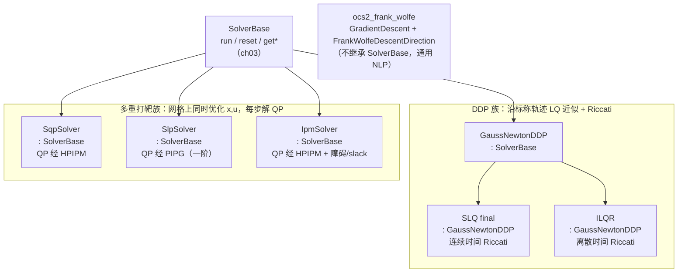

# 第 4 章：求解器与最优控制理论

本章承接 ch03。ch03 讲清了 [SolverBase](ocs2_oc/include/ocs2_oc/oc_solver/SolverBase.h#L54) 这个统一接口与 `ocs2_oc` 的共享机制；本章下钻到接口背后的**算法本身**——五个求解器包（`ocs2_ddp` / `ocs2_sqp` / `ocs2_slp` / `ocs2_ipm` / `ocs2_frank_wolfe`）各自用什么数值方法、`runImpl` 里在迭代什么。读者假设熟练 C++/Eigen 但**不熟悉最优控制理论**，所以前半部分先补够用的理论直觉（DP→DDP、KKT/SQP、多重打靶、内点法、增广拉格朗日/松弛障碍），后半部分把每段理论对照到具体源码。

一个总览性的结论先放这里：OCS2 的求解器分两族——

- **DDP 族**（`ocs2_ddp`）：沿一条标称轨迹做局部 LQ 近似，用 Riccati 反向扫掠求反馈策略，前向 rollout 更新轨迹。代表 `SLQ`（连续时间）/`iLQR`（离散时间）。
- **多重打靶族**（`ocs2_sqp` / `ocs2_slp` / `ocs2_ipm`）：在时间网格节点上同时优化状态与输入，每步迭代解一个 QP 子问题，差别只在"QP 怎么解"和"不等式怎么处理"。

此外 `ocs2_frank_wolfe` 是一个**通用的约束 NLP 工具箱**（条件梯度法），并不实现 `SolverBase`、不是 OC 求解器——它出现在仓库里主要是历史遗留与辅助用途，本章末尾单列说明。

## 学习目标

学完本章，你应该能回答：

1. DDP 为什么能避开动态规划的"维数灾难"？沿标称轨迹线性化动力学、二次化成本后，反向 Riccati 扫掠得到的 `K`（反馈增益）和 `l`（前馈项）分别对应什么物理直觉？前向 rollout 与线搜索为什么必要？
2. SLQ 与 iLQR 在 OCS2 里共享同一个基类 [GaussNewtonDDP](ocs2_ddp/include/ocs2_ddp/GaussNewtonDDP.h#L60)，区别只在 Riccati 方程的"连续 vs 离散"——这个区别在源码里体现在哪几个被 override 的虚函数上？
3. SQP 每次迭代解的 QP 子问题是怎么从非线性 OCP 构造出来的？为什么多重打靶（同时优化 `x` 和 `u`）比单打靶（只优化 `u`）更适合实时 MPC？
4. 同样解 QP，SQP 用 HPIPM（精确、基于分解）、SLP 用 PIPG（一阶、可并行）——两者的取舍是什么？IPM 又为何要引入 slack/对偶变量与障碍参数 μ？
5. 三条约束处理路线——DDP 的 merit+二次惩罚、SQP/SLP 的松弛障碍+投影、IPM 的内点障碍——分别适合什么场景？它们与 ch02 讲的 `ocs2_core` 的 `augmented_lagrangian` / `penalties` 是什么关系？

## 关键概念

### 求解器家族地图



注意：[PipgSolver](ocs2_slp/include/ocs2_slp/pipg/PipgSolver.h#L52) 与 [FrankWolfeDescentDirection](ocs2_frank_wolfe/include/ocs2_frank_wolfe/FrankWolfeDescentDirection.h#L48) 都不是 `SolverBase` 的派生——前者是 `SlpSolver` 内部持有的 QP 求解器，后者是 NLP 工具箱里的一个下降方向计算器。

### 从 DP 到 DDP

**动态规划（DP）**的最优性原理把求解最优控制转成求解**值函数** $V(x,t)$——从状态 $x$、时刻 $t$ 出发到末端的最小代价。连续时间下它满足 HJB 方程：

$$V_t + \min_u\bigl\{\ell(x,u,t) + V_x(x,t)^{\!\top} f(x,u,t)\bigr\} = 0$$

理论上解出 $V$ 就能顺手上出最优策略 $u^*(x,t)$。问题是 $V$ 是 $(x,t)$ 上的函数，状态维数一高就存不下、算不动——这就是"维数灾难"。

**微分动态规划（DDP）**的破局思路：不求全局 $V$，只围绕**一条标称轨迹** $\bar x(t),\bar u(t)$ 求一个**局部二次**值函数。三步：

1. **局部 LQ 近似**：把动力学在标称点线性化 $\delta\dot x \approx A\,\delta x + B\,\delta u$（$\delta x = x-\bar x$），把代价增量二次化。定义 Hamilton 量 $H(x,u,\lambda)=\ell+\lambda^{\!\top} f$，其 Hessian 给出 $H_{uu}$ 等。
2. **反向 Riccati 扫掠**：从末端 $V(T)$ 出发，沿时间**倒着**传播一个二次型 $V(\delta x,t)\approx \tfrac12\delta x^{\!\top} S\,\delta x + s^{\!\top}\delta x$。$S,s$ 满足 Riccati 方程（见下）。每一步顺带算出反馈增益 $K$ 与前馈项 $l$。
3. **前向 rollout**：用新策略 $\delta u = -K\,\delta x - \alpha\, l$（$\alpha$ 为步长）从 $x(t_0)$ 正向积分动力学，得到新轨迹，回代成新的标称轨迹。

> **为什么反向扫掠得到的 $K$ 是反馈、$l$ 是前馈？** $K$ 把"偏离标称的量 $\delta x$"压回去（闭环），$l$ 则是"标称点上还要加多少控制"（开环修正）。步长 $\alpha$ 用线搜索定——因为 LQ 近似只在标称点附近有效，走太大轨迹会跑出有效域、代价反而升。

**Gauss-Newton 近似**：OCS2 的 DDP 基类叫 [GaussNewtonDDP](ocs2_ddp/include/ocs2_ddp/GaussNewtonDDP.h#L60)，关键在计算 Hamilton 量 Hessian 时**丢弃二阶动力学项**（即不含 $f_{xx},f_{uu}$ 对 $S$ 的贡献），只保留 $\ell_{\bullet\bullet}+f_\bullet^{\!\top}S f_\bullet$ 形式。好处是 $H_{uu}\succeq 0$（半正定），反向扫掠稳定；代价是收敛速度从二阶降到一阶（类似 Gauss-Newton 比 Newton 慢但更稳）。当 $H_{uu}$ 仍然不正定（数值上），[HessianCorrection](ocs2_ddp/include/ocs2_ddp/HessianCorrection.h#L44) 里的 `DIAGONAL_SHIFT` / `CHOLESKY_MODIFICATION` / `EIGENVALUE_MODIFICATION` / `GERSHGORIN_MODIFICATION` 四种策略会把它修正成正定。

**连续 vs 离散**：
- **SLQ**（连续时间）：直接对连续动力学 $\dot x=f(x,u)$ 线性化，$S$ 满足 **Riccati 微分方程**，用 ODE 积分器（灵敏度积分）倒着积分。
- **iLQR**（离散时间）：先把动力学离散化 $x_{k+1}=f_d(x_k,u_k)$（通过 [DynamicsSensitivityDiscretizer](ocs2_ddp/include/ocs2_ddp/ILQR.h#L94)），$S$ 满足 **Riccati 差分方程**，逐节点倒推。

离散 Riccati 差分方程（iLQR 每步，结构清晰，便于对照）：

$$
\begin{aligned}
Q_{uu} &= \ell_{uu} + B^{\!\top} S_{k+1} B, &\quad Q_{ux} &= \ell_{ux} + B^{\!\top} S_{k+1} A \\
K_k &= Q_{uu}^{-1} Q_{ux}, &\quad l_k &= Q_{uu}^{-1} q_u \\
S_k &= Q_{xx} - Q_{xu}\,Q_{uu}^{-1} Q_{ux}
\end{aligned}
$$

其中 $Q_{xx}=\ell_{xx}+A^{\!\top}S_{k+1}A$，$A,B$ 是离散动力学在该节点的雅可比。新策略 $\delta u_k = -K_k\,\delta x_k - \alpha\, l_k$，rollout 后更新标称。

一轮 DDP 的数据流（反向扫掠 + 前向 rollout 交替）：

```
   末端 V(T) = final cost 的二次展开
        │  ◄── 从后往前：每节点算 K_k, l_k，并把 S_k 传给上一节点
        ▼
   tN-1 ──► tN-2 ──► ... ──► t0      （反向 Riccati 扫掠，多线程分段时间倒着跑）
        │                            每节点输出：反馈 K_k、前馈 l_k
        ▼
   unoptimizedController_           ← GaussNewtonDDP::calculateController 汇总
        │
        ▼  前向：x(t0)=initState, u = ū - α l - K(x-x̄)，积分动力学
   rolloutInitialController ─► searchStrategyPtr_->run(...)
        │  试步长 α（Armijo / LM 判据），接受则成新 nominal
        ▼
   optimizedPrimalSolution / optimizedDualSolution ─► 回灌成下一轮 nominal
```

**连续时间 Riccati（SLQ）的差别**：SLQ 不离散化，而是把 $S$（对称矩阵只存下三角 $n(n+1)/2$ 项 + 向量 $s_v$ + 标量 $s$，见 [s_vector_dim](ocs2_ddp/include/ocs2_ddp/riccati_equations/ContinuousTimeRiccatiEquations.h#L87)）展平成一个向量，当作一个 ODE 的状态，用积分器**倒着**积分。其右端函数 `computeFlowMap` 形如 $\dot S = -(Q_{xx} + A^{\!\top}S + SA - (SB+P)(R)^{-1}(\cdots))$（$R=H_{uu}$，[ContinuousTimeRiccatiEquations](ocs2_ddp/include/ocs2_ddp/riccati_equations/ContinuousTimeRiccatiEquations.h#L106) 里有 `computeFlowMapSLQ` 与一个 `computeFlowMapILEG` 变体）；模式切换时刻用 `computeJumpMap` 把 $S$ 跳变。事件处理是 SLQ 比 iLQR 复杂的地方——离散形式里事件只是多一个节点，连续形式里必须显式处理 ODE 的不连续。

### KKT 与 SQP

**Lagrangian 与 KKT**：带等式约束 $c(x)=0$ 的优化 $\min f(x)$，构造 Lagrangian $\mathcal{L}=f+\lambda^{\!\top}c$。最优性（KKT）条件是 $\nabla_x\mathcal{L}=0$ 且 $c=0$。不等式再加互补松弛 $\mu\ge0,\,g\le0,\,\mu\odot g=0$。

**序列二次规划（SQP）**：在当前迭代点 $x_k$，把约束线性化 $c(x_k+\delta)\approx c_k + C_k\delta$、把目标做成二次模型 $\tfrac12\delta^{\!\top}W_k\delta + g_k^{\!\top}\delta$（$W_k$ 是 Lagrangian 的 Hessian，或其拟牛顿近似），解一个 QP 子问题得到 $\delta$，线搜索后 $x_{k+1}=x_k+\alpha\delta$。SQP 的"每次迭代解一个 QP"正对应 OCS2 里 [SqpSolver::setupQuadraticSubproblem](ocs2_sqp/ocs2_sqp/include/ocs2_sqp/SqpSolver.h#L122) → `getOCPSolution` → `takeStep` 的三段式。

### 多重打靶

**单打靶**只在输入 $u_0,\dots,u_{N-1}$ 上优化，状态由初值 $x_0$ 积分决定 $x_k=\Phi(x_{k-1},u_{k-1})$。问题：对不稳定系统，$x_k$ 对 $u$ 极敏感，QP 严重病态。

**多重打靶**把状态也当独立变量 $\{x_0,\dots,x_N\}\cup\{u_0,\dots,u_{N-1}\}$，但加**动力学连续性约束**把它们缝起来：

$$x_{k+1} = \Phi(x_k, u_k) \quad\text{（连续时间则 } x_{k+1} = x_k + \int_{t_k}^{t_{k+1}} f\,\mathrm{d}t\text{）}$$

```
时间网格:  t0 ─── t1 ─── t2 ─── ... ─── tN
状态节点:  x0     x1     x2            xN      ← 全是独立变量
输入:      u0     u1     ...  u_{N-1}
连续性:    x1=Φ(x0,u0)  x2=Φ(x1,u1)  ...     ← 等式约束
```

好处：每个节点的 LQ 近似只涉及局部量，QP 稀疏且良态；初值不稳也不会放大。OCS2 的 SQP/SLP/IPM 全是多重打靶，连续性约束就是 QP 里的动力学等式约束行。

### 内点法（IPM）

内点法处理不等式 $g(x)\le0$ 的办法：引入**障碍函数**把不等式塞进目标。对数障碍 $-\mu\sum\log(-g_i)$ 当 $g_i\to0^-$ 时趋向 $+\infty$，从而把迭代点"挡"在可行域内部；当 $\mu\to0$ 时障碍子问题的解收敛到原问题解。

**原始-对偶内点法**（OCS2 的 [IpmSolver](ocs2_ipm/include/ocs2_ipm/IpmSolver.h#L51) 采用）进一步引入**松弛变量** $s\ge0$ 使 $g(x)+s=0$，并对偶变量 $\lambda\ge0$。每次迭代：固定障碍参数 $\mu$，解一个 KKT 线性化得到的 QP 子问题，做一步原始步 + 对偶步（用 fraction-to-boundary 规则保证 $s,\lambda$ 不越界），然后**降低 $\mu$**。$\mu$ 的下降策略（线性 `barrierLinearDecreaseFactor`、超线性 `barrierSuperlinearDecreasePower`）与 IPOPT 一致。

### 约束处理：增广拉格朗日 vs 松弛障碍

这里有**两层**，容易混，务必分清：

**第一层——问题级（ch02 已讲）**：用户在 `OptimalControlProblem` 里把某个约束放进 `softConstraintPtr` 或 `equalityLagrangianPtr`/`inequalityLagrangianPtr` 槽，意味着这条约束允许被软化为代价。OCS2 用 [ocs2_core/augmented_lagrangian](ocs2_core/include/ocs2_core/augmented_lagrangian/StateInputAugmentedLagrangianInterface.h#L41) 的 `updateLagrangian` 做乘子更新（增广项 $\tfrac\rho2\|c\|^2+\lambda^{\!\top}c$），用 [ocs2_core/penalties](ocs2_core/include/ocs2_core/penalties/Penalties.h#L38) 里的 `RelaxedBarrierPenalty`/`SquaredHingePenalty`（及其 `augmented/` 变体 `ModifiedRelaxedBarrierPenalty`/`SlacknessSquaredHingePenalty`）作不等式的光滑惩罚函数。这一层对所有求解器通用，因为它把约束变成了代价项，求解器只看到一个"更胖的代价"。

**第二层——求解器级**：每个求解器还有自己对**硬约束**的处理：

- **DDP**：用 merit 函数 + 二次惩罚。`constraintPenaltyInitialValue_`/`constraintPenaltyIncreaseRate_` 控制惩罚系数初值与增长率，每轮 [updateConstraintPenalties](ocs2_ddp/include/ocs2_ddp/GaussNewtonDDP.h#L311) 按约束违反 SSE 加大惩罚。
- **SQP/SLP**：等式（含状态-输入等式 `Cx+Du+e=0`）用**投影法**（`projectStateInputEqualityConstraints`），把约束消到零空间里；不等式用**松弛障碍**参数 `inequalityConstraintMu`/`inequalityConstraintDelta`，即在 QP 代价里加一个松弛障碍项。
- **IPM**：不等式用**真正的内点障碍**——显式 slack/对偶变量 + 障碍参数 $\mu$ + fraction-to-boundary 步长 + $\mu$ 下降（见上）。这是三条路线里对不等式最"硬核"的。

一句话区分：松弛障碍是"把不等式光滑地塞进代价，$\mu$ 固定"（简单、可微、但只是近似）；内点障碍是"显式跟踪 slack/对偶，$\mu$ 动态下降到 0"（精确收敛、但变量更多）。

## 代码走读

### SLQ / iLQR（ocs2_ddp）

**类层级**：[GaussNewtonDDP](ocs2_ddp/include/ocs2_ddp/GaussNewtonDDP.h#L60) 是 DDP 算法的实现主体（`: public SolverBase`），把"沿标称轨迹迭代"的主循环、LQ 近似、控制器计算、线搜索都放这里；[SLQ](ocs2_ddp/include/ocs2_ddp/SLQ.h#L43)（`final`）与 [ILQR](ocs2_ddp/include/ocs2_ddp/ILQR.h#L43) 都是 `: public GaussNewtonDDP`，只 override 几个与 Riccati 形式相关的纯虚函数。选哪种由 [ddp::Settings::algorithm_](ocs2_ddp/include/ocs2_ddp/DDP_Settings.h#L65)（`Algorithm::SLQ` 或 `Algorithm::ILQR`）决定。

**主循环**（[GaussNewtonDDP::runImpl](ocs2_ddp/src/GaussNewtonDDP.cpp#L980)，`while(true)`）每轮做四件事：

```
近似 → 反向 Riccati → 算控制器 → 前向步 + 线搜索 → 查收敛
  approximateOptimalControlProblem()      // GaussNewtonDDP.h:292 / cpp:1039
  solveSequentialRiccatiEquations(...)    // 虚，SLQ/iLQR 各自实现
  calculateController()                   // GaussNewtonDDP.h:266 / cpp:1049
  takePrimalDualStep(lqModelExpectedCost) // GaussNewtonDDP.h:325 / cpp:1056
    └─ searchStrategyPtr_->run(...)       // 内部做前向 rollout + 线搜索
  searchStrategyPtr_->checkConvergence()  // cpp:1068
  updateConstraintPenalties(...)         // cpp:1077（违反大则加惩罚）
```

- **近似** [approximateOptimalControlProblem](ocs2_ddp/include/ocs2_ddp/GaussNewtonDDP.h#L292)：沿 nominal 轨迹在每个节点把 OCP 展成 LQ（线性动力学 + 二次代价 + 线性约束），多线程跑 `approximateIntermediateLQ`（虚）。
- **反向 Riccati**：基类提供 [solveSequentialRiccatiEquationsImpl](ocs2_ddp/include/ocs2_ddp/GaussNewtonDDP.h#L184)，把时间分段丢给工作线程；每个工作线程调 `riccatiEquationsWorker`（虚）做实际的反向传播。SLQ 用 [ContinuousTimeRiccatiEquations](ocs2_ddp/include/ocs2_ddp/riccati_equations/ContinuousTimeRiccatiEquations.h#L106)（`: public OdeBase`，把 $S$ 展平成向量后用 ODE 积分器倒着积分，事件时刻用 `computeJumpMap` 处理模式切换），iLQR 用 [DiscreteTimeRiccatiEquations](ocs2_ddp/include/ocs2_ddp/riccati_equations/DiscreteTimeRiccatiEquations.h#L71)（逐节点 Riccati 差分方程，`computeMapILQR`）。这就是"连续 vs 离散"在源码里的全部落点。
- **算控制器** [calculateController](ocs2_ddp/include/ocs2_ddp/GaussNewtonDDP.h#L266)：从对偶解（Riccati 结果）在每个节点算出前馈 `l` + 反馈 `K`，写入 `unoptimizedController_`（之所以叫 unoptimized 是还没经线搜索）。具体每个节点的计算由虚函数 `calculateControllerWorker` 完成。
- **前向步 + 线搜索** [takePrimalDualStep](ocs2_ddp/include/ocs2_ddp/GaussNewtonDDP.h#L325) 把活交给 `searchStrategyPtr_`，它内部做 rollout 并按策略接受/拒绝。成员 [searchStrategyPtr_](ocs2_ddp/include/ocs2_ddp/GaussNewtonDDP.h#L360) 的类型是 [SearchStrategyBase](ocs2_ddp/include/ocs2_ddp/search_strategy/SearchStrategyBase.h#L59)。

**步长策略**（[StrategySettings.h](ocs2_ddp/include/ocs2_ddp/search_strategy/StrategySettings.h)）：[Type](ocs2_ddp/include/ocs2_ddp/search_strategy/StrategySettings.h#L49) 枚举只有两个值——`LINE_SEARCH` 与 `LEVENBERG_MARQUARDT`（注释里提到 trust-region 但枚举并未实现）。
- `LINE_SEARCH`：前向 rollout 试不同步长 $\alpha$，用 Armijo 条件接受。设置在 [line_search::Settings](ocs2_ddp/include/ocs2_ddp/search_strategy/StrategySettings.h#L87)：`minStepLength`/`maxStepLength`/`contractionRate`/`armijoCoefficient`，以及 Hessian 不正定时的修正策略 `hessianCorrectionStrategy`。
- `LEVENBERG_MARQUARDT`：不靠缩放步长，而是给 Riccati 加正则（增广 Hamilton Hessian，见 `augmentHamiltonianHessian`），用实际下降/预测下降比 `minAcceptedPho` 决定接受与否，连续拒绝 `maxNumSuccessiveRejections` 次则调正则。设置在 [levenberg_marquardt::Settings](ocs2_ddp/include/ocs2_ddp/search_strategy/StrategySettings.h#L121)。

**DDP 设置**（[ddp::Settings](ocs2_ddp/include/ocs2_ddp/DDP_Settings.h#L63)，注意字段带尾下划线）：关键项——`algorithm_`（SLQ/ILQR）、`maxNumIterations_`（默认 15）、`minRelCost_`（相对代价变化终止，1e-3）、`constraintTolerance_`（约束 ISE 容差）、`backwardPassIntegratorType_`（SLQ 积分 Riccati / iLQR 离散化 LQ 用）、`useFeedbackPolicy_`（解里给反馈策略还是仅前馈轨迹）、`riskSensitiveCoeff_`（风险敏感 DDP，非零开启）、`nThreads_`。约束惩罚初值与增长率 `constraintPenaltyInitialValue_`/`constraintPenaltyIncreaseRate_` 控制上面说的 merit 惩罚。

### SQP（ocs2_sqp）

[SqpSolver](ocs2_sqp/ocs2_sqp/include/ocs2_sqp/SqpSolver.h#L51)（`: public SolverBase`）是多重打靶 SQP。`runImpl` 里每轮：

1. [setupQuadraticSubproblem](ocs2_sqp/ocs2_sqp/include/ocs2_sqp/SqpSolver.h#L122)：在当前 $\{t,x(t),u(t)\}$ 上离散化动力学、把代价/约束线性二次化，得到 LQ 数据（`cost_`/`dynamics_`/`stateInputEqConstraints_`/`stateIneqConstraints_` 等），同时返回当前性能指标 `PerformanceIndex`。
2. [getOCPSolution](ocs2_sqp/ocs2_sqp/include/ocs2_sqp/SqpSolver.h#L135)：把 LQ 数据组装成一个稀疏 QP（决策变量 $\delta x,\delta u$，约束 = 动力学连续性 + 线性化约束），交给 [HpipmInterface](ocs2_sqp/hpipm_catkin/include/hpipm_catkin/HpipmInterface.h#L49) 解，返回增量解 $\{\delta x,\delta u\}$ 与 Armijo 下降度量。
3. [takeStep](ocs2_sqp/ocs2_sqp/include/ocs2_sqp/SqpSolver.h#L144)：线搜索（步长从 1 开始按 `alpha_decay` 缩），用 `g_max`/`g_min`/`armijoFactor`/`gamma_c` 三段式判据接受，更新 $x\leftarrow x+\alpha\delta x$、$u\leftarrow u+\alpha\delta u$。
4. [checkConvergence](ocs2_sqp/ocs2_sqp/include/ocs2_sqp/SqpSolver.h#L149)：RMS 增量小于 `deltaTol` 且代价变化小于 `costTol` 则收敛。

一次 SQP 外迭代的调用序列（与 iLQR 的"反向+前向"两段式对照——SQP 是"构造 QP→解 QP→线搜索"三段式，且 QP 一次解出全时域增量）：

```
   {t, x(t), u(t)}  ──setupQuadraticSubproblem──►  LQ 数据 (cost_/dynamics_/constraints_*) + PerformanceIndex
                                                          │
                                  稀疏 QP 组装          │  (决策变量 δx,δu；等式行=动力学连续性+线性化约束)
                                                          ▼
                                               HpipmInterface.solve()  ──►  {δx, δu} + armijoDescentMetric
                                                          │
                                                          ▼
                                          takeStep：α=1 起按 alpha_decay 缩
                                          g_max/g_min/armijoFactor/gamma_c 三段判据接受
                                                          │
                                                          ▼
                                          x ← x + α·δx,  u ← u + α·δu   ──►  下一轮 nominal
```

**QP 求解器 HPIPM/BLASFEO**：`ocs2_sqp` 下有同级子目录 `hpipm_catkin` 与 `blasfeo_catkin`——它们在本 ros2 分支是 `ament_cmake` 包，但仍保留旧的 `*_catkin` 名字。`hpipm_catkin` 提供 [HpipmInterface](ocs2_sqp/hpipm_catkin/include/hpipm_catkin/HpipmInterface.h#L49)（"OCS2 的 LQ OC 问题与 HPIPM 求解器之间的接口"）与 [HpipmInterfaceSettings](ocs2_sqp/ocs2_sqp/include/ocs2_sqp/SqpSettings.h#L61)（`hpipmSettings`）。BLASFEO 是 HPIPM 底层的稠密线性代数后端。这是"精确、基于矩阵分解"的 QP 解法。

**约束处理**：状态-输入等式约束 $Cx+Du+e=0$ 用投影法（`projectStateInputEqualityConstraints=true`，把约束消到零空间，避免在 QP 里显式成等式行）；不等式用松弛障碍项 `inequalityConstraintMu`/`inequalityConstraintDelta`。线搜索用的是 `ocs2_oc` 的 [FilterLinesearch](ocs2_oc/include/ocs2_oc/search_strategy/FilterLinesearch.h)（过滤线搜索，不是 DDP 的 Armijo 线搜索）。

**SQP 设置**（[sqp::Settings](ocs2_sqp/ocs2_sqp/include/ocs2_sqp/SqpSettings.h#L40)，字段**不带**尾下划线）：`sqpIteration`（默认 10）、`deltaTol`/`costTol`（终止）、`alpha_decay`/`alpha_min`（步长）、`g_max`/`g_min`/`armijoFactor`/`gamma_c`（接受判据）、`useFeedbackPolicy`/`createValueFunction`、`dt`/`integratorType`（离散化）、`inequalityConstraintMu`/`inequalityConstraintDelta`、`projectStateInputEqualityConstraints`/`extractProjectionMultiplier`、`nThreads`。

### SLP（ocs2_slp）

[SlpSolver](ocs2_slp/include/ocs2_slp/SlpSolver.h#L49)（`: public SolverBase`）的结构与 SQP **几乎逐方法对应**（`setupQuadraticSubproblem`/`getOCPSolution`/`takeStep`/`checkConvergence`），唯一的实质差别在 [getOCPSolution](ocs2_slp/include/ocs2_slp/SlpSolver.h#L137) 用的 QP 求解器：SQP 是 `hpipmInterface_`（HPIPM），SLP 是 [pipgSolver_](ocs2_slp/include/ocs2_slp/SlpSolver.h#L159)（[PipgSolver](ocs2_slp/include/ocs2_slp/pipg/PipgSolver.h#L52)）。

**关于命名（计划描述与源码不符之处，如实说明）**：[SlpSettings](ocs2_slp/include/ocs2_slp/SlpSettings.h#L41) 的注释写 "Multiple-shooting SLP (Successive Linear Programming)"，但实现上 `setupQuadraticSubproblem` 构造的是**二次**代价（`cost_` 是 `ScalarFunctionQuadraticApproximation`），PIPG 的 `solve` 也接收二次代价并设了 Hessian 下界 `lowerBoundH`。所以 SLP 实际解的是"逐次 QP"，与 SQP 的差别只在"QP 怎么解"——HPIPM（精确分解）vs PIPG（一阶、可并行），而不是"LP vs QP"。"Successive Linear Programming"是历史/遗留命名。

**PIPG 是什么**：[PipgSolver](ocs2_slp/include/ocs2_slp/pipg/PipgSolver.h#L52) 头注释写明它是 "Proportional-Integral Projected Gradient Method"（arxiv 2009.06980），一种**一阶原始-对偶方法**：不分解矩阵，而是反复做原始/对偶变量的梯度投影步，可在 `ThreadPool` 上并行化。优势是单步便宜、可并行、对大规模稀疏 QP 友好；劣势是收敛慢、精度受容差 `absoluteTolerance`/`relativeTolerance` 限制，需要预处理（`scalingIteration` 轮缩放）。`SlpSolver` 因此多了 `lambdaEstimation_`/`sigmaEstimation_`/`preConditioning_` 等计时器。

**SLP 设置**（[slp::Settings](ocs2_slp/include/ocs2_slp/SlpSettings.h#L41)）：`slpIteration`、`scalingIteration`（预处理轮数，SQP 无此项）、`deltaTol`/`costTol`、线搜索四件套、`dt`/`integratorType`、`inequalityConstraintMu`/`inequalityConstraintDelta`、`pipgSettings`（嵌套 [pipg::Settings](ocs2_slp/include/ocs2_slp/pipg/PipgSettings.h#L37)：`maxNumIterations` 默认 3000、`absoluteTolerance`/`relativeTolerance`、`checkTerminationInterval`、`lowerBoundH`）。注意 SLP **没有** `createValueFunction`（`getValueFunction` 直接抛 not available），也**没有** `projectStateInputEqualityConstraints`（只有 `extractProjectionMultiplier`）。

### IPM（ocs2_ipm）

[IpmSolver](ocs2_ipm/include/ocs2_ipm/IpmSolver.h#L51)（`: public SolverBase`）是非线性原始-对偶内点法。它也多重打靶、也用 HPIPM 解 QP，但 QP 里多了**障碍项**，并且维护显式的 slack/对偶轨迹。每轮：

1. [initializeSlackDualTrajectory](ocs2_ipm/include/ocs2_ipm/IpmSolver.h#L128)：给不等式约束的松弛 $s\ge0$ 与对偶 $\lambda\ge0$ 初值（`initialSlackLowerBound`/`initialSlackMarginRate` 等，IPOPT 风格）。
2. [setupQuadraticSubproblem](ocs2_ipm/include/ocs2_ipm/IpmSolver.h#L133)：在当前 $\{x,u,\lambda_{\text{costate}},\nu,s\}$ 上构造带障碍项的 QP（传入 `barrierParam`）。
3. [getOCPSolution](ocs2_ipm/include/ocs2_ipm/IpmSolver.h#L158)：解 QP，返回**比 SQP 更多的增量**——除了 $\delta x,\delta u$，还有 $\delta\lambda_{\text{costate}}$（costate）、$\delta\nu$（投影乘子）、$\delta s$（slack）、$\delta\lambda$（对偶），以及原始/对偶最大步长。
4. [takePrimalStep](ocs2_ipm/include/ocs2_ipm/IpmSolver.h#L171)：原始步，用 `fractionToBoundaryMargin`（=IPOPT 的 $\tau$）保证 $s$ 不触界。
5. [takeDualStep](ocs2_ipm/include/ocs2_ipm/IpmSolver.h#L177)：对偶步更新 $\lambda_{\text{costate}},\nu,\lambda$。
6. [updateBarrierParameter](ocs2_ipm/include/ocs2_ipm/IpmSolver.h#L181)：按代价/约束下降情况降低 $\mu$（线性因子 `barrierLinearDecreaseFactor`、超线性幂 `barrierSuperlinearDecreasePower`），直到 `targetBarrierParameter`。
7. [checkConvergence](ocs2_ipm/include/ocs2_ipm/IpmSolver.h#L184)：带 $\mu$ 的收敛判断。

**障碍 QP 的结构**：IPM 在 [setupQuadraticSubproblem](ocs2_ipm/include/ocs2_ipm/IpmSolver.h#L133) 里把每个不等式约束 $g(x,u)\le0$ 替换成 $g(x,u)+s=0,\,s\ge0$，并在代价里加障碍项 $\mu\,\phi(s)$（$\phi$ 是对数障碍的一阶/二阶展开）。于是 QP 的决策变量除了 $\delta x,\delta u$ 还含 $\delta s,\delta\lambda$，约束矩阵里多了 slack 行。这就是为什么 [OcpSubproblemSolution](ocs2_ipm/include/ocs2_ipm/IpmSolver.h#L145) 比 SQP 的同名结构多出 `deltaSlackStateIneq`/`deltaDualStateIneq`/`deltaSlackStateInputIneq`/`deltaDualStateInputIneq` 四组——它们是不等式 slack/对偶的增量。costate $\lambda$（状态-输入等式的拉格朗日乘子）与投影乘子 $\nu$ 也被显式跟踪（`costateTrajectory_`/`projectionMultiplierTrajectory_`），所以 IPM 能给出真正的对偶解（`getDualSolution` 返回 `dualIneqTrajectory_`，非 null）。

**$\mu$ 的下降**：[updateBarrierParameter](ocs2_ipm/include/ocs2_ipm/IpmSolver.h#L181) 在每步后判断——若代价与约束违反都达标（`barrierReductionCostTol`/`barrierReductionConstraintTol`），则按 `barrierLinearDecreaseFactor`（线性，$\mu\leftarrow\mu\cdot f$）或 `barrierSuperlinearDecreasePower`（超线性，$\mu\leftarrow\mu^{p}$）降 $\mu$，直到 `targetBarrierParameter`。整个外循环就是"固定 $\mu$ 解 QP → 原始/对偶步 → 降 $\mu$"，$\mu\to0$ 时 slack 趋紧、解趋近原问题。

**IPM 设置**（[ipm::Settings](ocs2_ipm/include/ocs2_ipm/IpmSettings.h#L40)）：`ipmIteration`、`deltaTol`/`costTol`、线搜索四件套、`useFeedbackPolicy`/`createValueFunction`/`computeLagrangeMultipliers`、`hpipmSettings`、`dt`/`integratorType`、**障碍组** `initialBarrierParameter`/`targetBarrierParameter`/`barrierReductionCostTol`/`barrierReductionConstraintTol`/`barrierLinearDecreaseFactor`/`barrierSuperlinearDecreasePower`、**初始化组** `initialSlackLowerBound`/`initialDualLowerBound`/`initialSlackMarginRate`/`initialDualMarginRate`、**步长组** `fractionToBoundaryMargin`/`usePrimalStepSizeForDual`。IPM 能解对偶解（`getDualSolution` 非 null，返回 `dualIneqTrajectory_`）。

### Frank-Wolfe（ocs2_frank_wolfe）——通用 NLP，非 OC 求解器

**重要澄清（与计划描述的出入）**：`ocs2_frank_wolfe` **不实现** `SolverBase`、不是 OC 求解器，而是求解**静态约束 NLP** $\min f(p)$ s.t. $Ap\le b$ 的一阶工具箱。两个主角：

- [GradientDescent](ocs2_frank_wolfe/include/ocs2_frank_wolfe/GradientDescent.h#L57)：一个一阶迭代框架（尽管类名叫梯度下降，头注释说它"implements the Frank-Wolfe algorithm"）。`run` 接初值、代价接口 [NLP_Cost](ocs2_frank_wolfe/include/ocs2_frank_wolfe/NLP_Cost.h) 与约束接口 [NLP_Constraints](ocs2_frank_wolfe/include/ocs2_frank_wolfe/NLP_Constraints.h)，内部做线搜索（`lineSearch`，可升/降序）。
- [FrankWolfeDescentDirection](ocs2_frank_wolfe/include/ocs2_frank_wolfe/FrankWolfeDescentDirection.h#L48)：计算 Frank-Wolfe 下降方向——即解一个**线性规划** $\min \nabla f^{\!\top}d$ s.t. 域约束，得到条件梯度方向。这里用了 **GLPK**（GNU Linear Programming Kit，`#include <glpk.h>`）。

**Frank-Wolfe（条件梯度法）直觉**：要在一个多面体可行域上最小化可微 $f$，每次迭代在当前点线性化目标 $\approx f(p)+\nabla f^{\!\top}(d-p)$，解 LP 得到顶点方向 $d^*$，沿 $p\to d^*$ 线搜索。好处是只要能解 LP 就行、不需要投影、适合可行域是简单多面体的场合。

**设置** [NLP_Settings](ocs2_frank_wolfe/include/ocs2_frank_wolfe/NLP_Settings.h#L39) 是个**类**（不是 `struct`，且字段带尾下划线）：`displayInfo_`/`maxIterations_`（默认 1000）/`minRelCost_`/`maxLearningRate_`/`minLearningRate_`/`useAscendingLineSearchNLP_`。

因为不实现 `SolverBase`，`ocs2_frank_wolfe` 与 MPC/OCP 主线无直接耦合；它更多是仓库里独立的最优化工具。多数机器人用户不会直接用到它。

### 数值稳定性与正则化（横切）

所有迭代法都要对付"子问题不正定/不可行"。OCS2 各求解器的正则化手段各有落点，对照看更能理解设置项的用途：

- **DDP**：$H_{uu}$ 不正定时由 [HessianCorrection](ocs2_ddp/include/ocs2_ddp/HessianCorrection.h#L44) 的四种策略修正（`DIAGONAL_SHIFT` 最常用，直接加 $\epsilon I$）。若选 `LEVENBERG_MARQUARDT` 策略，则不走步长线搜索，而是给 Riccati 加正则项（`augmentHamiltonianHessian`），用实际/预测下降比 `minAcceptedPho` 决策，连续拒绝 `maxNumSuccessiveRejections` 次后调大正则。
- **SQP/IPM**：QP 经 HPIPM 解，正定性由 HPIPM 内部处理；不等式靠松弛障碍（SQP）或障碍+fraction-to-boundary（IPM）保持迭代点在域内。IPM 的 `fractionToBoundaryMargin`（默认 0.995，=IPOPT 的 $\tau$）刻意不让 slack 贴到 0，避免对数障碍发散。
- **SLP/PIPG**：一阶方法需要强凸性保证收敛，故 [pipg::Settings::lowerBoundH](ocs2_slp/include/ocs2_slp/pipg/PipgSettings.h#L46) 给代价 Hessian 设一个静态下界（默认 5e-6），并用 `scalingIteration` 轮预处理（行/列缩放）改善条件数——这是 PIPG 相对 HPIPM 多出来的调参负担。

另外，三个多重打靶求解器共用 [FilterLinesearch](ocs2_oc/include/ocs2_oc/search_strategy/FilterLinesearch.h)（过滤线搜索：维护一个"代价-约束违反"过滤集，新点只要不被旧点支配就接受，比 Armijo 更不易卡住），而 DDP 用的是自家的 [SearchStrategyBase](ocs2_ddp/include/ocs2_ddp/search_strategy/SearchStrategyBase.h#L59) 体系（Armijo 或 LM）。

## 选型建议表

| 求解器 | 主类（继承） | 时间形式 | 多重打靶 | QP/子问题解法 | 不等式处理 | 典型外迭代 | 适用场景 |
| --- | --- | --- | --- | --- | --- | --- | --- |
| SLQ | [SLQ](ocs2_ddp/include/ocs2_ddp/SLQ.h#L43) `: GaussNewtonDDP` | 连续 | 否（标称轨迹） | 反向 Riccati ODE | merit+二次惩罚 | ~15 | 连续动力学、要值函数/Hamiltonian、可用灵敏度积分器 |
| iLQR | [ILQR](ocs2_ddp/include/ocs2_ddp/ILQR.h#L43) `: GaussNewtonDDP` | 离散 | 否 | 反向 Riccati 差分 | merit+二次惩罚 | ~15 | 离散动力学/已离散化、状态维高时比 SLQ 便宜 |
| SQP | [SqpSolver](ocs2_sqp/ocs2_sqp/include/ocs2_sqp/SqpSolver.h#L51) `: SolverBase` | 离散 | 是 | HPIPM（精确分解） | 松弛障碍+投影 | ~10 | 通用首选、约束多、要精度 |
| SLP | [SlpSolver](ocs2_slp/include/ocs2_slp/SlpSolver.h#L49) `: SolverBase` | 离散 | 是 | PIPG（一阶、并行） | 松弛障碍 | ~10 + 内层 3000 | 大规模稀疏 QP、看重并行/单步成本、可接受一阶精度 |
| IPM | [IpmSolver](ocs2_ipm/include/ocs2_ipm/IpmSolver.h#L51) `: SolverBase` | 离散 | 是 | HPIPM + 障碍 | 真内点（slack/对偶/μ） | ~10 | 需要精确对偶解、不等式多且需严格可行 |
| Frank-Wolfe | [GradientDescent](ocs2_frank_wolfe/include/ocs2_frank_wolfe/GradientDescent.h#L57)（非 SolverBase） | — | — | GLPK 解 LP | 多面体域 | ~1000 | 静态约束 NLP、可行域为多面体，与 MPC 无关 |

> 选型直觉：先用 **SQP**（最稳、接口最全，能出值函数/对偶）；状态维很高、QP 规模大、要榨并行性时试 **SLP**；不等式约束硬、要精确乘子时考虑 **IPM**；连续时间动力学、需要 Hamiltonian/值函数查询时用 **SLQ**。

## 速查表

| 求解器包 | 主类 | Settings | 子问题解法 | 一句话算法 |
| --- | --- | --- | --- | --- |
| `ocs2_ddp` | [GaussNewtonDDP](ocs2_ddp/include/ocs2_ddp/GaussNewtonDDP.h#L60) / [SLQ](ocs2_ddp/include/ocs2_ddp/SLQ.h#L43) / [ILQR](ocs2_ddp/include/ocs2_ddp/ILQR.h#L43) | [ddp::Settings](ocs2_ddp/include/ocs2_ddp/DDP_Settings.h#L63) + [search_strategy](ocs2_ddp/include/ocs2_ddp/search_strategy/StrategySettings.h#L49) | 反向 Riccati（连续 ODE / 离散差分） | 沿标称轨迹 LQ 近似 → 反向 Riccati 得 $K,l$ → 前向 rollout + 线搜索 |
| `ocs2_sqp` | [SqpSolver](ocs2_sqp/ocs2_sqp/include/ocs2_sqp/SqpSolver.h#L51) | [sqp::Settings](ocs2_sqp/ocs2_sqp/include/ocs2_sqp/SqpSettings.h#L40) | HPIPM（精确 QP） | 多重打靶，每轮构造稀疏 QP 交 HPIPM，过滤线搜索接受步 |
| `ocs2_slp` | [SlpSolver](ocs2_slp/include/ocs2_slp/SlpSolver.h#L49) | [slp::Settings](ocs2_slp/include/ocs2_slp/SlpSettings.h#L41) + [pipg::Settings](ocs2_slp/include/ocs2_slp/pipg/PipgSettings.h#L37) | PIPG（一阶原始-对偶） | 与 SQP 同结构，但 QP 由一阶并行 PIPG 解（命名"Successive Linear Programming"实为逐次 QP） |
| `ocs2_ipm` | [IpmSolver](ocs2_ipm/include/ocs2_ipm/IpmSolver.h#L51) | [ipm::Settings](ocs2_ipm/include/ocs2_ipm/IpmSettings.h#L40) | HPIPM + 障碍/slack | 多重打靶 + 原始-对偶内点：固定 μ 解 QP，原始/对偶步 fraction-to-boundary，降 μ |
| `ocs2_frank_wolfe` | [GradientDescent](ocs2_frank_wolfe/include/ocs2_frank_wolfe/GradientDescent.h#L57) + [FrankWolfeDescentDirection](ocs2_frank_wolfe/include/ocs2_frank_wolfe/FrankWolfeDescentDirection.h#L48) | [NLP_Settings](ocs2_frank_wolfe/include/ocs2_frank_wolfe/NLP_Settings.h#L39) | GLPK 解 LP | 条件梯度法：线性化目标解 LP 得顶点方向，沿多面体边线搜索（非 SolverBase） |

---

> **阅读建议**：第一次接触 OCS2 求解器时，建议先读 [SqpSolver](ocs2_sqp/ocs2_sqp/include/ocs2_sqp/SqpSolver.h#L51)——它的 `runImpl` 结构最清晰（构造 QP → 解 QP → 线搜索 → 收敛判断），且 [SqpSettings](ocs2_sqp/ocs2_sqp/include/ocs2_sqp/SqpSettings.h#L40) 字段命名直白。读懂 SQP 后，[SlpSolver](ocs2_slp/include/ocs2_slp/SlpSolver.h#L49) 只需对比"PIPG vs HPIPM"，[IpmSolver](ocs2_ipm/include/ocs2_ipm/IpmSolver.h#L51) 只需对比"障碍/slack 多了哪些变量"。DDP 族单独成体系，建议从 [GaussNewtonDDP::runImpl](ocs2_ddp/src/GaussNewtonDDP.cpp#L980) 的主循环入手，再进 [riccati_equations/](ocs2_ddp/include/ocs2_ddp/riccati_equations/) 看反向扫掠的连续/离散实现。所有求解器的 `*Settings` 都能从 `.info` 配置加载（`loadSettings`，字段名见速查表），机器人例子的 `config/mpc/task.info` 里对应 `ddp`/`multiple_shooting`/`ipm`/`pipg` 段。

> 衔接：本章把五个求解器包的算法讲完。下一章（`05-*.md`，尚未撰写）将进入 `ocs2_mpc`，看一个 `SolverBase` 求解器如何被包进 MPC 循环、`MRT_BASE`/`MPC_MRT_Interface` 如何在进程内驱动它、以及 `ocs2_ros_interfaces` 里解耦的 ROS 节点变体。
