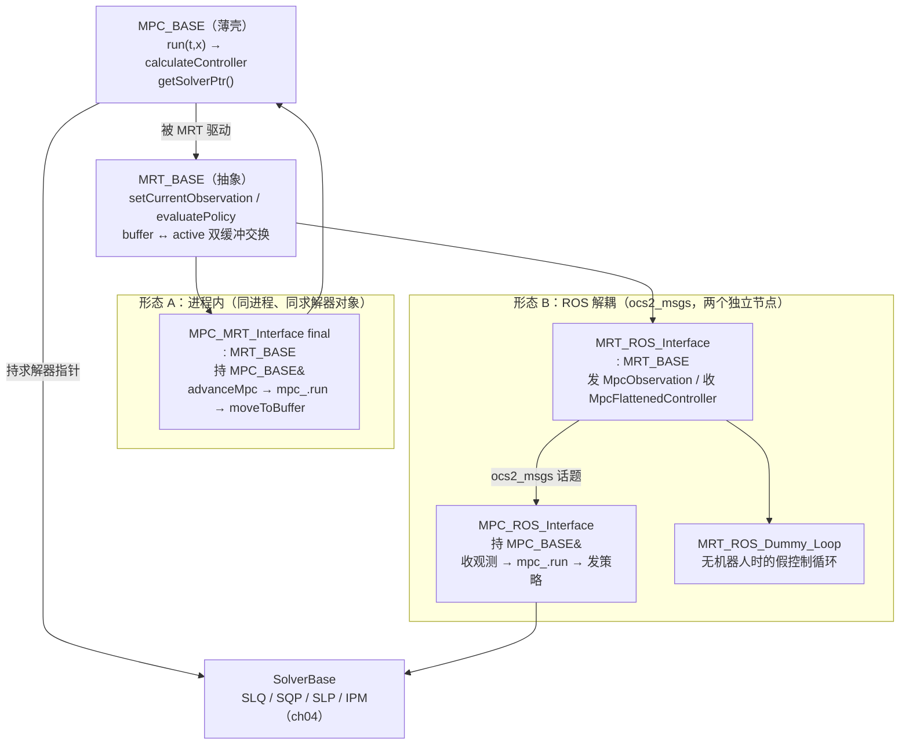

# 第 5 章：MPC 层——把求解器包成实时控制循环

本章承接 ch04。ch04 讲清了五个 [SolverBase](ocs2_oc/include/ocs2_oc/oc_solver/SolverBase.h#L54) 求解器的算法本身；本章回答紧接着的工程问题：**一个一次 `run` 要几十毫秒的求解器，怎么被包进一个要按几百 Hz 查询控制量的实时控制循环？** 答案分两层：[ocs2_mpc](ocs2_mpc/include/ocs2_mpc/MPC_BASE.h) 把求解器包成一个"给定 (t,x) 就向前解一段时域"的 MPC 循环，[MRT_BASE](ocs2_mpc/include/ocs2_mpc/MRT_BASE.h#L58)（Model Reference Tracking）再在它外面套一个**观测进、策略出**的抽象，并用一个"生产者写 buffer、消费者 try_to_lock 换 active"的双缓冲把"慢的求解"和"快的查询"解耦。最后，这套抽象有两种部署形态：进程内的 [MPC_MRT_Interface](ocs2_mpc/include/ocs2_mpc/MPC_MRT_Interface.h#L50)（同进程同求解器对象），和 ROS 解耦的 [MRT_ROS_Interface](ocs2_ros_interfaces/include/ocs2_ros_interfaces/mrt/MRT_ROS_Interface.h#L58) + [MPC_ROS_Interface](ocs2_ros_interfaces/include/ocs2_ros_interfaces/mpc/MPC_ROS_Interface.h#L64)（两个节点用 `ocs2_msgs` 通信）。本章把它们一次讲透。

## 学习目标

学完本章，你应该能回答：

1. [MPC_BASE](ocs2_mpc/include/ocs2_mpc/MPC_BASE.h#L44) 的公开接口只有 `run(currentTime, currentState)`、`reset()`、`getSolverPtr()`，而真正干活的 [calculateController](ocs2_mpc/include/ocs2_mpc/MPC_BASE.h#L90) 是一个受保护的纯虚函数——这种"薄壳"设计把"MPC 循环的节奏控制"和"求解器调用"分离的好处是什么？`run` 返回 `bool`，在什么情况下返回 `false`？
2. [MRT_BASE](ocs2_mpc/include/ocs2_mpc/MRT_BASE.h#L58) 里只有 `setCurrentObservation` 与 `resetMpcNode` 是纯虚函数，而 `evaluatePolicy`/`rolloutPolicy`/`updatePolicy` 都是基类提供的具体方法——为什么把"通信"留作派生类的职责、却把"策略查询与缓冲交换"收归基类？
3. `updatePolicy` 用 `std::try_to_lock` 而不是阻塞锁；`evaluatePolicy` 读 `active*` 时不持锁。这套设计如何保证**控制循环永远不会被一次慢求解卡住**，并且 `evaluatePolicy` 返回的永远是"当前时刻可用的最新策略"而非"等这一次求解完"？
4. 进程内（[MPC_MRT_Interface](ocs2_mpc/include/ocs2_mpc/MPC_MRT_Interface.h#L50)）与 ROS 解耦（[MRT_ROS_Interface](ocs2_ros_interfaces/include/ocs2_ros_interfaces/mrt/MRT_ROS_Interface.h#L58) + [MPC_ROS_Interface](ocs2_ros_interfaces/include/ocs2_ros_interfaces/mpc/MPC_ROS_Interface.h#L64)）两种形态，在**线程模型、通信方式、共享对象**上各有什么差别？什么时候该选哪种？
5. [RosReferenceManager](ocs2_ros_interfaces/include/ocs2_ros_interfaces/synchronized_module/RosReferenceManager.h#L48) 继承的是 [ReferenceManagerDecorator](ocs2_oc/include/ocs2_oc/synchronized_module/ReferenceManagerDecorator.h#L44) 而非直接继承 [ReferenceManager](ocs2_oc/include/ocs2_oc/synchronized_module/ReferenceManager.h#L41)——这个装饰器模式如何让"目标轨迹/步态"既能在进程内设置、又能通过 ROS 话题在线修改？

## 关键概念

### 为什么需要两层薄壳

实时 MPC 的核心矛盾是**节奏失配**：求解器一次 `run` 要几十毫秒（且耗时不定），而控制循环要按几百 Hz、节拍稳定地查控制量。直接在控制循环里同步调求解器，要么周期被拉长到求解耗时、要么求解被打断。OCS2 的解法是把"调一次求解器"和"查一次控制量"拆成两个独立节拍，中间用一组双缓冲解耦：求解慢了，控制器就多坚持几拍旧策略；求解快，就即时换上新的。为此引出两层薄壳——[MPC_BASE](ocs2_mpc/include/ocs2_mpc/MPC_BASE.h#L44) 封装"调求解器解一段时域"，[MRT_BASE](ocs2_mpc/include/ocs2_mpc/MRT_BASE.h#L58) 封装"喂观测 + 取策略 + 双缓冲交换"。两者都不创建线程、不碰 ROS，把"何时求解、是否跨进程"全部留给派生类。

### MPC 层的分层与两种形态



要点：[MPC_BASE](ocs2_mpc/include/ocs2_mpc/MPC_BASE.h#L44) 不创建线程、不碰 ROS——它只是把"求解器 + 时域 + 冷/热启动标志"包成一个可重复调用的 `run`。[MRT_BASE](ocs2_mpc/include/ocs2_mpc/MRT_BASE.h#L58) 同样不创建线程，它只定义双缓冲与查询接口。"是否后台、是否跨进程"全由派生类决定：进程内形态在调用方线程里同步推进求解（或由调用方自行开 MPC 线程），ROS 形态把求解挪到另一个节点的 executor 线程里。

### 双缓冲：生产者/消费者解耦的核心

[MRT_BASE](ocs2_mpc/include/ocs2_mpc/MRT_BASE.h#L58) 内部为三类数据各维护一对指针——`buffer*`（生产者正在写的）与 `active*`（消费者正在读的）：

```
   bufferCommandPtr_      ◄── 生产者写        activeCommandPtr_      ──► 消费者读
   bufferPrimalSolutionPtr_                  activePrimalSolutionPtr_
   bufferPerformanceIndicesPtr_              activePerformanceIndicesPtr_
                  ▲                                                          ▲
                  │ moveToBuffer() 加锁写入，置 newPolicyInBuffer_=true      │ updatePolicy() try_to_lock，成功则 swap(buffer* ↔ active*)
                  │ 调 modifyBufferedSolution( observers )                    │ 调 modifyActiveSolution( observers )
                  └──────────── 同一把 bufferMutex_ ──────────────────────────┘
```

生产者（求解侧）调 [moveToBuffer](ocs2_mpc/include/ocs2_mpc/MRT_BASE.h#L162)：持锁把新结果 swap 进 `buffer*`，置 `newPolicyInBuffer_=true`，并跑一遍 [modifyBufferedSolution](ocs2_mpc/src/MRT_BASE.cpp#L226)（委托给所有 [MrtObserver](ocs2_mpc/include/ocs2_mpc/MrtObserver.h#L51)，允许在缓冲阶段改策略）。消费者（控制侧）调 [updatePolicy](ocs2_mpc/include/ocs2_mpc/MRT_BASE.h#L148)：用 `std::try_to_lock` 抢锁——抢到且有新策略就 `swap` 两边指针、置 `newPolicyInBuffer_=false`、跑 [modifyActiveSolution](ocs2_mpc/src/MRT_BASE.cpp#L215)，返回 `true`；抢不到锁或没新策略就**立刻返回 `false`，沿用旧 `active*`**。之后 [evaluatePolicy](ocs2_mpc/include/ocs2_mpc/MRT_BASE.h#L126) 直接读 `active*`（不持锁，调用者需保证不与自身的 `updatePolicy` 交错）。

这就是实时性的关键：控制循环**永远不会阻塞在一次慢求解上**——求解慢了，控制器就多坚持几拍旧策略；求解快，就即时换上新的。

**两个修改钩子的线程归属**：[MrtObserver](ocs2_mpc/include/ocs2_mpc/MrtObserver.h#L51) 故意给了两个时机——[modifyBufferedSolution](ocs2_mpc/include/ocs2_mpc/MrtObserver.h#L81) 在生产者（求解线程）持锁时跑，[modifyActiveSolution](ocs2_mpc/include/ocs2_mpc/MrtObserver.h#L71) 在消费者（控制线程）`updatePolicy` 换缓冲时跑。头注释明确建议：**重的计算放 `modifyBufferedSolution`**（不阻塞控制线程），**轻的改动放 `modifyActiveSolution`**（顺序随 `updatePolicy`，会阻塞控制线程）。这是个容易踩坑的契约——把重活放错钩子会直接拖慢控制节拍。

## 代码走读

### MPC_BASE：把求解器包成 MPC 循环

[MPC_BASE](ocs2_mpc/include/ocs2_mpc/MPC_BASE.h#L44) 是个纯接口薄壳（头注释 "interface class for the MPC method"）。公开面只有四样：

- [run(scalar_t currentTime, const vector_t& currentState)](ocs2_mpc/include/ocs2_mpc/MPC_BASE.h#L68)：主入口。注意它是**同步**的——实现在 [MPC_BASE.cpp#L53](ocs2_mpc/src/MPC_BASE.cpp#L53)，内部只做四步：

  1. 守门：若非首轮且 `currentTime >= getSolverPtr()->getFinalTime()`（上次时域末端），打告警并返回 `false`——这捕捉"求解时域追不上实时时钟"的错位。
  2. 算时域：`finalTime = currentTime + mpcSettings_.timeHorizon_`（[L61](ocs2_mpc/src/MPC_BASE.cpp#L61)）。
  3. 调 [calculateController(currentTime, currentState, finalTime)](ocs2_mpc/include/ocs2_mpc/MPC_BASE.h#L90)——派生类在此调一次 `getSolverPtr()->run(...)`，**阻塞至求解返回**。
  4. 置 `initRun_ = false`（[L78](ocs2_mpc/src/MPC_BASE.cpp#L78)），返回 `true`。

  所谓"后台求解"不是 `MPC_BASE` 提供的，而是**调用方**（一个独立线程，或 ROS executor 回调）把它挪到别的线程去。
- [reset()](ocs2_mpc/include/ocs2_mpc/MPC_BASE.h#L60)：把 `initRun_=true` 并 `getSolverPtr()->reset()`——热启动链断在这里，下一次 `run` 走冷启动。
- [getSolverPtr()](ocs2_mpc/include/ocs2_mpc/MPC_BASE.h#L71)（纯虚，const 版本 L74）：暴露底层求解器，供外面查值函数/对偶/反馈增益。
- [getTimeHorizon()](ocs2_mpc/include/ocs2_mpc/MPC_BASE.h#L77) / [settings()](ocs2_mpc/include/ocs2_mpc/MPC_BASE.h#L80)：读时域与设置。

真正干活的 [calculateController(initTime, initState, finalTime)](ocs2_mpc/include/ocs2_mpc/MPC_BASE.h#L90) 是个**受保护的纯虚函数**——派生类实现它：调 `getSolverPtr()->run(initTime, initState, finalTime)`（即 ch03 的 [SolverBase::run](ocs2_oc/include/ocs2_oc/oc_solver/SolverBase.h#L54)），依据 `isFirstMpcRun()`（[L93](ocs2_mpc/include/ocs2_mpc/MPC_BASE.h#L93) → `initRun_`）决定传 `coldStart` 标志给求解器。`initRun_` 在 `run` 末尾被置 `false`（[L78](ocs2_mpc/src/MPC_BASE.cpp#L78)），从而后续 `run` 自动热启动。

> 为什么 `calculateController` 是 protected 纯虚？把"调一次求解器"封装在基类 `run` 里、只留节奏/时域逻辑在基类，派生类只负责"怎么调求解器"这一件事。这样加一种部署形态（进程内 / ROS）时不必重写时域与冷热启动逻辑。

### MRT_BASE：观测输入与策略输出的抽象

[MRT_BASE](ocs2_mpc/include/ocs2_mpc/MRT_BASE.h#L58)（头注释 "core MRT functionality. The responsibility of filling the buffer variables is left to the deriving classes."）定义了控制侧的全部接口，但把"怎么把观测送进 MPC、怎么把策略从 MPC 取回"留给派生类。**纯虚函数只有两个**：

- [setCurrentObservation(const SystemObservation&)](ocs2_mpc/include/ocs2_mpc/MRT_BASE.h#L85)：把当前测量（时间、状态、输入、模式，见 [SystemObservation](ocs2_mpc/include/ocs2_mpc/SystemObservation.h#L41)）交给 MPC。
- [resetMpcNode(const TargetTrajectories&)](ocs2_mpc/include/ocs2_mpc/MRT_BASE.h#L74)：阻塞地请求 MPC 复位并重置目标。

其余都是基类提供的**具体方法**（`MRT_BASE` 没有 `virtual` 修饰它们，不可 override）：

- [updatePolicy()](ocs2_mpc/include/ocs2_mpc/MRT_BASE.h#L148)：见上节，消费者侧换缓冲。
- [evaluatePolicy(currentTime, currentState, mpcState, mpcInput, mode)](ocs2_mpc/include/ocs2_mpc/MRT_BASE.h#L126)：读 `activePrimalSolutionPtr_`，用 `controllerPtr_->computeInput(t,x)` 算控制量、对状态轨迹做线性插值、`modeSchedule_.modeAtTime(t)` 取模式（[MRT_BASE.cpp#L104](ocs2_mpc/src/MRT_BASE.cpp#L104)）。**它查询的是 `active*` 里"当前时刻可用的最新策略"，并不触发、也不等待任何求解**——这正是 MPC 实时性的语义：控制器永远即时可用，顶多是上一次的。
- [rolloutPolicy(currentTime, currentState, timeStep, ...)](ocs2_mpc/include/ocs2_mpc/MRT_BASE.h#L138)：用 `initRollout` 注入的 [RolloutBase](ocs2_oc/include/ocs2_oc/rollout/RolloutBase.h) 对象，沿当前控制器把状态前推一个 `timeStep`（[L124](ocs2_mpc/src/MRT_BASE.cpp#L124)），供无真机时的前向仿真。
- [getPolicy()](ocs2_mpc/include/ocs2_mpc/MRT_BASE.h#L109) / [getCommand()](ocs2_mpc/include/ocs2_mpc/MRT_BASE.h#L93) / [getPerformanceIndices()](ocs2_mpc/include/ocs2_mpc/MRT_BASE.h#L101)：直接引用 `active*`（无锁，注释明确警告须由调用者与 `updatePolicy` 同步）。三者都在 `active*` 为空时抛 `runtime_error`（[L79](ocs2_mpc/src/MRT_BASE.cpp#L79)/[L68](ocs2_mpc/src/MRT_BASE.cpp#L68)）——契约是"必须先成功调一次 `updatePolicy` 才能读"，控制循环据此用 [initialPolicyReceived()](ocs2_mpc/include/ocs2_mpc/MRT_BASE.h#L79) 守门：首策略未到前不进查询。
- [initialPolicyReceived()](ocs2_mpc/include/ocs2_mpc/MRT_BASE.h#L79)：原子布尔，首次收到策略后置真，控制循环常据此决定是否已可开始查询。
- [addMrtObserver(...)](ocs2_mpc/include/ocs2_mpc/MRT_BASE.h#L159)：挂一个 [MrtObserver](ocs2_mpc/include/ocs2_mpc/MrtObserver.h#L51)，在缓冲/激活两个时机回调它的 [modifyBufferedSolution](ocs2_mpc/include/ocs2_mpc/MrtObserver.h#L81) / [modifyActiveSolution](ocs2_mpc/include/ocs2_mpc/MrtObserver.h#L71)（默认空实现），用于插入自定义后处理。

缓冲的数据单元是 [CommandData](ocs2_mpc/include/ocs2_mpc/CommandData.h#L42)：`{ mpcInitObservation_, mpcTargetTrajectories_ }`——即"这次求解从哪个观测出发、用的什么目标"，连同 [PrimalSolution](ocs2_oc/include/ocs2_oc/oc_data/PrimalSolution.h)（控制器+轨迹+模式表）与 [PerformanceIndex](ocs2_oc/include/ocs2_oc/oc_data/PerformanceIndex.h) 一起作为一个"策略包"在缓冲间流转。

### 两种部署形态对比

| 维度 | 进程内：[MPC_MRT_Interface](ocs2_mpc/include/ocs2_mpc/MPC_MRT_Interface.h#L50) | ROS 解耦：[MRT_ROS_Interface](ocs2_ros_interfaces/include/ocs2_ros_interfaces/mrt/MRT_ROS_Interface.h#L58) + [MPC_ROS_Interface](ocs2_ros_interfaces/include/ocs2_ros_interfaces/mpc/MPC_ROS_Interface.h#L64) |
| --- | --- | --- |
| 继承 | `final : MRT_BASE`（[L50](ocs2_mpc/include/ocs2_mpc/MPC_MRT_Interface.h#L50)） | MRT_ROS_Interface `: MRT_BASE`；MPC_ROS_Interface **无基类**，持 `MPC_BASE& mpc_` |
| 持有求解器 | 是（`MPC_BASE& mpc_`，[L126](ocs2_mpc/include/ocs2_mpc/MPC_MRT_Interface.h#L126)） | 仅 MPC_ROS_Interface 侧持求解器；MRT 侧完全不碰求解器 |
| 通信 | 进程内直接函数调用 | `ocs2_msgs` 话题（`*_mpc_observation` / `*_mpc_policy`）+ `*_mpc_reset` 服务 |
| 求解触发 | [advanceMpc()](ocs2_mpc/include/ocs2_mpc/MPC_MRT_Interface.h#L74) 同步调 `mpc_.run` | MPC 节点 [mpcObservationCallback](ocs2_ros_interfaces/src/mpc/MPC_ROS_Interface.cpp#L377) 收到观测后调 `mpc_.run` |
| 策略回传 | [copyToBuffer](ocs2_mpc/src/MPC_MRT_Interface.cpp#L118) → `moveToBuffer` | MPC 节点 [publisherWorker](ocs2_ros_interfaces/src/mpc/MPC_ROS_Interface.cpp#L318) 线程发 `MpcFlattenedController`；MRT 侧 [mpcPolicyCallback](ocs2_ros_interfaces/src/mrt/MRT_ROS_Interface.cpp#L250) → `moveToBuffer` |
| 适用 | 单进程、要最低延迟/最简部署、Python 绑定、CI 测试 | 求解器与控制器分进程/分机器、多机器人、要可视化与在线改目标 |

**形态 A：进程内 [MPC_MRT_Interface](ocs2_mpc/include/ocs2_mpc/MPC_MRT_Interface.h#L50)。** 它把 `MPC_BASE` 与 `MRT_BASE` 缝在一起：构造时 `explicit MPC_MRT_Interface(MPC_BASE& mpc)`（[L56](ocs2_mpc/include/ocs2_mpc/MPC_MRT_Interface.h#L56)），持有求解器引用。[setCurrentObservation](ocs2_mpc/src/MPC_MRT_Interface.cpp#L56) 只是把观测写进 `currentObservation_`（加 `observationMutex_`）。[advanceMpc()](ocs2_mpc/src/MPC_MRT_Interface.cpp#L78) 是核心：拷一份当前观测 → `mpc_.run(t,x)`（同步求解，[L88](ocs2_mpc/src/MPC_MRT_Interface.cpp#L88)）→ [copyToBuffer](ocs2_mpc/src/MPC_MRT_Interface.cpp#L118)（取 `getPrimalSolution`、组装 `CommandData`、`moveToBuffer`）。它**不创建线程**——`advanceMpc` 在调用方线程里同步跑完；是否"后台"由调用方决定（见下节时序）。它还额外暴露了直接查求解器的便捷方法 [getLinearFeedbackGain](ocs2_mpc/include/ocs2_mpc/MPC_MRT_Interface.h#L84) / [getValueFunction](ocs2_mpc/include/ocs2_mpc/MPC_MRT_Interface.h#L95) / [getStateInputEqualityConstraintLagrangian](ocs2_mpc/include/ocs2_mpc/MPC_MRT_Interface.h#L106) / [getIntermediateDualSolution](ocs2_mpc/include/ocs2_mpc/MPC_MRT_Interface.h#L116)（注释标注**非线程安全**，只能在两次 `advanceMpc` 之间查）。

> 计划描述里有 `setReferenceManager`/`updateBufferedSolution` 之名，核对源码后**两者都不存在于 `MPC_MRT_Interface`**。它只有 [getReferenceManager()](ocs2_mpc/include/ocs2_mpc/MPC_MRT_Interface.h#L67)（转发 `mpc_.getSolverPtr()->getReferenceManager()`），且"修改缓冲策略"的口子叫 [modifyBufferedSolution](ocs2_mpc/include/ocs2_mpc/MrtObserver.h#L81)，是 [MrtObserver](ocs2_mpc/include/ocs2_mpc/MrtObserver.h#L51) 的虚方法，由 `MRT_BASE` 在持锁时统一派发，而非 `MPC_MRT_Interface` 的方法。

**形态 B：ROS 解耦。** MRT 侧 [MRT_ROS_Interface](ocs2_ros_interfaces/include/ocs2_ros_interfaces/mrt/MRT_ROS_Interface.h#L58)（`: MRT_BASE`）：[launchNodes](ocs2_ros_interfaces/include/ocs2_ros_interfaces/mrt/MRT_ROS_Interface.h#L102) 建观测发布器与策略订阅器，并开一个 [publisherWorkerThread](ocs2_ros_interfaces/include/ocs2_ros_interfaces/mrt/MRT_ROS_Interface.h#L134)（[L52](ocs2_ros_interfaces/src/mrt/MRT_ROS_Interface.cpp#L52)）专门发观测；[setCurrentObservation](ocs2_ros_interfaces/src/mrt/MRT_ROS_Interface.cpp#L117) 把观测塞进发布器；[mpcPolicyCallback](ocs2_ros_interfaces/src/mrt/MRT_ROS_Interface.cpp#L250) 收到 MPC 回传的 `MpcFlattenedController` 后 `moveToBuffer`（[L260](ocs2_ros_interfaces/src/mrt/MRT_ROS_Interface.cpp#L260)）——即 **MRT 侧复用 `MRT_BASE` 的双缓冲，只是生产者从 `advanceMpc` 换成了 ROS 回调**。MPC 侧 [MPC_ROS_Interface](ocs2_ros_interfaces/include/ocs2_ros_interfaces/mpc/MPC_ROS_Interface.h#L64)（无基类，持 `MPC_BASE& mpc_`）：[launchNodes](ocs2_ros_interfaces/include/ocs2_ros_interfaces/mpc/MPC_ROS_Interface.h#L103) 建观测订阅器、策略发布器、reset 服务、以及一个**诊断发布器** `mpcSolverDiagnosticsPublisher_`（[L167](ocs2_ros_interfaces/include/ocs2_ros_interfaces/mpc/MPC_ROS_Interface.h#L167)，发布 `diagnostic_msgs/DiagnosticArray`）；[spin](ocs2_ros_interfaces/src/mpc/MPC_ROS_Interface.cpp#L511) 就是 `rclcpp::spin(node_)`。[mpcObservationCallback](ocs2_ros_interfaces/src/mpc/MPC_ROS_Interface.cpp#L377) 收到观测 → `mpc_.run`（[L396](ocs2_ros_interfaces/src/mpc/MPC_ROS_Interface.cpp#L396)）→ [copyToBuffer](ocs2_ros_interfaces/src/mpc/MPC_ROS_Interface.cpp#L351) → 唤醒 [publisherWorker](ocs2_ros_interfaces/src/mpc/MPC_ROS_Interface.cpp#L318) 线程，由后者 [createMpcPolicyMsg](ocs2_ros_interfaces/src/mpc/MPC_ROS_Interface.cpp#L336) 发回策略。可见"求解在 executor 线程、发策略在 publisher 线程"——求解与发布也解耦了。两侧往来的 `ocs2_msgs` 类型：观测 `MpcObservation`、回传策略 `MpcFlattenedController`（含时间/状态/输入轨迹 + 控制器 + 模式表，由 [RosMsgConversions](ocs2_ros_interfaces/include/ocs2_ros_interfaces/common/RosMsgConversions.h) 序列化）、复位服务 `ocs2_msgs/srv/Reset`——MRT 侧 [resetMpcNode](ocs2_ros_interfaces/include/ocs2_ros_interfaces/mrt/MRT_ROS_Interface.h#L80) 经 `mpcResetServiceClient_` 调它，MPC 侧 [resetMpcCallback](ocs2_ros_interfaces/include/ocs2_ros_interfaces/mpc/MPC_ROS_Interface.h#L112) 实现；注意头注释强调 `resetMpcNode` 必须在节点 spin 之前调，否则在 ROS 回调里调会死锁。

### MPC 循环时序与线程模型

两种形态每个控制周期的时序对照（生产者=求解侧，消费者=控制侧）：

```
形态 A  进程内 MPC_MRT_Interface（单线程顺序版，见测试例）
  控制线程:  setCurrentObservation ──► advanceMpc[mpc_.run 同步求解] ──► updatePolicy ──► evaluatePolicy(t,x) ──► ...
  （advanceMpc 与查询同线程；buffer 在此仅作"有/无新策略"标志，无并发）

形态 A' 进程内 MPC_MRT_Interface（多线程版，真实机器人常用）
  控制线程: setCurrentObservation ─► updatePolicy(try_to_lock) ─► evaluatePolicy ─► ...   ← 永不阻塞
                          ▲                     │ 抢不到锁或无新策略 → 沿用旧 active*，立刻返回
                          │                     ▼
  MPC 线程 :            advanceMpc ─► mpc_.run[求解] ─► copyToBuffer ─► moveToBuffer(bufferMutex) ─┘
  （MPC 线程由调用方自开；MPC_MRT_Interface 本身不开线程）

形态 B  ROS 解耦（两个节点，ocs2_msgs 通信）
  MRT 节点: setCurrentObservation ─publish MpcObservation─►              ... updatePolicy ─► evaluatePolicy
                                              ▲                              │
  MRT 节点收: mpcPolicyCallback ◄─publish MpcFlattenedController─ MPC 节点   │ moveToBuffer
                                              │                              │
  MPC 节点 : mpcObservationCallback(观测) ─► mpc_.run[求解] ─► copyToBuffer ─► publisherWorker 线程发策略
```

关键时序事实：`evaluatePolicy` 读 `active*`、`mpc_.run` 写 `buffer*`，两者用 `bufferMutex_` 经 `try_to_lock` 间接同步；消费者抢不到锁**不重试、不等待**，直接用旧策略，因此控制周期长度完全由 `mrtDesiredFrequency_` 决定，与一次求解耗时无关。`advanceMpc` 与 MPC 节点的 `mpcObservationCallback` 都调 `mpc_.run`，后者会阻塞其所在线程直到求解返回——但那阻塞落在求解线程上，不影响控制线程。形态 A 的同步顺序版最易上手：[DoubleIntegratorNoRosIntegrationTest](ocs2_robotic_examples/ocs2_double_integrator/test/DoubleIntegratorNoRosIntegrationTest.cpp#L100) 与 [PerceptiveMpcDemo](ocs2_robotic_examples/ocs2_perceptive_anymal/ocs2_anymal_loopshaping_mpc/src/PerceptiveMpcDemo.cpp#L266) 都是 `setCurrentObservation → advanceMpc → updatePolicy → evaluatePolicy` 的三行循环；把 `advanceMpc` 挪进一个独立线程即得多线程版（形态 A'），双缓冲正是为此而设。[advanceMpc](ocs2_mpc/src/MPC_MRT_Interface.cpp#L102) 还会自检延迟：若 `solutionTimeWindow_` 短于两倍平均求解耗时，打告警"时间窗可能短于求解延迟"——这是把 `solutionTimeWindow_` 调大的信号。

无真机时用 [MRT_ROS_Dummy_Loop](ocs2_ros_interfaces/include/ocs2_ros_interfaces/mrt/MRT_ROS_Dummy_Loop.h#L41)：构造 `MRT_ROS_Dummy_Loop(MRT_ROS_Interface& mrt, mrtDesiredFrequency, mpcDesiredFrequency=-1)`（[L55](ocs2_ros_interfaces/include/ocs2_ros_interfaces/mrt/MRT_ROS_Dummy_Loop.h#L55)）。[run](ocs2_ros_interfaces/include/ocs2_ros_interfaces/mrt/MRT_ROS_Dummy_Loop.h#L69) 依 `mpcDesiredFrequency_` 分流（[L75](ocs2_ros_interfaces/src/mrt/MRT_ROS_Dummy_Loop.cpp#L75)）：>0 走 [synchronizedDummyLoop](ocs2_ros_interfaces/include/ocs2_ros_interfaces/mrt/MRT_ROS_Dummy_Loop.h#L97)（MPC 与前向仿真同步，每拍 `mrt/mpc` 步数比），否则走 [realtimeDummyLoop](ocs2_ros_interfaces/include/ocs2_ros_interfaces/mrt/MRT_ROS_Dummy_Loop.h#L105)（仿真按 `mrtDesiredFrequency_`、MPC 尽力跑）。[forwardSimulation](ocs2_ros_interfaces/include/ocs2_ros_interfaces/mrt/MRT_ROS_Dummy_Loop.h#L109) 优先用 [rolloutPolicy](ocs2_mpc/include/ocs2_mpc/MRT_BASE.h#L138)，没设 rollout 才退化为 [evaluatePolicy](ocs2_mpc/include/ocs2_mpc/MRT_BASE.h#L126)。`mrtDesiredFrequency_`/`mpcDesiredFrequency_` 两个设置**只在这个 dummy loop 里被消费**。

### 一个 MPC 周期的数据流

把上面几节的类串成一条数据通路（两种形态通用，差别只在"生产者"由谁触发）：

```
  机器人/仿真                          MRT_BASE 双缓冲                     控制侧查询
  ──────────                          ──────────────                      ──────────
  SystemObservation ─setCurrentObservation→ currentObservation_ (派生类持有, 加锁)
  {time,state,input,mode}                │
                                         ▼  进程内: advanceMpc 同步调 mpc_.run
                                            ROS:   观测消息触发 MPC_ROS_Interface::mpcObservationCallback
  MPC_BASE::run(t,x) ─calculateController→ SolverBase::run ── 解 ──┐
                                         │                          │
                                         ▼ copyToBuffer             │
  CommandData{mpcInitObservation_, mpcTargetTrajectories_} ◄────────┤
  PrimalSolution{timeTrajectory_,stateTrajectory_,inputTrajectory_,controllerPtr_,modeSchedule_}
  PerformanceIndex{cost,merit,...}                                    │
                                         │                            │
                                         ▼ moveToBuffer (持 bufferMutex_)
                                buffer* ◄── newPolicyInBuffer_=true
                                          modifyBufferedSolution(observers)
                                         │
  控制线程: updatePolicy() ─try_to_lock► swap(buffer*↔active*) ─► modifyActiveSolution(observers)
                                         │
                                         ▼ 读 active* (不持锁)
  evaluatePolicy(t,x) ─► controllerPtr_->computeInput(t,x) ─► mpcInput
                         LinearInterpolation(stateTraj_)     ─► mpcState
                         modeSchedule_.modeAtTime(t)         ─► mode
```

要点：穿过缓冲的"策略包"始终是三元组 [CommandData](ocs2_mpc/include/ocs2_mpc/CommandData.h#L42) + [PrimalSolution](ocs2_oc/include/ocs2_oc/oc_data/PrimalSolution.h) + [PerformanceIndex](ocs2_oc/include/ocs2_oc/oc_data/PerformanceIndex.h)——`CommandData` 记"从哪个观测/目标解出来"，`PrimalSolution` 记"解出来什么"，`PerformanceIndex` 记"解得好不好"。`evaluatePolicy` 永远从 `active*` 取这三者里的后两者，与生产者写到 `buffer*` 的动作通过 `try_to_lock` 交换解耦。

### ReferenceManager 怎么喂目标/步态

求解器在每次 `run` 前要从 [ReferenceManagerInterface](ocs2_oc/include/ocs2_oc/synchronized_module/ReferenceManagerInterface.h#L41) 取最新的 [TargetTrajectories](ocs2_core/include/ocs2_core/reference/TargetTrajectories.h)（目标轨迹）与 [ModeSchedule](ocs2_core/include/ocs2_core/reference/ModeSchedule.h)（步态/模式表）。注意 [SolverBase](ocs2_oc/include/ocs2_oc/oc_solver/SolverBase.h#L106) 的注释点明：ReferenceManager **在所有 SynchronizedModules 之前**更新——它是 ch03 提到的同步模块链里的第一环，保证求解看到的是"本拍最新"的目标与步态。这条链是：[SolverBase::setReferenceManager](ocs2_oc/include/ocs2_oc/oc_solver/SolverBase.h#L108)（[L270](ocs2_oc/include/ocs2_oc/oc_solver/SolverBase.h#L270) 持 `referenceManagerPtr_`）→ [getReferenceManager()](ocs2_oc/include/ocs2_oc/oc_solver/SolverBase.h#L118)。具体实现是 [ReferenceManager](ocs2_oc/include/ocs2_oc/synchronized_module/ReferenceManager.h#L41)（`: public ReferenceManagerInterface`），提供 [setModeSchedule](ocs2_oc/include/ocs2_oc/synchronized_module/ReferenceManager.h#L51) / [setTargetTrajectories](ocs2_oc/include/ocs2_oc/synchronized_module/ReferenceManager.h#L55) / [getTargetTrajectories](ocs2_oc/include/ocs2_oc/synchronized_module/ReferenceManager.h#L54)；`set*` 内部写一个缓冲（`*.setBuffer(...)`），求解前再 `get()` 取出，于是"用户随时写"与"求解定点读"也经一层小缓冲解耦。进程内形态直接用：[MPC_MRT_Interface::resetMpcNode](ocs2_mpc/src/MPC_MRT_Interface.cpp#L47) 调 `mpc_.getSolverPtr()->getReferenceManager().setTargetTrajectories(...)`。

ROS 形态要在线改目标/步态，于是有 [RosReferenceManager](ocs2_ros_interfaces/include/ocs2_ros_interfaces/synchronized_module/RosReferenceManager.h#L48)。注意核对源码后要纠正一个常见误解：**它继承的是 [ReferenceManagerDecorator](ocs2_oc/include/ocs2_oc/synchronized_module/ReferenceManagerDecorator.h#L44)（`: public ReferenceManagerInterface`），而非直接继承 `ReferenceManager`**。装饰器（[L44](ocs2_oc/include/ocs2_oc/synchronized_module/ReferenceManagerDecorator.h#L44)）持一个 `referenceManagerPtr_`，把 [setModeSchedule](ocs2_oc/include/ocs2_oc/synchronized_module/ReferenceManagerDecorator.h#L60) / [setTargetTrajectories](ocs2_oc/include/ocs2_oc/synchronized_module/ReferenceManagerDecorator.h#L64) 全部转发给被装饰的真实 `ReferenceManager`。`RosReferenceManager` 在其上加了两个 ROS 订阅器——[modeScheduleSubscriber_](ocs2_ros_interfaces/include/ocs2_ros_interfaces/synchronized_module/RosReferenceManager.h#L90)（`*_mode_schedule`）、[targetTrajectoriesSubscriber_](ocs2_ros_interfaces/include/ocs2_ros_interfaces/synchronized_module/RosReferenceManager.h#L92)（`*_mpc_target`），在 [subscribe(node)](ocs2_ros_interfaces/include/ocs2_ros_interfaces/synchronized_module/RosReferenceManager.h#L85) 里建好。于是 ROS 话题消息到了，就经由装饰器写进底层 `ReferenceManager` 的缓冲，下次求解前被取出——目标/步态的"在线修改"与"求解使用"由此解耦。典型用法是静态工厂 [create<ReferenceManagerType, Args...>](ocs2_ros_interfaces/include/ocs2_ros_interfaces/synchronized_module/RosReferenceManager.h#L75)（[L99](ocs2_ros_interfaces/include/ocs2_ros_interfaces/synchronized_module/RosReferenceManager.h#L99)）包一个机器人自定义的 `ReferenceManager` 子类。

### MPC_Settings

[mpc::Settings](ocs2_mpc/include/ocs2_mpc/MPC_Settings.h#L43)（注意字段带尾下划线，`struct`）：

- [timeHorizon_](ocs2_mpc/include/ocs2_mpc/MPC_Settings.h#L45)（默认 1.0s）：每次 `run` 向前解的时域长度，`finalTime = currentTime + timeHorizon_`。
- [solutionTimeWindow_](ocs2_mpc/include/ocs2_mpc/MPC_Settings.h#L50)（默认 -1）：取回策略的时间窗；负值表示取整个时域。`MPC_MRT_Interface::copyToBuffer` 与 `advanceMpc` 都按它裁剪 `getPrimalSolution(finalTime)`，并据此告警"时间窗是否短于求解延迟"。
- [debugPrint_](ocs2_mpc/include/ocs2_mpc/MPC_Settings.h#L53)：打 MPC 计时。
- [coldStart_](ocs2_mpc/include/ocs2_mpc/MPC_Settings.h#L57)：是否强制冷启动（不复用上次控制器）。
- [mpcDesiredFrequency_](ocs2_mpc/include/ocs2_mpc/MPC_Settings.h#L65) / [mrtDesiredFrequency_](ocs2_mpc/include/ocs2_mpc/MPC_Settings.h#L70)：**仅被 [MRT_ROS_Dummy_Loop](ocs2_ros_interfaces/include/ocs2_ros_interfaces/mrt/MRT_ROS_Dummy_Loop.h#L41) 消费**——前者 <0 走实时异步循环，>0 走同步循环；后者是（假）控制器的查询频率。真机部署时这两个值无意义，频率由你的控制节点自己决定。

用 [mpc::loadSettings](ocs2_mpc/include/ocs2_mpc/MPC_Settings.h#L81) 从 `.info` 的 `mpc` 段读，机器人例子的 `config/mpc/task.info` 里即此段。

### 三条不变量

把全章收成三个必须记住的契约：

1. **求解与查询不同节拍**：`MPC_BASE::run`（[L68](ocs2_mpc/include/ocs2_mpc/MPC_BASE.h#L68)）阻塞到求解返回，`evaluatePolicy`（[L126](ocs2_mpc/include/ocs2_mpc/MRT_BASE.h#L126)）读最新可用策略即时返回——两者频率独立。
2. **try_to_lock 不阻塞控制循环**：[updatePolicy](ocs2_mpc/include/ocs2_mpc/MRT_BASE.h#L148) 抢不到 `bufferMutex_` 就返回 `false` 沿用旧策略，控制周期长度只由 `mrtDesiredFrequency_`（或你的控制节点）决定。
3. **首策略前不查询**：`getPolicy`/`getCommand`/`getPerformanceIndices` 在 `active*` 为空时抛异常，故控制循环入口须用 [initialPolicyReceived()](ocs2_mpc/include/ocs2_mpc/MRT_BASE.h#L79) 守门。

## 速查表

| 形态 | 主类（继承/持有） | 求解触发 | 策略回传 | 通信 | 适用 |
| --- | --- | --- | --- | --- | --- |
| 进程内 | [MPC_MRT_Interface](ocs2_mpc/include/ocs2_mpc/MPC_MRT_Interface.h#L50) `final : MRT_BASE`，持 `MPC_BASE&` | 调用方线程调 [advanceMpc](ocs2_mpc/include/ocs2_mpc/MPC_MRT_Interface.h#L74)→`mpc_.run` | [copyToBuffer](ocs2_mpc/src/MPC_MRT_Interface.cpp#L118)→`moveToBuffer` | 进程内函数调用 | 单进程、最低延迟、Python 绑定、CI 测试 |
| ROS 解耦（控制侧） | [MRT_ROS_Interface](ocs2_ros_interfaces/include/ocs2_ros_interfaces/mrt/MRT_ROS_Interface.h#L58) `: MRT_BASE` | 不触发求解 | [mpcPolicyCallback](ocs2_ros_interfaces/src/mrt/MRT_ROS_Interface.cpp#L250)→`moveToBuffer` | 订阅 `*_mpc_policy` | 控制器与求解器分进程 |
| ROS 解耦（求解侧） | [MPC_ROS_Interface](ocs2_ros_interfaces/include/ocs2_ros_interfaces/mpc/MPC_ROS_Interface.h#L64)，持 `MPC_BASE&` | [mpcObservationCallback](ocs2_ros_interfaces/src/mpc/MPC_ROS_Interface.cpp#L377)→`mpc_.run` | [publisherWorker](ocs2_ros_interfaces/src/mpc/MPC_ROS_Interface.cpp#L318) 发 `MpcFlattenedController` | 订阅 `*_mpc_observation`、提供 `*_mpc_reset` | 独立 MPC 节点、多机器人、在线改目标 |
| 假机器人 | [MRT_ROS_Dummy_Loop](ocs2_ros_interfaces/include/ocs2_ros_interfaces/mrt/MRT_ROS_Dummy_Loop.h#L41)，持 `MRT_ROS_Interface&` | 经 MRT 触发 | 经 MRT 取 | 复用 MRT 侧 | 无真机时跑通 MRT↔MPC 链路、调频率 |

---

> **阅读建议**：先读 [MPC_BASE.cpp](ocs2_mpc/src/MPC_BASE.cpp#L53)（仅 40 行，看清 `run` 怎么算 `finalTime` 并调 `calculateController`），再读 [MRT_BASE.cpp](ocs2_mpc/src/MRT_BASE.cpp#L156) 的 `updatePolicy` 与 `moveToBuffer` 一对——双缓冲是全章枢纽。形态选择上，先用 [MPC_MRT_Interface](ocs2_mpc/include/ocs2_mpc/MPC_MRT_Interface.h#L50) 跑通（参考 [DoubleIntegratorNoRosIntegrationTest](ocs2_robotic_examples/ocs2_double_integrator/test/DoubleIntegratorNoRosIntegrationTest.cpp#L100) 里 `advanceMpc → updatePolicy → evaluatePolicy` 的三行循环），需要跨进程或在线改目标时再切 [MRT_ROS_Interface](ocs2_ros_interfaces/include/ocs2_ros_interfaces/mrt/MRT_ROS_Interface.h#L58) + [MPC_ROS_Interface](ocs2_ros_interfaces/include/ocs2_ros_interfaces/mpc/MPC_ROS_Interface.h#L64)，并用 [RosReferenceManager](ocs2_ros_interfaces/include/ocs2_ros_interfaces/synchronized_module/RosReferenceManager.h#L48) 接目标话题。

> 衔接：本章把 `SolverBase` 到实时控制循环的最后一公里补完。后续 `06-*.md` 将进入 `ocs2_pinocchio` / `ocs2_centroidal_model`，看质心动力学与关节运动学如何成为上面 MPC 循环里的 `SystemDynamicsBase`。
