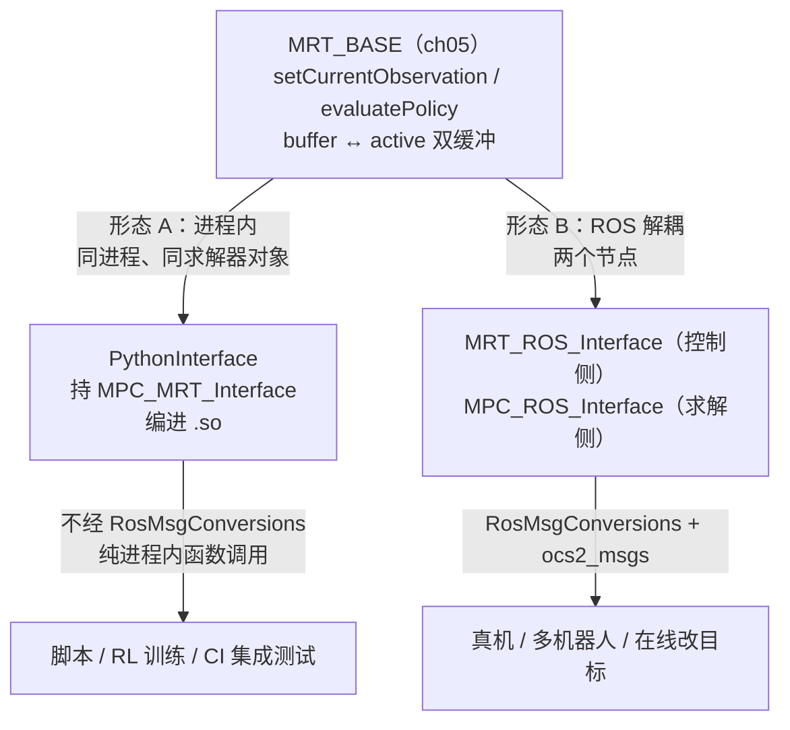
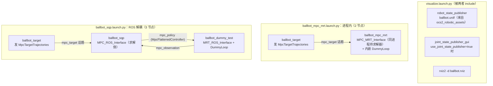

# 第 6 章：ROS 2 部署与 Python 绑定——让 MPC 跑起来

本章承接 ch05。ch05 把 [SolverBase](ocs2_oc/include/ocs2_oc/oc_solver/SolverBase.h#L54) 到实时控制循环的最后一公里补完，末尾预告进入 `ocs2_pinocchio`。但在那之前先补一个绕不开的工程层：**ch01–05 搭好的 MPC 循环到底以什么形态跑起来？** 答案有两条路——ROS 2 节点（真机、解耦、在线改目标）与 Python 绑定（脚本、RL 训练、CI 集成测试）。前者把 ch05 的 [MRT_BASE](ocs2_mpc/include/ocs2_mpc/MRT_BASE.h#L58) 用 [MRT_ROS_Interface](ocs2_ros_interfaces/include/ocs2_ros_interfaces/mrt/MRT_ROS_Interface.h#L58) + [MPC_ROS_Interface](ocs2_ros_interfaces/include/ocs2_ros_interfaces/mpc/MPC_ROS_Interface.h#L64) 拆成两个节点、用 `ocs2_msgs` 通信；后者用 [PythonInterface](ocs2_python_interface/include/ocs2_python_interface/PythonInterface.h#L44) 把 [MPC_MRT_Interface](ocs2_mpc/include/ocs2_mpc/MPC_MRT_Interface.h#L50) 编进一个 `.so`，在 Python 里直接 `advanceMpc()`。本章把工作区布局、消息、转换、命令发布、launch 拓扑、绑定宏一次讲透；`ocs2_pinocchio` / `ocs2_centroidal_model` 留到后续章节。

## 学习目标

学完本章，你应该能回答：

1. OCS2 的 colcon 工作区为什么要在 `src/` 下放三个仓库（`ocs2` + `ocs2_robotic_assets` + `elevation_mapping_cupy/plane_segmentation`）？为什么 Pinocchio 必须用 robotpkg 且 `rosdep` 要 `--skip-keys pinocchio`、还要导出 `CMAKE_PREFIX_PATH=/opt/openrobots`？
2. [ocs2_msgs](ocs2_msgs/msg/) 的 11 条 `.msg` 怎么按"观测 / 目标 / 控制器 / 诊断 / 模式 / 对偶"分组？为什么状态/输入向量在消息里是 `float32[]` 而 `scalar_t` 是 `double`——这套 [RosMsgConversions](ocs2_ros_interfaces/include/ocs2_ros_interfaces/common/RosMsgConversions.h#L50) 转换有没有精度损失？
3. 把目标喂进 MPC 有哪三种 publisher（[TargetTrajectoriesRosPublisher](ocs2_ros_interfaces/include/ocs2_ros_interfaces/command/TargetTrajectoriesRosPublisher.h#L47) / [TargetTrajectoriesKeyboardPublisher](ocs2_ros_interfaces/include/ocs2_ros_interfaces/command/TargetTrajectoriesKeyboardPublisher.h#L46) / [TargetTrajectoriesInteractiveMarker](ocs2_ros_interfaces/include/ocs2_ros_interfaces/command/TargetTrajectoriesInteractiveMarker.h#L46)）？它们都往 `"topicPrefix_mpc_target"` 发 `MpcTargetTrajectories`，差别在哪？
4. 同一个 ballbot 为什么有两套 launch：`ballbot_mpc_mrt.launch.py` 启 2 个节点、`ballbot_sqp.launch.py` 启 3 个节点？这与 ch05 的"进程内形态 vs ROS 解耦形态"如何对应？
5. [CREATE_ROBOT_PYTHON_BINDINGS](ocs2_python_interface/include/ocs2_python_interface/PybindMacros.h#L67) 宏生成的 `mpc_interface` 类里，`scalar_array`/`vector_array`/`matrix_array` 为什么被 `PYBIND11_MAKE_OPAQUE` 设成不可隐式转换的 opaque 类型？为什么 `LIB_NAME` 必须**严格等于** CMake 里 `pybind11_add_module` 的目标名？

## 关键概念

### 两条部署路径：ROS 节点 vs Python 绑定

ch05 把 [MRT_BASE](ocs2_mpc/include/ocs2_mpc/MRT_BASE.h#L58) 定为"观测进、策略出、双缓冲"的抽象薄壳，**它不创建线程、不碰 ROS**。"是否跨进程"全留给派生类。于是同一套 MPC 循环有两种落地形态：



形态 A 走 [PythonInterface](ocs2_python_interface/include/ocs2_python_interface/PythonInterface.h#L44)（C++ 侧）+ [CREATE_ROBOT_PYTHON_BINDINGS](ocs2_python_interface/include/ocs2_python_interface/PybindMacros.h#L67) 宏（绑定侧），把 [MPC_MRT_Interface](ocs2_mpc/include/ocs2_mpc/MPC_MRT_Interface.h#L50) 包成一个 Python 可 `import` 的模块；形态 B 走 [MRT_ROS_Interface](ocs2_ros_interfaces/include/ocs2_ros_interfaces/mrt/MRT_ROS_Interface.h#L58) + [MPC_ROS_Interface](ocs2_ros_interfaces/include/ocs2_ros_interfaces/mpc/MPC_ROS_Interface.h#L64)，两侧用 [RosMsgConversions](ocs2_ros_interfaces/include/ocs2_ros_interfaces/common/RosMsgConversions.h#L50) 在 C++ 类型与 `ocs2_msgs` 之间互转。两者共用 ch05 的双缓冲与策略查询逻辑，只是"策略怎么从求解侧到控制侧"换了通道。

### colcon 工作区布局

这是 ROS 2 Jazzy 的 colcon 工作区，不是独立 CMake 工程。`src/` 下要放三个仓库（见 [installation.md](installation.md#L60)）：

```
~/ocs2_ws/src/
├── ocs2/                      # 本仓库，branch ros2
├── ocs2_robotic_assets/        # branch ros2：URDF、mesh、.info 示例资源
└── elevation_mapping_cupy/    # sparse-checkout，只要 plane_segmentation/
    └── plane_segmentation/    # 凸面分解，被 perceptive 示例引用
```

`ocs2_robotic_assets` 提供 ballbot/双足等机器人的 URDF 与 config，缺失会让多数示例 launch 找不到 URDF。`plane_segmentation` 只在 perceptive MPC 示例里用到，可用 sparse-checkout 只取 `plane_segmentation/` 子目录而不拉整个 `elevation_mapping_cupy`。Docker 路径（[Dockerfile.jazzy](docker/Dockerfile.jazzy#L46)）替你把后两个仓库 clone 好；本地手搭则照 [installation.md](installation.md#L66)。

两处 Pinocchio 坑（[installation.md](installation.md#L30)）：Jazzy 上 `rosdep` 把 `pinocchio` 解析成未发布的 `ros-jazzy-pinocchio`，所以 (1) `rosdep install` 必须 `--skip-keys pinocchio`；(2) Pinocchio 从 OpenRobots robotpkg 装（`robotpkg-pinocchio` + `robotpkg-coal`），并导出 `CMAKE_PREFIX_PATH=/opt/openrobots` 与 `LD_LIBRARY_PATH=/opt/openrobots/lib` 让 CMake/运行时找到它。Dockerfile 里对应 [L22–L30](docker/Dockerfile.jazzy#L22) 两段：装 robotpkg、设 ENV。

### ocs2_msgs：MPC 通信的 11 条消息

`ls ocs2_msgs/msg/` 实际有 **11 条** `.msg`（注意：含 `Multiplier.msg`，它真实存在且被 [createMultiplierMsg](ocs2_ros_interfaces/include/ocs2_ros_interfaces/common/RosMsgConversions.h#L99) 使用）。按用途分六组：

| 组 | 消息 | 字段要点 |
| --- | --- | --- |
| 观测 | [MpcObservation](ocs2_msgs/msg/MpcObservation.msg) | `time`(f64) + `MpcState state` + `MpcInput input` + `mode`(i8) |
| 观测载体 | [MpcState](ocs2_msgs/msg/MpcState.msg) / [MpcInput](ocs2_msgs/msg/MpcInput.msg) | 都是 `float32[] value`——向量包成消息字段 |
| 目标 | [MpcTargetTrajectories](ocs2_msgs/msg/MpcTargetTrajectories.msg) | `time_trajectory[]` + `state_trajectory[]` + `input_trajectory[]` |
| 控制器 | [MpcFlattenedController](ocs2_msgs/msg/MpcFlattenedController.msg) | 序列化控制器：`controller_type` 枚举(FEEDFORWARD/LINEAR) + 初始观测 + 目标 + 状态/输入/时间轨迹 + `post_event_indices` + `ModeSchedule` + `ControllerData[]` + 性能指标 |
| 控制器载体 | [ControllerData](ocs2_msgs/msg/ControllerData.msg) | `float32[] data`——每步一包的扁平 payload（[MPC_ROS_Interface](ocs2_ros_interfaces/include/ocs2_ros_interfaces/mpc/MPC_ROS_Interface.h#L64) 的 `flatten()` 产物） |
| 模式 | [ModeSchedule](ocs2_msgs/msg/ModeSchedule.msg) | `event_times[]`(f64) + `mode_sequence[]`(i8)——切换系统的步态/接触模式 |
| 诊断 | [MpcPerformanceIndices](ocs2_msgs/msg/MpcPerformanceIndices.msg) | `init_time/merit/cost/dynamics_violation_sse/equality_constraints_sse/equality_lagrangian/inequality_lagrangian` |
| 约束/对偶 | [Constraint](ocs2_msgs/msg/Constraint.msg) / [LagrangianMetrics](ocs2_msgs/msg/LagrangianMetrics.msg) / [Multiplier](ocs2_msgs/msg/Multiplier.msg) | 都是 `time` + 标量 penalty + 向量(constraint/lagrangian)——逐时刻的约束值与对偶 |

注意一个**精度契约**：消息里的向量一律 `float32[]`，而 OCS2 内部 `scalar_t = double`。[createObservationMsg](ocs2_ros_interfaces/src/common/RosMsgConversions.cpp#L38) 用 `static_cast<float>` 把 double 降精度写进消息，[readObservationMsg](ocs2_ros_interfaces/src/common/RosMsgConversions.cpp#L62) 再用 `Eigen::Map<const VectorXf>.cast<scalar_t>()` 升回 double。跨进程通信有 float32 截断，但进/出两侧一致；进程内 Python 路径不经此转换，全程 double。

解耦形态下，这 11 条消息按方向分四股流（话题名前缀 `topicPrefix`，默认 `anonymousRobot`）：

```
  控制侧节点                          求解侧节点
  (MRT_ROS_Interface)                (MPC_ROS_Interface)
       │── MpcObservation ──────────►│  topicPrefix_mpc_observation   （观测：当前 t,x,u,mode）
       │◄──── MpcFlattenedController ─│  topicPrefix_mpc_policy        （策略：序列化控制器+轨迹+模式+诊断）
       │── mpc_reset (服务) ────────►│  topicPrefix_mpc_reset         （重置 MPC 到给定目标）
       ▲                              ▲
       └──────── MpcTargetTrajectories ─────────┘  topicPrefix_mpc_target （目标：命令发布器→两侧）
```

`MpcObservation`/`MpcFlattenedController` 在两节点间双向流动，`MpcTargetTrajectories` 由命令发布器同时喂给求解侧（经 [RosReferenceManager](ocs2_ros_interfaces/include/ocs2_ros_interfaces/synchronized_module/RosReferenceManager.h) 在线改目标），`MpcState`/`MpcInput`/`ControllerData` 只是它们的内嵌字段，`ModeSchedule`/`Multiplier`/`Constraint`/`LagrangianMetrics` 是诊断与对偶的逐时刻载体。进程内形态（`mpc_mrt`）不经任何话题——这一切都在同进程里函数调用完成。

### launch 两种拓扑：进程内 vs 解耦

每个机器人在 `ocs2_<robot>_ros/launch/` 下成对提供 `*_ddp/sqp/slp.launch.py`（解耦形态）与 `*_mpc_mrt.launch.py`（进程内形态）。以 ballbot 为例，两者都 `include` 同一个 [visualize.launch.py](ocs2_robotic_examples/ocs2_ballbot_ros/launch/visualize.launch.py)（起 `robot_state_publisher` + 可选 `joint_state_publisher_gui` + `rviz2`），差别在 MPC 部分：



进程内形态只有两个节点：[ballbot_mpc_mrt](ocs2_robotic_examples/ocs2_ballbot_ros/launch/ballbot_mpc_mrt.launch.py#L32)（求解器与 DummyLoop 同进程，对应 ch05 的 [MPC_MRT_Interface](ocs2_mpc/include/ocs2_mpc/MPC_MRT_Interface.h#L50)）和 [ballbot_target](ocs2_robotic_examples/ocs2_ballbot_ros/launch/ballbot_mpc_mrt.launch.py#L39)（发目标）。解耦形态多一个 [ballbot_dummy_test](ocs2_robotic_examples/ocs2_ballbot_ros/launch/ballbot_sqp.launch.py#L40)：求解器 `ballbot_sqp` 用 [MPC_ROS_Interface](ocs2_ros_interfaces/include/ocs2_ros_interfaces/mpc/MPC_ROS_Interface.h#L64) 收观测、解完发 `MpcFlattenedController`；`ballbot_dummy_test` 用 [MRT_ROS_Interface](ocs2_ros_interfaces/include/ocs2_ros_interfaces/mrt/MRT_ROS_Interface.h#L58) + [MRT_ROS_Dummy_Loop](ocs2_ros_interfaces/include/ocs2_ros_interfaces/mrt/MRT_ROS_Dummy_Loop.h#L41) 充当假控制循环。两者都通过 `ballbot_target` 发 `MpcTargetTrajectories` 喂目标。这些可执行体在 [CMakeLists.txt](ocs2_robotic_examples/ocs2_ballbot_ros/CMakeLists.txt#L64) 里 `add_executable` 声明（`ballbot_ddp/sqp/slp/mpc_mrt/dummy_test/target` 六个）。

## 代码走读

### colcon 构建与 Pinocchio

每次开新 shell 都要两步 `source`：

```bash
source /opt/ros/jazzy/setup.bash          # ROS 2 本体
source ~/ocs2_ws/install/setup.bash       # 本工作空间产物
```

构建（[installation.md](installation.md#L85)）：

```bash
colcon build --cmake-args -DCMAKE_BUILD_TYPE=RelWithDebInfo
# 子集：--packages-upto ocs2_ballbot_ros（含依赖）/ --packages-select ocs2_ballbot
# rosdep：rosdep install --from-paths src --ignore-src -r -y --skip-keys pinocchio
```

`-GNinja` 显著加速（CI 用）。Docker 一键复现（[docker/README.md](docker/README.md#L3)）：`docker build -f docker/Dockerfile.jazzy -t ocs2:jazzy .` 然后 `docker run --rm -it --net=host ocs2:jazzy`。

> 顺带：`ocs2_mpcnet` 与 `ocs2_raisim` 在本分支用 `COLCON_IGNORE` 排除（未移植到 Jazzy），`rqt_multiplot` 在 Jazzy 未发布，故 multiplot launch 文件可选——见 [installation.md](installation.md#L53)。

### ocs2_ros_interfaces 包布局

本章其余代码都在 [ocs2_ros_interfaces](ocs2_ros_interfaces/include/ocs2_ros_interfaces/) 包里，按子目录分工：`common/` 放 [RosMsgConversions](ocs2_ros_interfaces/include/ocs2_ros_interfaces/common/RosMsgConversions.h#L50) 与 [RosMsgHelpers](ocs2_ros_interfaces/include/ocs2_ros_interfaces/common/RosMsgHelpers.h#L43)；`command/` 放三种目标发布器；`mrt/` 放控制侧 [MRT_ROS_Interface](ocs2_ros_interfaces/include/ocs2_ros_interfaces/mrt/MRT_ROS_Interface.h#L58)、[MRT_ROS_Dummy_Loop](ocs2_ros_interfaces/include/ocs2_ros_interfaces/mrt/MRT_ROS_Dummy_Loop.h#L41) 与假观测器 [DummyObserver](ocs2_ros_interfaces/include/ocs2_ros_interfaces/mrt/DummyObserver.h)；`mpc/` 放求解侧 [MPC_ROS_Interface](ocs2_ros_interfaces/include/ocs2_ros_interfaces/mpc/MPC_ROS_Interface.h#L64)；`synchronized_module/` 放 [RosReferenceManager](ocs2_ros_interfaces/include/ocs2_ros_interfaces/synchronized_module/RosReferenceManager.h)（在线改目标/步态的 ROS 装饰器，ch05）；`visualization/` 与 `multiplot/` 放可视化与绘图桥。记住这个布局就能按职责快速找到对应头文件。

### RosMsgConversions：C++ ↔ msg 的桥

[RosMsgConversions](ocs2_ros_interfaces/include/ocs2_ros_interfaces/common/RosMsgConversions.h#L50)（命名空间 `ocs2::ros_msg_conversions`）是一组成对函数，每条消息一个 `createXxxMsg`（C++→msg）和一个 `readXxxMsg`（msg→C++），覆盖 `MpcObservation` / `ModeSchedule` / `MpcTargetTrajectories` / `MpcPerformanceIndices`，外加单向的 `createConstraintMsg` / `createLagrangianMetricsMsg` / `createMultiplierMsg`。读侧 [readTargetTrajectoriesMsg](ocs2_ros_interfaces/src/common/RosMsgConversions.cpp#L209) 还做三项校验：空消息抛异常、time/state 长度不匹配抛异常、时间序列递减抛异常——保证喂进 MPC 的目标永远是合法的。

旁边还有 [RosMsgHelpers](ocs2_ros_interfaces/include/ocs2_ros_interfaces/common/RosMsgHelpers.h#L43)（命名空间 `ocs2::ros_msg_helpers`），提供 `getVectorMsg`/`getPointMsg`/`getOrientationMsg`/`getHeaderMsg`/`getLineMsg`/`getColor` 这类把 `Eigen::Vector3d`/`Quaterniond` 转成 `geometry_msgs`/`visualization_msgs` 的小工具，给可视化节点（如 ballbot 的 `BallbotDummyVisualization`）画 marker 用。

### command publishers：怎么把目标喂进 MPC

三种 publisher 都往 `"topicPrefix_mpc_target"` 发 `MpcTargetTrajectories`，且都靠 [TargetTrajectoriesRosPublisher](ocs2_ros_interfaces/include/ocs2_ros_interfaces/command/TargetTrajectoriesRosPublisher.h#L47) 这个底层发布器（构造时 `topicPrefix` 默认 `"anonymousRobot"`，对应话题 `anonymousRobot_mpc_target`）。差别在"目标从哪来"：

- [TargetTrajectoriesRosPublisher](ocs2_ros_interfaces/include/ocs2_ros_interfaces/command/TargetTrajectoriesRosPublisher.h#L62)：最薄，直接 `publishTargetTrajectories(TargetTrajectories)`，由调用方自己造目标——给上层节点程序化发目标用。
- [TargetTrajectoriesKeyboardPublisher](ocs2_ros_interfaces/include/ocs2_ros_interfaces/command/TargetTrajectoriesKeyboardPublisher.h#L46)：从命令行读一个向量，经用户注入的 `CommandLineToTargetTrajectories` 回调（签名 `(commandLineTarget, observation) -> TargetTrajectories`）转成目标轨迹。它还订阅 `MpcObservation`（拿到当前状态以便把目标对齐到当前位姿），并按 `targetCommandLimits` 做安全裁剪。
- [TargetTrajectoriesInteractiveMarker](ocs2_ros_interfaces/include/ocs2_ros_interfaces/command/TargetTrajectoriesInteractiveMarker.h#L46)（`final`）：在 rviz 里拖一个 interactive marker，把拖到的 `(position, orientation)` 经 `GaolPoseToTargetTrajectories` 回调（源码如此拼写，即 GoalPose）转成目标。`publishInteractiveMarker()` 直接 `rclcpp::spin(node_)`，是个自带 spin 循环的节点。

三者都订阅 `MpcObservation`（在 `topicPrefix_mpc_observation` 上）以拿到当前状态，这样目标可以"相对当前状态"构造——例如键盘发的位移目标要对齐当前位姿。

**topicPrefix 一致性契约**：四个角色——命令发布器、求解侧 [MPC_ROS_Interface](ocs2_ros_interfaces/include/ocs2_ros_interfaces/mpc/MPC_ROS_Interface.h#L64)、控制侧 [MRT_ROS_Interface](ocs2_ros_interfaces/include/ocs2_ros_interfaces/mrt/MRT_ROS_Interface.h#L58)、重置服务——必须用**同一个 `topicPrefix`** 才能对上话题/服务名（`*_mpc_target` / `*_mpc_observation` / `*_mpc_policy` / `*_mpc_reset`）。launch 里 `ballbot_target` 与 `ballbot_sqp`/`ballbot_dummy_test` 节点各自构造时传同一个前缀，节点间才连得通；换机器人或换实例就改这个前缀做多机器人隔离。

### PythonInterface：把 MPC 包成 Python 可调

[PythonInterface](ocs2_python_interface/include/ocs2_python_interface/PythonInterface.h#L44) 是所有机器人 Python 绑定的基类，内部持一个 [MPC_BASE](ocs2_mpc/include/ocs2_mpc/MPC_BASE.h#L44) 与一个 [MPC_MRT_Interface](ocs2_mpc/include/ocs2_mpc/MPC_MRT_Interface.h#L50)（[init](ocs2_python_interface/include/ocs2_python_interface/PythonInterface.h#L55) 里 `mpcMrtInterface_.reset(new MPC_MRT_Interface(*mpcPtr_))`，见 [PythonInterface.cpp](ocs2_python_interface/src/PythonInterface.cpp#L42)）。公开面把这些暴露给 Python：

- 维度与重置：[getStateDim](ocs2_python_interface/include/ocs2_python_interface/PythonInterface.h#L66) / [getInputDim](ocs2_python_interface/include/ocs2_python_interface/PythonInterface.h#L73) / [reset](ocs2_python_interface/include/ocs2_python_interface/PythonInterface.h#L79)（带新目标重置 MPC）。
- 喂观测与目标、推进求解、取解：[setObservation](ocs2_python_interface/include/ocs2_python_interface/PythonInterface.h#L87) / [setTargetTrajectories](ocs2_python_interface/include/ocs2_python_interface/PythonInterface.h#L93) / [advanceMpc](ocs2_python_interface/include/ocs2_python_interface/PythonInterface.h#L99) / [getMpcSolution](ocs2_python_interface/include/ocs2_python_interface/PythonInterface.h#L107)（后三者经 `mpcMrtInterface_` 转发，`getMpcSolution` 调 `updatePolicy()` 再取 `getPolicy()`，见 [PythonInterface.cpp](ocs2_python_interface/src/PythonInterface.cpp#L92)）。
- 查询类：[getLinearFeedbackGain](ocs2_python_interface/include/ocs2_python_interface/PythonInterface.h#L114)（状态反馈矩阵）、[flowMap](ocs2_python_interface/include/ocs2_python_interface/PythonInterface.h#L117) / [flowMapLinearApproximation](ocs2_python_interface/include/ocs2_python_interface/PythonInterface.h#L120)（系统动力学）、[cost](ocs2_python_interface/include/ocs2_python_interface/PythonInterface.h#L123) / [costQuadraticApproximation](ocs2_python_interface/include/ocs2_python_interface/PythonInterface.h#L126)（含软约束惩罚项的代价及其二阶近似）、[valueFunction](ocs2_python_interface/include/ocs2_python_interface/PythonInterface.h#L134) / [valueFunctionStateDerivative](ocs2_python_interface/include/ocs2_python_interface/PythonInterface.h#L143)（值函数及其对状态导数）、[stateInputEqualityConstraint](ocs2_python_interface/include/ocs2_python_interface/PythonInterface.h#L152) 及其线性近似与 Lagrangian。
- [visualizeTrajectory](ocs2_python_interface/include/ocs2_python_interface/PythonInterface.h#L179)：**`virtual` 但非纯虚**——基类给了一个默认实现，直接 `throw std::runtime_error("...must be implemented by robot-specific derived class.")`（[L181](ocs2_python_interface/include/ocs2_python_interface/PythonInterface.h#L181)）。也就是说子类**可以**不实现它，但一旦调用就抛异常。

要点：查询类方法都直接走 `problem_`（[init](ocs2_python_interface/src/PythonInterface.cpp#L50) 里 `problem_ = robot.getOptimalControlProblem()`）与 `mpcMrtInterface_`，不触发新的求解——它们是"读当前策略/模型"的窗口，求解只由 `advanceMpc` 触发。

**`.noconvert()` 与 numpy 的契约**：绑定宏里几乎所有 `x`/`u` 参数都标了 `.noconvert()`（见 [PybindMacros.h](ocs2_python_interface/include/ocs2_python_interface/PybindMacros.h#L105) 的 `setObservation` / `flowMap` / `cost` / `valueFunction` 一长串），唯独标量 `t` 不标。`.noconvert()` 的语义是"禁止隐式拷贝转换"——传进去的 numpy 数组必须**内存布局与 dtype 直接匹配** `Eigen::Ref<const vector_t>`（`vector_t` 是列主、`double`）。传一个 `float64` 但非 C-contiguous 的切片、或 `float32` 数组，会直接抛 `TypeError` 而不是悄悄拷贝。这是为了零拷贝性能：[setObservation](ocs2_python_interface/include/ocs2_python_interface/PythonInterface.h#L87) 的观测直接写进 MPC 内存，不经中间缓冲。代价是 Python 侧要保证 `np.asarray(x, dtype=np.float64)` 且连续。

### CREATE_ROBOT_PYTHON_BINDINGS 宏

[CREATE_ROBOT_PYTHON_BINDINGS(PY_INTERFACE, LIB_NAME)](ocs2_python_interface/include/ocs2_python_interface/PybindMacros.h#L67) 一次生成整个 Python 模块。它干四件事：

1. 用 [PYBIND11_MAKE_OPAQUE](ocs2_python_interface/include/ocs2_python_interface/PybindMacros.h#L69) 把 `ocs2::scalar_array_t` / `vector_array_t` / `matrix_array_t` 标成 opaque——阻止 pybind11 把它们自动转成 Python `list`，从而保留 C++ 容器的引用语义（`getMpcSolution` 的 out 参数需要原地改写）。
2. 用 [VECTOR_TYPE_BINDING](ocs2_python_interface/include/ocs2_python_interface/PybindMacros.h#L41) 给这三个 opaque 类型绑 `clear/pop_back/push_back/resize/__getitem__/__setitem__/__len__/__iter__`，在 Python 里注册成 `scalar_array` / `vector_array` / `matrix_array`。
3. 绑定近似结构体（`VectorFunctionLinearApproximation` / `VectorFunctionQuadraticApproximation` / `ScalarFunctionQuadraticApproximation`，各暴露 `f/dfdx/dfdu/...`）与 [TargetTrajectories](ocs2_core/include/ocs2_core/reference/TargetTrajectories.h)（三参构造 `(time_array, state_array, input_array)`）。
4. `PYBIND11_MODULE(LIB_NAME, m)` 生成模块，并在其中用 `pybind11::class_<PY_INTERFACE>(m, "mpc_interface")` 绑定 [PythonInterface](ocs2_python_interface/include/ocs2_python_interface/PythonInterface.h#L44) 的全部公开方法。

**关键契约**：`LIB_NAME` 既是 Python 模块名（`PYBIND11_MODULE(LIB_NAME, m)` 决定 `import` 名），又必须**严格等于** CMake 里 `pybind11_add_module(LIB_NAME ...)` 的目标名——头注释 [@L65](ocs2_python_interface/include/ocs2_python_interface/PybindMacros.h#L65) 明确写了 "LIB_NAME must match target name in CMakeLists"。不匹配会链接/导入失败。

一个易混点：**模块名是 `LIB_NAME`，类名是 `mpc_interface`**。用法是 `from <pkg> import <LIB_NAME>; mpc = <LIB_NAME>.mpc_interface(taskFile, libFolder)`。

### BallbotPyBindings：一个完整示例

三件套缺一不可：

[BallbotPyBindings.h](ocs2_robotic_examples/ocs2_ballbot/include/ocs2_ballbot/BallbotPyBindings.h#L41)：`class BallbotPyBindings final : public PythonInterface`，构造函数接 `(taskFile, libraryFolder, urdfFile="")`。它做三步——设 `stateDim_/inputDim_`（来自 `definitions.h` 的 `STATE_DIM/INPUT_DIM`）、构造 [BallbotInterface](ocs2_robotic_examples/ocs2_ballbot/include/ocs2_ballbot/BallbotInterface.h) 并据此造 `GaussNewtonDDP_MPC`、设 `ReferenceManager`，最后调 [PythonInterface::init](ocs2_python_interface/include/ocs2_python_interface/PythonInterface.h#L55) 把 robot 与 mpc 交给基类（[L68](ocs2_robotic_examples/ocs2_ballbot/include/ocs2_ballbot/BallbotPyBindings.h#L68)）。注意它**没有** override `visualizeTrajectory`——ballbot 的 Python 绑定调可视化会抛异常。

[pyBindModule.cpp](ocs2_robotic_examples/ocs2_ballbot/src/pyBindModule.cpp#L4)：一行宏调用 `CREATE_ROBOT_PYTHON_BINDINGS(ocs2::ballbot::BallbotPyBindings, BallbotPyBindings)`——`LIB_NAME = BallbotPyBindings`。

[CMakeLists.txt](ocs2_robotic_examples/ocs2_ballbot/CMakeLists.txt#L56)：`pybind11_add_module(BallbotPyBindings src/pyBindModule.cpp)` 与宏里 `LIB_NAME` 完全一致；`ament_python_install_package(ocs2_ballbot PACKAGE_DIR src/ocs2_ballbot)` + [install(TARGETS BallbotPyBindings LIBRARY DESTINATION ${PYTHON_INSTALL_DIR}/ocs2_ballbot)](ocs2_robotic_examples/ocs2_ballbot/CMakeLists.txt#L83) 把 `.so` 装进 `ocs2_ballbot` Python 包目录。[setup.py](ocs2_robotic_examples/ocs2_ballbot/setup.py#L4) 用 `generate_distutils_setup` 声明 `packages=['ocs2_ballbot']`、`package_dir={'': 'src'}`。

合起来用法（全 double、不经 ROS）：

```python
from ocs2_ballbot import BallbotPyBindings
import numpy as np

mpc = BallbotPyBindings.mpc_interface(taskFile, libFolder)  # 类名 mpc_interface
mpc.setObservation(t, np.asarray(x), np.asarray(u))        # x/u 是 numpy，需匹配 vector_t 布局
mpc.setTargetTrajectories(BallbotPyBindings.TargetTrajectories(t_arr, x_arr, u_arr))
mpc.advanceMpc()                                            # 阻塞，求解一段时域

t = BallbotPyBindings.scalar_array()                        # opaque out 参数，先造空容器
x = BallbotPyBindings.vector_array()
u = BallbotPyBindings.vector_array()
mpc.getMpcSolution(t, x, u)                                 # 原地填充
X = np.stack([np.asarray(xi) for xi in x])                  # opaque 容器不能直接 np.array，需逐元素取
```

末尾那行是 opaque 类型的代价：`vector_array` 是 `std::vector<vector_t>` 暴露的序列对象，不是 numpy 数组，`np.array(x)` 不会得到 `(N, nx)` 矩阵——得遍历 `x` 把每个 `vector_t`（pybind11/eigen 已把它暴露成 numpy view）`np.asarray` 再 `np.stack`。换来的好处是 `getMpcSolution` 零拷贝原地写入、不触发 list 转换。

### 跑一个示例与 Docker

本地两步 `source` 后（[installation.md](installation.md#L94)）：

```bash
source /opt/ros/jazzy/setup.bash
source ~/ocs2_ws/install/setup.bash
ros2 launch ocs2_ballbot_ros ballbot_mpc_mrt.launch.py    # 进程内：2 节点
# 或 ros2 launch ocs2_ballbot_ros ballbot_sqp.launch.py   # 解耦：3 节点
```

`task_name` launch 参数（默认 `mpc`）选 `config/mpc/task.info`；`rviz` 参数默认 `true`。Docker 路径（[Dockerfile.jazzy](docker/Dockerfile.jazzy#L1)）已把 robotpkg、rosdep、`colcon build`、两个外部仓库全做好，进容器即可 `ros2 launch`。

### 三条契约

把全章收成三条必须记住的契约：

1. **`LIB_NAME` 必须与 CMake 目标名逐字一致**：[CREATE_ROBOT_PYTHON_BINDINGS](ocs2_python_interface/include/ocs2_python_interface/PybindMacros.h#L67) 既用 `LIB_NAME` 作 `PYBIND11_MODULE` 模块名、又要求它等于 `pybind11_add_module` 目标名（头注释 [@L65](ocs2_python_interface/include/ocs2_python_interface/PybindMacros.h#L65)）。ballbot 两边都是 `BallbotPyBindings`（[pyBindModule.cpp](ocs2_robotic_examples/ocs2_ballbot/src/pyBindModule.cpp#L4) vs [CMakeLists.txt](ocs2_robotic_examples/ocs2_ballbot/CMakeLists.txt#L56)）。模块里暴露的类名固定叫 `mpc_interface`——`LIB_NAME` 是模块名、`mpc_interface` 是类名，两者不同。
2. **opaque 数组不能直接当 numpy**：`scalar_array`/`vector_array`/`matrix_array` 被 [PYBIND11_MAKE_OPAQUE](ocs2_python_interface/include/ocs2_python_interface/PybindMacros.h#L69) 标成不自动转 list，是带序列协议的 C++ 容器视图。`getMpcSolution(t, x, u)` 的 out 参数要**先造空容器再传入**原地填充；要变 numpy 得逐元素 `np.asarray(xi)` 再 `np.stack`，不能 `np.array(x)`。
3. **ROS 消息有 float32 截断、Python 路径没有**：消息向量是 `float32[]`、内部 `scalar_t=double`，[RosMsgConversions](ocs2_ros_interfaces/include/ocs2_ros_interfaces/common/RosMsgConversions.h#L50) 在两侧做 `float↔double` 互转；解耦形态跨进程会截断，进程内 Python 形态不经转换、全程 double。要双精度对齐就得用 Python 绑定或进程内 `mpc_mrt`。

## 速查表

| 消息/类/宏 | 所在 | 用途 |
| --- | --- | --- |
| [MpcObservation](ocs2_msgs/msg/MpcObservation.msg) | ocs2_msgs | 当前 (t, state, input, mode) 观测 |
| [MpcTargetTrajectories](ocs2_msgs/msg/MpcTargetTrajectories.msg) | ocs2_msgs | 目标轨迹（time/state/input 三轨） |
| [MpcFlattenedController](ocs2_msgs/msg/MpcFlattenedController.msg) | ocs2_msgs | 序列化控制器（求解侧→控制侧的策略载体） |
| [ModeSchedule](ocs2_msgs/msg/ModeSchedule.msg) | ocs2_msgs | 切换系统 event_times + mode_sequence |
| [MpcPerformanceIndices](ocs2_msgs/msg/MpcPerformanceIndices.msg) | ocs2_msgs | 求解器性能诊断 |
| [Multiplier](ocs2_msgs/msg/Multiplier.msg) / [LagrangianMetrics](ocs2_msgs/msg/LagrangianMetrics.msg) / [Constraint](ocs2_msgs/msg/Constraint.msg) | ocs2_msgs | 逐时刻对偶/惩罚/约束值 |
| [RosMsgConversions](ocs2_ros_interfaces/include/ocs2_ros_interfaces/common/RosMsgConversions.h#L50) | ocs2_ros_interfaces | C++ ↔ msg 成对转换 + 目标合法性校验 |
| [RosMsgHelpers](ocs2_ros_interfaces/include/ocs2_ros_interfaces/common/RosMsgHelpers.h#L43) | ocs2_ros_interfaces | Eigen → geometry/visualization_msgs 小工具 |
| [TargetTrajectoriesRosPublisher](ocs2_ros_interfaces/include/ocs2_ros_interfaces/command/TargetTrajectoriesRosPublisher.h#L47) | ocs2_ros_interfaces | 最薄目标发布器 |
| [TargetTrajectoriesKeyboardPublisher](ocs2_ros_interfaces/include/ocs2_ros_interfaces/command/TargetTrajectoriesKeyboardPublisher.h#L46) | ocs2_ros_interfaces | 命令行 → 目标（带安全裁剪、订阅观测） |
| [TargetTrajectoriesInteractiveMarker](ocs2_ros_interfaces/include/ocs2_ros_interfaces/command/TargetTrajectoriesInteractiveMarker.h#L46) | ocs2_ros_interfaces | rviz 拖拽位姿 → 目标 |
| [PythonInterface](ocs2_python_interface/include/ocs2_python_interface/PythonInterface.h#L44) | ocs2_python_interface | 绑定基类，持 MPC_BASE + MPC_MRT_Interface |
| [CREATE_ROBOT_PYTHON_BINDINGS](ocs2_python_interface/include/ocs2_python_interface/PybindMacros.h#L67) | ocs2_python_interface | 生成 `mpc_interface` 模块（opaque 数组 + 近似 + TargetTrajectories + MPC API） |
| [BallbotPyBindings](ocs2_robotic_examples/ocs2_ballbot/include/ocs2_ballbot/BallbotPyBindings.h#L41) | ocs2_ballbot | `final : PythonInterface`，DDP MPC + ballbot 接口 |

> **阅读建议**：Python 路径先读 [PybindMacros.h](ocs2_python_interface/include/ocs2_python_interface/PybindMacros.h#L67) 看宏一次生成了什么（opaque 数组 + 近似结构体 + `TargetTrajectories` + `mpc_interface` 类），再对照 [BallbotPyBindings.h](ocs2_robotic_examples/ocs2_ballbot/include/ocs2_ballbot/BallbotPyBindings.h#L41) + [pyBindModule.cpp](ocs2_robotic_examples/ocs2_ballbot/src/pyBindModule.cpp#L4) + [CMakeLists.txt](ocs2_robotic_examples/ocs2_ballbot/CMakeLists.txt#L56) 看三件套怎么对上 `LIB_NAME`；ROS 路径先读 [RosMsgConversions.cpp](ocs2_ros_interfaces/src/common/RosMsgConversions.cpp#L38) 的 `create`/`read` 对与 float32 截断，再看 [ballbot_mpc_mrt.launch.py](ocs2_robotic_examples/ocs2_ballbot_ros/launch/ballbot_mpc_mrt.launch.py) 的 2 节点对比 [ballbot_sqp.launch.py](ocs2_robotic_examples/ocs2_ballbot_ros/launch/ballbot_sqp.launch.py) 的 3 节点——这就是 ch05 两种形态的落地。

> **衔接**：本章把 ch01–05 的 MPC 循环落到两种可运行形态——ROS 2 节点（`ocs2_msgs` + `RosMsgConversions` + launch 拓扑）与 Python 绑定（`PythonInterface` + `CREATE_ROBOT_PYTHON_BINDINGS` 宏）。两种形态复用 ch05 的 [MRT_BASE](ocs2_mpc/include/ocs2_mpc/MRT_BASE.h#L58) 双缓冲与策略查询，只是传输通道不同。后续章节将进入 `ocs2_pinocchio` / `ocs2_centroidal_model`，看质心动力学与关节运动学如何成为上面 MPC 循环里的 `SystemDynamicsBase`——届时本章的 `ballbot.urdf` 与 `task.info` 加载路径会再次出现。
