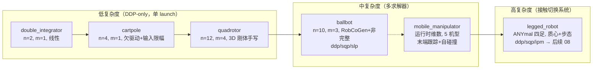

# 第 7 章：机器人示例横向对比——按需选型

本章承接 ch06。ch06 把 MPC 循环落到 ROS 2 节点与 Python 绑定两种形态，所有铺垫至此已闭环：从 [ocs2_core](ocs2_core/include/ocs2_core/Types.h) 的数学原语，到 [OptimalControlProblem](ocs2_oc/include/ocs2_oc/oc_problem/OptimalControlProblem.h) 的组装，到 [SolverBase](ocs2_oc/include/ocs2_oc/oc_solver/SolverBase.h) 的求解，再到 [MPC_BASE](ocs2_mpc/include/ocs2_mpc/MPC_BASE.h) / [MRT_BASE](ocs2_mpc/include/ocs2_mpc/MRT_BASE.h) 的滚动时域与两种部署。但读者真正要"跑一个机器人"时，面对的是 `ocs2_robotic_examples/` 下一打示例包——选哪个入门？ballbot 和 quadrotor 差在哪？legged_robot 凭什么最复杂？本章对仓库里 6 个核心示例做横向对比，从每个示例的 `*Interface.h` 与 `config/*/task.info` 真实读出**状态/输入维数、动力学来源、特色约束**，帮读者按需选型，并为后续 08 的四足深度走读铺路。

> **阅读提示**：本章是"速览深度"——每个示例只给一段代码走读，抓住"动力学从哪来、约束放哪个集合"两条主线，逐行解析留给后续按例深入。

> 建议先 `ls ocs2_robotic_examples/` 对照 6 个目录名建立空间感，再回头看各表列含义会更顺。

## 学习目标

学完本章，你应该能回答：

1. 6 个示例（double_integrator / cartpole / ballbot / quadrotor / legged_robot / mobile_manipulator）各自的状态、输入维数是多少？维数是写死的常量还是运行时从 URDF 推导？
2. 每个示例的动力学 `SystemDynamicsBase` 是怎么造的——手写解析式、[SystemDynamicsBaseAD](ocs2_core/include/ocs2_core/dynamics/SystemDynamicsBaseAD.h) 的 CppAd 自动微分、RobCoGen 生成的刚体动力学、还是 Pinocchio + 质心模型？
3. 哪些示例带约束（输入限幅、摩擦锥、自碰撞），哪些只有二次代价？约束落在 [OptimalControlProblem](ocs2_oc/include/ocs2_oc/oc_problem/OptimalControlProblem.h) 的 `inequalityLagrangianPtr` / `softConstraintPtr` / `equalityConstraintPtr` 哪个集合里？
4. 每个示例提供了哪些 launch、对应哪些求解器？为什么 ballbot 有 ddp/sqp/slp 三套而 double_integrator 只有一套？
5. 按难度递增，建议的入门路径是什么？为什么 legged_robot 是四足深度走读（后续 08）的合适起点？

## 关键概念

### 六示例的四个维度

把 6 个示例沿两个轴放在一起看，就抓住了选型的核心：

- **动力学来源轴**：从"手写线性"到"URDF/Pinocchio 在线推导"，工程量递增——
  - **手写解析**：double_integrator（线性 `A/B` 矩阵）、quadrotor（手写 `computeFlowMap` + `linearApproximation`）。
  - **CppAd 自动微分**：cartpole、ballbot、mobile_manipulator 的动力学都继承 [SystemDynamicsBaseAD](ocs2_core/include/ocs2_core/dynamics/SystemDynamicsBaseAD.h)，只需写 `systemFlowMap`，雅可比由 CppAd 编译期生成。
  - **刚体动力学库**：ballbot 在 CppAd 内部调用 RobCoGen 生成的 `ForwardDynamics`；legged_robot / mobile_manipulator 则用 Pinocchio 解析 URDF。
- **系统复杂度轴**：全驱动线性 → 欠驱动 → 非完整/3D 刚体 → 接触切换系统 → 浮基操作臂。

读这张图：横向是动力学来源的"工程量"递增（左→右），纵向分带是系统本身的复杂度（下→上）。前三个示例都在"低复杂度"带——它们只用 DDP、单 launch，因为系统简单到一个求解器就够；从 ballbot 起进入"中复杂度"，需要多求解器对照（ballbot）或多机型配置（mobile_manipulator）；legged_robot 独占"高复杂度"带，因为接触切换把步态、`ModeSchedule`、逐足约束全带进来。值得注意 quadrotor 虽是 12 维 3D 刚体，但因其动力学可手写解析、无约束、单求解器，仍落在低复杂度带——**复杂度不等于维数，而等于"建模+约束+切换"的叠加**。

### 总览表

下表所有维数与动力学来源均从各示例 `definitions.h` 与 `*Interface.cpp` 源码读出。`n` 为状态维数、`m` 为输入维数；标注"运行时"者无静态常量，由模型信息结构体在构造时从 URDF 推导。

| 示例 | 系统类型 | n / m | 动力学来源 | 特色约束 / 成本 | 可用 launch | 难度 |
| --- | --- | --- | --- | --- | --- | --- |
| double_integrator | 全驱动线性 | 2 / 1 | 解析 [LinearSystemDynamics](ocs2_core/include/ocs2_core/dynamics/LinearSystemDynamics.h) | 仅二次代价 (Q,R,Qf) | `double_integrator` | ★ |
| cartpole | 欠驱动 | 4 / 1 | CppAd ([SystemDynamicsBaseAD](ocs2_core/include/ocs2_core/dynamics/SystemDynamicsBaseAD.h)) | 输入限幅（增广拉格朗日） | `cartpole` | ★★ |
| ballbot | 欠驱动 + 非完整 | 10 / 3 | RobCoGen 生成代码包在 CppAd 内 | 仅二次代价 | `ballbot_ddp/slp/sqp`、`ballbot_mpc_mrt` | ★★★ |
| quadrotor | 3D 刚体（6 DOF/4 输入） | 12 / 4 | 手写解析 ([SystemDynamicsBase](ocs2_core/include/ocs2_core/dynamics/SystemDynamicsBase.h)) | 仅二次代价 | `quadrotor` | ★★★ |
| legged_robot | 足式接触切换 | 运行时 | Pinocchio 质心 + CppAd | 摩擦锥/零力/零速度/法向速度（逐足） | `legged_robot_ddp/sqp/ipm` | ★★★★★ |
| mobile_manipulator | 浮基操作臂 | 运行时 | CppAd + Pinocchio（4 类动力学） | 关节限位/末端位姿/自碰撞 | 6 个机型 launch | ★★★★ |

要点：维数"写死"还是"运行时"是个分水岭——前四个示例在 `definitions.h` 里用 `constexpr STATE_DIM/INPUT_DIM` 固定维数（见 [double_integrator](ocs2_robotic_examples/ocs2_double_integrator/include/ocs2_double_integrator/definitions.h#L37) / [cartpole](ocs2_robotic_examples/ocs2_cartpole/include/ocs2_cartpole/definitions.h#L37) / [ballbot](ocs2_robotic_examples/ocs2_ballbot/include/ocs2_ballbot/definitions.h#L37) / [quadrotor](ocs2_robotic_examples/ocs2_quadrotor/include/ocs2_quadrotor/definitions.h#L37)），后两个则由 [CentroidalModelInfo](ocs2_robotic_examples/ocs2_legged_robot/include/ocs2_legged_robot/LeggedRobotInterface.h#L85) / [ManipulatorModelInfo](ocs2_robotic_examples/ocs2_mobile_manipulator/include/ocs2_mobile_manipulator/MobileManipulatorInterface.h#L80) 在构造时按 URDF 推导，因此能换机型而不改代码。

### 配置文件：一文件 vs 多文件

| 示例 | 配置文件 | 数量 |
| --- | --- | --- |
| double_integrator / cartpole / ballbot / quadrotor | `config/mpc/task.info` | 1 |
| legged_robot | `config/mpc/task.info` + `config/command/gait.info`（步态）+ `config/command/reference.info`（参考命令） | 3 |
| mobile_manipulator | `config/<机型>/task*.info`（franka/pr2/mabi_mobile/ridgeback_ur5 各一个 `task.info`，kinova 有 `task_j2n6/j2n7.info`） | 每机型 1 |

legged_robot 之所以要三个文件，是因为步态（`GaitSchedule`）与参考命令（初始模式序列、默认模式模板）天然独立于 MPC 数值设置——这是切换系统带来的配置复杂度。mobile_manipulator 则因机型差异而分目录，每目录一份 task 文件。

### 切换系统：谁真用了

OCS2 名义面向"切换系统（switched systems）"，但 6 示例里只有 legged_robot 真正用上模式调度。其余的 `task.info` 里 `subsystemsSequence` 都是单模式 `[0]` 占位（double_integrator / ballbot / quadrotor），cartpole 干脆没有模式块——这印证了 ch03 的设计：[ModeSchedule](ocs2_core/include/ocs2_core/reference/ModeSchedule.h) 对非切换问题是无害的可选件，`pre-jump` 阶段在单模式下退化为普通中间节点。

### 求解器与反馈策略

各示例加载的 settings 段直接决定可用 launch 与求解器。`useFeedbackPolicy` 决定下发的是开环轨迹还是前馈+反馈控制器（见 ch03 [PrimalSolution](ocs2_oc/include/ocs2_oc/oc_data/PrimalSolution.h)）：

| 示例 | 加载的 settings | launch 数 | `useFeedbackPolicy`（task.info 真实值） |
| --- | --- | --- | --- |
| double_integrator | `ddp` + `mpc` | 1 | ddp = `true` |
| cartpole | `ddp` + `mpc` | 1 | ddp = `false`（开环） |
| ballbot | `ddp` + `sqp` + `slp` + `mpc` | 4（ddp/slp/sqp + mpc_mrt） | ddp = `true`，sqp = `false` |
| quadrotor | `ddp` + `mpc` | 1 | ddp = `false`（开环） |
| legged_robot | `ddp` + `sqp` + `ipm` + `mpc` + `rollout` | 3（ddp/sqp/ipm） | sqp = `true` |
| mobile_manipulator | `ddp` + `mpc` | 6（每机型一个） | ddp 默认 |

DDP 段里的 `algorithm` 字段区分 SLQ（连续时间）与 iLQR（离散时间）：double_integrator / cartpole / ballbot / legged_robot 用 `SLQ`，quadrotor 用 `ILQR`——这与 ch04 讲的 [GaussNewtonDDP](ocs2_ddp/include/ocs2_ddp/GaussNewtonDDP.h#L60) 双模式对应。

### 建模工具复用

ch01 把 `ocs2_pinocchio` / `ocs2_centroidal_model` / `ocs2_self_collision` / `ocs2_perceptive` 列为建模旁支。6 示例对它们的复用清晰对应复杂度阶梯（依 `package.xml` 的 `depend`）：

| 示例 | 额外建模依赖 |
| --- | --- |
| double_integrator / cartpole / quadrotor | 无（纯 `ocs2_core` + `ocs2_oc`，动力学手写或 CppAd） |
| ballbot | RobCoGen 生成代码内嵌在包内（`generated/`，非外部包依赖） |
| legged_robot | `ocs2_pinocchio_interface` + `ocs2_centroidal_model` |
| mobile_manipulator | `ocs2_pinocchio_interface` + `ocs2_self_collision`（HPP-FCL） |

规律：需要 URDF 刚体动力学就引入 Pinocchio；足式要质心模型再加 `ocs2_centroidal_model`；操作臂要避碰再加 `ocs2_self_collision`。ballbot 是特例——RobCoGen 代码离线生成后直接 vendoring 进包，运行时不依赖外部刚体库。

### 初始化器对照

求解器启动需要一个 [Initializer](ocs2_core/include/ocs2_core/initialization/Initializer.h) 给出初始轨迹。6 示例的选型分两档：

| 示例 | 初始化器 | 说明 |
| --- | --- | --- |
| double_integrator / cartpole / ballbot / mobile_manipulator | [DefaultInitializer](ocs2_core/include/ocs2_core/initialization/DefaultInitializer.h) | 零输入（`inputDim` 维零向量），最省事 |
| quadrotor | [OperatingPoints](ocs2_core/include/ocs2_core/initialization/OperatingPoints.h) | 给一个悬停工作点（`Fz = mass*gravity`），避免零推力起飞 |
| legged_robot | [LeggedRobotInitializer](ocs2_robotic_examples/ocs2_legged_robot/include/ocs2_legged_robot/initialization/LeggedRobotInitializer.h) | 按质心模型 + 步态构造初始轨迹，`extendNormalizedMomentum = true` |

规律：系统越复杂，初始化器越专属——quadrotor 需要一个物理上合理的工作点（悬停），legged_robot 则必须结合步态与质心模型给初值，否则 DDP 在零起点上发散。

## 代码走读

下面每个示例一小段，均从其 `*Interface.h` 与 `config/*/task.info` 源码读出。阅读顺序建议：先看 `definitions.h` 的 `STATE_DIM/INPUT_DIM`（或运行时维数来源）坐实维度，再看 `*Interface.cpp` 里 `dynamicsPtr.reset(...)` 一行确认动力学怎么造，最后看约束挂在 `problem_` 的哪个集合——这三步就能抓住每个示例的核心。

### double_integrator：最简，学流程首选

[DoubleIntegratorInterface](ocs2_robotic_examples/ocs2_double_integrator/include/ocs2_double_integrator/DoubleIntegratorInterface.h#L49) 是全部示例里代码最短的 [RobotInterface](ocs2_robotic_tools/include/ocs2_robotic_tools/common/RobotInterface.h#L48) 子类。构造函数（[DoubleIntegratorInterface.cpp](ocs2_robotic_examples/ocs2_double_integrator/src/DoubleIntegratorInterface.cpp#L97)）里动力学直接 `new LinearSystemDynamics(A, B)`——`A`/`B` 是手写常量矩阵（`A=[[0,1],[0,0]]`，`B=[0,1]`），连 CppAd 都不碰。代价只有一组二次 `QuadraticStateInputCost(Q, R)` 加末端 `QuadraticStateCost(Qf)`，没有任何约束。`task.info` 里的 `subsystemsSequence` 只有一个模式 `0`——名义上是"切换系统"但实际不切换。

它只加载 `ddp` + `mpc` 两段设置（[L69-L70](ocs2_robotic_examples/ocs2_double_integrator/src/DoubleIntegratorInterface.cpp#L69)），ROS 节点 [DoubleIntegratorMpcNode](ocs2_robotic_examples/ocs2_double_integrator_ros/src/DoubleIntegratorMpcNode.cpp#L73) 用 `GaussNewtonDDP_MPC`，`useFeedbackPolicy = true`。launch 只有一个 `double_integrator.launch.py`。这正是学 ch01–06 全流程的最小载体：状态 2 维（`[x1, x2]` = 位置、速度）、输入 1 维，肉眼可验算。`task.info` 里 `algorithm = SLQ`、`timeHorizon = 2.5 s`、`mpcDesiredFrequency = 100 Hz`、`mrtDesiredFrequency = 400 Hz`，Q 是 2×2 对角阵（`(0,0)=(1,1)=1.0`），R 是 1×1。

### cartpole：欠驱动 + 输入限幅

[CartPoleInterface](ocs2_robotic_examples/ocs2_cartpole/include/ocs2_cartpole/CartPoleInterface.h#L47) 把杆-小车系统状态定为 `[theta, x, theta_dot, x_dot]`（n=4），输入为小车推力（m=1）——欠驱动（1 个输入控制 2 个自由度）。动力学 [CartPoleSytemDynamics](ocs2_robotic_examples/ocs2_cartpole/include/ocs2_cartpole/dynamics/CartPoleSystemDynamics.h#L44) 继承 [SystemDynamicsBaseAD](ocs2_core/include/ocs2_core/dynamics/SystemDynamicsBaseAD.h)：`systemFlowMap` 用 `ad_scalar_t` 写非线性方程，雅可比由 CppAd 在构造时编译生成（`initialize(STATE_DIM, INPUT_DIM, "cartpole_dynamics", libraryFolder, ...)`）。

与 double_integrator 的关键差别是**有约束**：输入限幅挂在 [inequalityLagrangianPtr](ocs2_robotic_examples/ocs2_cartpole/src/CartPoleInterface.cpp#L122)，用 `LinearStateInputConstraint` 把 `|u| <= maxInput(=5.0)` 表成两条不等式，惩罚选 `augmented::SlacknessSquaredHingePenalty`——这就是 ch01 讲的"路径约束用松弛化方法而非硬约束"的最小可运行样例。参数从 `task.info` 的 `cartpole_parameters` 段读：`cartMass=2.0`、`poleMass=0.2`、`poleLength=1.0`、`maxInput=5.0`、`gravity=9.81`；初态 `theta=3.14`（倒立）。其余仍是 DDP-only（`algorithm = SLQ`）、单 launch、`useFeedbackPolicy = false`（开环下发）。

### ballbot：非完整约束 + RobCoGen 生成代码

[BallbotInterface](ocs2_robotic_examples/ocs2_ballbot/include/ocs2_ballbot/BallbotInterface.h#L53) 的状态 n=10 = 广义坐标 5（球位置 x/y + 欧拉角 ZYX 三轴）+ 广义速度 5，输入 m=3 为三个轮子力矩——5 自由度受 3 输入驱动，欠驱动且含球滚动这一非完整约束。维数与 `JOINTS_DOF_NUM=5` 见 [definitions.h](ocs2_robotic_examples/ocs2_ballbot/include/ocs2_ballbot/definitions.h#L37)。

动力学 [BallbotSystemDynamics](ocs2_robotic_examples/ocs2_ballbot/include/ocs2_ballbot/dynamics/BallbotSystemDynamics.h#L49) 同样继承 [SystemDynamicsBaseAD](ocs2_core/include/ocs2_core/dynamics/SystemDynamicsBaseAD.h)，但 [systemFlowMap](ocs2_robotic_examples/ocs2_ballbot/src/dynamics/BallbotSystemDynamics.cpp#L18) 内部调用 RobCoGen 生成的刚体动力学：先构造 5×3 的驱动矩阵 `S_transposed`（把 3 个轮力矩映射到 5 个广义力），再调 `iit::Ballbot::tpl::ForwardDynamics::fd(qdd, q, qd, S^T·τ)`（生成代码来自 `include/ocs2_ballbot/generated/`，源描述在 `generated/kindsl/Ballbot.kindsl`）。也就是说，运动方程由 RobCoGen 离线生成、再被 CppAd 包一层做自动微分——这是"刚体动力学库 + CppAd"组合的范例。`S^T` 的 5×3 结构正是欠驱动的数学体现：3 个输入无法独立控制 5 个自由度，球-轮的滚动耦合（非完整约束）补上了缺的 2 个通道。

ballbot 是第一个**多求解器**示例：接口同时加载 `ddp`/`sqp`/`slp` 三段设置（[BallbotInterface.cpp](ocs2_robotic_examples/ocs2_ballbot/src/BallbotInterface.cpp#L68)），ROS 包提供 `ballbot_ddp/slp/sqp.launch.py`（解耦形态，3 节点）和 `ballbot_mpc_mrt.launch.py`（进程内，2 节点）——这正是 ch06 两种部署形态的对照样本。代价仍只有二次 (Q,R,Qf)，无额外约束。

### quadrotor：3D 刚体，手写解析

[QuadrotorInterface](ocs2_robotic_examples/ocs2_quadrotor/include/ocs2_quadrotor/QuadrotorInterface.h#L48) 的状态 n=12 = 位置 3 + 欧拉角 3 + 线速度 3 + 角速度 3，输入 m=4 = 总推力 Fz + 三轴力矩——6 自由度刚体受 4 输入，欠驱动。动力学 [QuadrotorSystemDynamics](ocs2_robotic_examples/ocs2_quadrotor/include/ocs2_quadrotor/dynamics/QuadrotorSystemDynamics.h#L40) 继承 [SystemDynamicsBase](ocs2_core/include/ocs2_core/dynamics/SystemDynamicsBase.h)（**非** AD 版），手写 `computeFlowMap` 和 `linearApproximation`（[QuadrotorSystemDynamics.cpp](ocs2_robotic_examples/ocs2_quadrotor/src/QuadrotorSystemDynamics.cpp)），不用 CppAd、不用 Pinocchio——是"手写解析非线性动力学"的范本。

与 ballbot 的另一个区别在初始化：[OperatingPoints](ocs2_robotic_examples/ocs2_quadrotor/src/QuadrotorInterface.cpp#L105) 给一个悬停工作点（初始输入 `Fz = mass*gravity`），而非 `DefaultInitializer`。参数从 `task.info` 的 `QuadrotorParameters` 段读：`quadrotorMass=0.546`、`Thzz=3e-4`、`Thxxyy=2.32e-3`、`gravity=9.8`。仍 DDP-only（`algorithm = ILQR`）、单 launch、`useFeedbackPolicy = false`、仅二次代价。`task.info` 的模式序列同样是单模式占位。

### legged_robot：足式接触切换系统

[LeggedRobotInterface](ocs2_robotic_examples/ocs2_legged_robot/include/ocs2_legged_robot/LeggedRobotInterface.h#L56) 是 6 示例里最复杂的。它没有静态 `STATE_DIM`——维数来自 [centroidalModelInfo_.stateDim/inputDim](ocs2_robotic_examples/ocs2_legged_robot/include/ocs2_legged_robot/LeggedRobotInterface.h#L85)，由 URDF + `centroidal_model::createCentroidalModelInfo(...)` 在构造时推导。机器人本体是 ANYmal C 四足（launch 里 `urdfFile` 指向 `ocs2_robotic_assets/.../anymal_c/urdf/anymal.urdf`），[ModelSettings](ocs2_robotic_examples/ocs2_legged_robot/include/ocs2_legged_robot/common/ModelSettings.h) 默认 4 个 3-DoF 足端（`LF/RF/LH/RH_FOOT`）、12 个驱动关节（4 腿 × HAA/HFE/KFE）。

动力学 [LeggedRobotDynamicsAD](ocs2_robotic_examples/ocs2_legged_robot/include/ocs2_legged_robot/dynamics/LeggedRobotDynamicsAD.h#L42) 继承 `SystemDynamicsBase`，但内部持一个 [PinocchioCentroidalDynamicsAD](ocs2_robotic_examples/ocs2_legged_robot/include/ocs2_legged_robot/dynamics/LeggedRobotDynamicsAD.h#L57) 成员（来自 `ocs2_centroidal_model`）——质心动力学由 Pinocchio 建模、CppAd 做自动微分。构造处见 [LeggedRobotInterface.cpp](ocs2_robotic_examples/ocs2_legged_robot/src/LeggedRobotInterface.cpp#L144)（注意 `useAnalyticalGradientsDynamics=true` 的分支会抛"未实现"异常，即只走 AD 路径）。

特色约束最丰富，逐足挂在三个集合里（[L181-L190](ocs2_robotic_examples/ocs2_legged_robot/src/LeggedRobotInterface.cpp#L181)）：

- **摩擦锥**：默认软约束进 `softConstraintPtr`（[RelaxedBarrierPenalty](ocs2_core/include/ocs2_core/penalties/penalties/RelaxedBarrierPenalty.h)，摩擦系数 0.7），构造参数 `useHardFrictionConeConstraint=true` 时改硬约束进 `inequalityConstraintPtr`——软/硬可切换是 [FrictionConeConstraint](ocs2_robotic_examples/ocs2_legged_robot/include/ocs2_legged_robot/constraint/FrictionConeConstraint.h) 的设计点。
- **零力**（摆动足）：`equalityConstraintPtr` 的 [ZeroForceConstraint](ocs2_robotic_examples/ocs2_legged_robot/include/ocs2_legged_robot/constraint/ZeroForceConstraint.h)——摆动相不接触就不该有地面反力。
- **零速度 / 法向速度**（接触足）：`equalityConstraintPtr` 的 CppAd 版末端运动学约束（[ZeroVelocityConstraintCppAd](ocs2_robotic_examples/ocs2_legged_robot/include/ocs2_legged_robot/constraint/ZeroVelocityConstraintCppAd.h) / `NormalVelocityConstraintCppAd`）——接触足相对地面不该滑动，摆动足则受法向速度约束。

这三组约束按模式（支撑/摆动）激活与否，正是"切换系统"的体现：`ModeSchedule` 决定哪只脚在哪段时间接触，约束集合据此在不同模式间切换。

外加 [GaitSchedule](ocs2_robotic_examples/ocs2_legged_robot/src/LeggedRobotInterface.cpp#L208) + [SwitchedModelReferenceManager](ocs2_robotic_examples/ocs2_legged_robot/include/ocs2_legged_robot/reference_manager/SwitchedModelReferenceManager.h) + 摆动轨迹规划器（`SwingTrajectoryPlanner`，配置 `swingHeight=0.1`、`liftOffVelocity=0.2`、`touchDownVelocity=-0.4`）——这才是真正用上 ch01"切换系统一等公民"的示例：`GaitSchedule` 从 `config/command/gait.info` 读初始模式序列与默认步态模板（如 trot），`SwitchedModelReferenceManager` 把步态与摆动轨迹交给求解器的 `preRun` 同步（ch05 的 `SolverSynchronizedModule`）。配置也分三个文件：`config/mpc/task.info`（数值）+ `config/command/gait.info`（步态）+ `config/command/reference.info`（参考命令）。求解器支持 ddp/sqp/ipm（launch 三套），是唯一带 ipm 的示例。

### mobile_manipulator：末端跟踪 + 多机型

[MobileManipulatorInterface](ocs2_robotic_examples/ocs2_mobile_manipulator/include/ocs2_mobile_manipulator/MobileManipulatorInterface.h#L50) 同样无静态维数，来自 [manipulatorModelInfo_.stateDim/inputDim](ocs2_robotic_examples/ocs2_mobile_manipulator/include/ocs2_mobile_manipulator/MobileManipulatorInterface.h#L80)（按 URDF 臂数 + 基座类型推导）。构造时读 `manipulatorModelType`（[L98](ocs2_robotic_examples/ocs2_mobile_manipulator/src/MobileManipulatorInterface.cpp#L98)），按枚举 [ManipulatorModelType](ocs2_robotic_examples/ocs2_mobile_manipulator/include/ocs2_mobile_manipulator/ManipulatorModelInfo.h#L36) 选四类动力学之一（[L183-L206](ocs2_robotic_examples/ocs2_mobile_manipulator/src/MobileManipulatorInterface.cpp#L183)）：`DefaultManipulator` / `FloatingArmManipulator` / `FullyActuatedFloatingArmManipulator` / `WheelBasedMobileManipulator`，四者都继承 [SystemDynamicsBaseAD](ocs2_core/include/ocs2_core/dynamics/SystemDynamicsBaseAD.h) 且经 Pinocchio 建模。

特色在约束：代价只有二次输入成本 [QuadraticInputCost](ocs2_robotic_examples/ocs2_mobile_manipulator/src/MobileManipulatorInterface.cpp#L163)（无状态代价），状态跟踪靠软约束实现——

- **关节限位**：`softConstraintPtr` 的 [StateInputSoftBoxConstraint](ocs2_core/include/ocs2_core/soft_constraint/StateInputSoftBoxConstraint.h)（位置限位从 URDF `lowerPositionLimit/upperPositionLimit` 读，速度限位从 `task.info` 读）。
- **末端位姿**：`stateSoftConstraintPtr`（中间）+ `finalSoftConstraintPtr`（末端）的 6 维软约束（3 位置 + 3 姿态，各配 `QuadraticPenalty`）。
- **自碰撞**：`stateSoftConstraintPtr` 的 [SelfCollisionConstraint](ocs2_robotic_examples/ocs2_mobile_manipulator/src/MobileManipulatorInterface.cpp#L177)，基于 HPP-FCL 的 [PinocchioGeometryInterface](ocs2_pinocchio/ocs2_self_collision/include/ocs2_self_collision/PinocchioGeometryInterface.h) + `RelaxedBarrierPenalty`。

这是唯一显式做自碰撞避免的示例。机型配置有 **5 个目录**（`ls config/` 真实结果），对应 6 个 launch（kinova 有两版）：

| 机型目录 | task 文件 | modelType | eeFrame | launch |
| --- | --- | --- | --- | --- |
| `franka` | `task.info` | 0 (Default) | `panda_hand_tcp` | `manipulator_franka` |
| `kinova` | `task_j2n6.info` / `task_j2n7.info` | 0 (Default) | — | `manipulator_kinova_j2n6` / `_j2n7` |
| `mabi_mobile` | `task.info` | 1 (WheelBased) | `WRIST_2` | `manipulator_mabi_mobile` |
| `pr2` | `task.info` | 1 (WheelBased) | `r_gripper_tool_frame` | `manipulator_pr2` |
| `ridgeback_ur5` | `task.info` | 1 (WheelBased) | `ur_arm_tool0` | `manipulator_ridgeback_ur5` |

franka / kinova 是定基操作臂（type 0），其余三个是轮基移动操作臂（type 1）。仍 DDP-only。

mobile_manipulator 还演示了 `usePreComputation` 开关（[L125-L130](ocs2_robotic_examples/ocs2_mobile_manipulator/src/MobileManipulatorInterface.cpp#L125)，默认 `true`）：开启时末端运动学与自碰撞用 [MobileManipulatorPreComputation](ocs2_robotic_examples/ocs2_mobile_manipulator/include/ocs2_mobile_manipulator/MobileManipulatorPreComputation.h) 在每步求解前批量算好（走 `PinocchioEndEffectorKinematics`，不经 CppAd），关闭则退回 `PinocchioEndEffectorKinematicsCppAd` 把雅可比也编进 CppAd 库——这是"PreComputation 缓存 vs 全 CppAd"两种建模策略的切换点。

### 旁注：感知型四足 ocs2_perceptive_anymal

`ocs2_robotic_examples/` 下还有第 7 个目录 `ocs2_perceptive_anymal`，它是一个多包集合（含 `ocs2_anymal_mpc`、`ocs2_quadruped_interface`、`ocs2_switched_model_interface`、`segmented_planes_terrain_model` 等），在 legged_robot 的接触切换框架上叠加 `ocs2_perceptive` 的地形分解，做带地形感知的四足 MPC。本章不展开它，但它的接口设计（`QuadrupedInterface`）是 legged_robot 的进阶演化——读懂本章 legged_robot 后再去看它会顺很多。

## 选哪个入门

按复杂度递增、每一步只引入一个新概念来排：

1. **double_integrator**：2 维线性、无约束、DDP——验算 ch01–06 全流程的最小载体。*新概念：线性 [LinearSystemDynamics](ocs2_core/include/ocs2_core/dynamics/LinearSystemDynamics.h) + `useFeedbackPolicy=true` 反馈下发。*
2. **cartpole**：4 维非线性 + 欠驱动 + 输入限幅软约束——第一次接触 [SystemDynamicsBaseAD](ocs2_core/include/ocs2_core/dynamics/SystemDynamicsBaseAD.h) 与 `inequalityLagrangianPtr`。*新概念：CppAd 自动微分 + 增广拉格朗日软约束。*
3. **ballbot**：10 维 + RobCoGen 刚体动力学 + 非完整 + 三种求解器/两种 launch 形态——把 ch06 的部署选择和求解器选择一起练了。*新概念：RobCoGen 生成代码内嵌 + sqp/slp 多求解器对照。*
4. **quadrotor 或 mobile_manipulator**（二选一）：quadrotor 学手写解析非线性 + 3D 刚体 + `OperatingPoints` 初始化；mobile_manipulator 学 Pinocchio URDF 建模 + 多机型 + 末端/自碰撞软约束。*新概念：浮基建模 + 状态软约束（非代价）做跟踪。*
5. **legged_robot**：足式接触切换系统，质心动力学 + 步态调度 + 逐足约束 + ipm——本课程的集大成示例，也是后续 08 四足深度走读的起点。*新概念：[ModeSchedule](ocs2_core/include/ocs2_core/reference/ModeSchedule.h) 步态 + 接触约束按模式切换 + 多求解器。*

这条路径的依据是"每次只加一个维度"：1→2 加非线性与约束，2→3 加刚体库与多求解器，3→4 加浮基/3D，4→5 加接触与切换。跳过任何一步都可能一次面对太多新概念。

> 一条经验：前 4 步任选其一都能在分钟级跑通（不含 CppAd 首次编译）。legged_robot 因质心模型 + 步态 + 多约束，首次 CppAd 编译较慢，但它是唯一把"切换系统 + 接触 + 多求解器"全用上的示例，值得作为进阶目标。

> 已有最优控制理论基础、只想快速摸 OCS2 API 的读者可跳到 ballbot：它一次覆盖 RobCoGen 刚体动力学、ddp/slp/sqp 三求解器、`ballbot_mpc_mrt`（进程内 MRT）与 `ballbot_sqp`（ROS 接口）两种 launch 形态，是"单例练全栈"的最小载体。其 `task.info` 里 `ddp` 段的 `algorithm SLQ` + `useFeedbackPolicy true` 与 `sqp` 段的 `useFeedbackPolicy false` 的对照，恰好把 ch04 的连续/离散与反馈策略差异落到一个真实机器人上。

## 速查表

| 示例 | Interface 类 | task.info 路径 | 维数来源 |
| --- | --- | --- | --- |
| double_integrator | [DoubleIntegratorInterface](ocs2_robotic_examples/ocs2_double_integrator/include/ocs2_double_integrator/DoubleIntegratorInterface.h#L49) | `ocs2_double_integrator/config/mpc/task.info` | [definitions.h](ocs2_robotic_examples/ocs2_double_integrator/include/ocs2_double_integrator/definitions.h#L37) n=2,m=1 |
| cartpole | [CartPoleInterface](ocs2_robotic_examples/ocs2_cartpole/include/ocs2_cartpole/CartPoleInterface.h#L47) | `ocs2_cartpole/config/mpc/task.info` | [definitions.h](ocs2_robotic_examples/ocs2_cartpole/include/ocs2_cartpole/definitions.h#L37) n=4,m=1 |
| ballbot | [BallbotInterface](ocs2_robotic_examples/ocs2_ballbot/include/ocs2_ballbot/BallbotInterface.h#L53) | `ocs2_ballbot/config/mpc/task.info` | [definitions.h](ocs2_robotic_examples/ocs2_ballbot/include/ocs2_ballbot/definitions.h#L37) n=10,m=3 |
| quadrotor | [QuadrotorInterface](ocs2_robotic_examples/ocs2_quadrotor/include/ocs2_quadrotor/QuadrotorInterface.h#L48) | `ocs2_quadrotor/config/mpc/task.info` | [definitions.h](ocs2_robotic_examples/ocs2_quadrotor/include/ocs2_quadrotor/definitions.h#L37) n=12,m=4 |
| legged_robot | [LeggedRobotInterface](ocs2_robotic_examples/ocs2_legged_robot/include/ocs2_legged_robot/LeggedRobotInterface.h#L56) | `config/mpc/task.info` + `config/command/{gait,reference}.info` | [CentroidalModelInfo](ocs2_robotic_examples/ocs2_legged_robot/include/ocs2_legged_robot/LeggedRobotInterface.h#L85) 运行时 |
| mobile_manipulator | [MobileManipulatorInterface](ocs2_robotic_examples/ocs2_mobile_manipulator/include/ocs2_mobile_manipulator/MobileManipulatorInterface.h#L50) | `config/<机型>/task*.info`（5 机型） | [ManipulatorModelInfo](ocs2_robotic_examples/ocs2_mobile_manipulator/include/ocs2_mobile_manipulator/MobileManipulatorInterface.h#L80) 运行时 |

> **衔接**：本章把 6 个示例的维数、动力学来源、约束、launch 一次理清。其中 legged_robot 浓缩了"切换系统 + 质心动力学 + 步态 + 接触约束 + 多求解器"全部要素，是后续 `08-quadruped-deep-dive.md`（四足深度走读）的主角——届时本章提及的 [LeggedRobotDynamicsAD](ocs2_robotic_examples/ocs2_legged_robot/include/ocs2_legged_robot/dynamics/LeggedRobotDynamicsAD.h#L42)、[SwitchedModelReferenceManager](ocs2_robotic_examples/ocs2_legged_robot/include/ocs2_legged_robot/reference_manager/SwitchedModelReferenceManager.h)、逐足约束与 `config/command/gait.info` 都会逐一展开。
