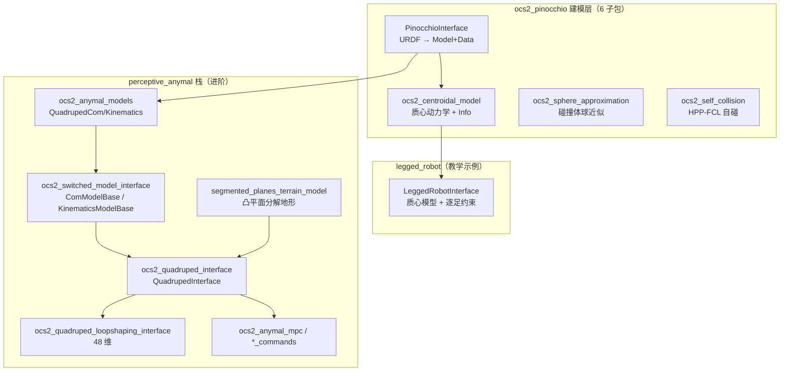

# 第 8 章：四足机器人深度走读

承接 ch07。ch07 把 6 个示例横向扫过一遍，给 legged_robot 留了一段"速览深度"摘要。本章不重复那段摘要，而是钻进 ch07 没展开的三层内部：底层的 Pinocchio/质心动力学建模、中层的 legged_robot 子系统装配、以及 perceptive_anymal 栈如何把这套框架演化为带地形感知的感知式四足 MPC。读本章前请确认已读 ch02（loopshaping）、ch03（OCP 与 pre-jump 阶段）、ch04（求解器）。

本章反复用到前序章节的成果：ch02 的 loopshaping 把滤波器状态并进 OCP（见后文 loopshaping 变体）；ch03 的 OCP 中间阶段约束与 pre-jump 阶段（见"接触、步态与 switched system"）；ch04 的 DDP/SQP/IPM 在多节点上解 QP（见"运行时数据流"）；ch05 的 `ReferenceManager`/`SolverSynchronizedModule` 是每步同步的入口（同上）；ch07 给了 legged_robot 的速览，本章展开其未竟的子系统与 perceptive_anymal 全栈。

## 学习目标

1. 质心动力学的状态/输入到底怎么编排？`PinocchioCentroidalDynamics` 的非 AD 版与 AD 版各自动量线性化的路径有何不同？
2. URDF 是怎么变成 Pinocchio `Model`/`Data` 的？`PinocchioInterface`、`CentroidalModelPinocchioMapping`、`AccessHelperFunctions` 各自承担哪一段映射？
3. 球近似与 HPP-FCL 自碰撞分别解决什么几何问题？二者为何要分两个包？
4. perceptive_anymal 栈与 legged_robot 是"同一套代码换机型"还是"另一套抽象"？栈里 10 个包各管什么？loopshaping 变体把状态维数从 24 抬到 48 是怎么做到的？
5. `ModeSchedule` 如何驱动逐足接触开关？它与 ch03 的 `pre-jump` 阶段是什么关系？

## 关键概念



读这张图：纵向是"建模→装配→部署"的依赖链。**legged_robot 直接消费质心动力学层**（`PinocchioCentroidalDynamicsAD` 包进 `LeggedRobotDynamicsAD`）；**perceptive_anymal 在质心层之上又套了一层 switched_model 抽象**（`ComModelBase`/`KinematicsModelBase`），再由 `QuadrupedInterface` 装配。两条路都通 Pinocchio，但中间层不同——这正是本章要讲清的核心区别。

为何要两套？legged_robot 是**教学示例**：一个机型、一套质心模型、平地假设，直接调 `PinocchioCentroidalDynamicsAD` 最省事，代码路径短、易读。perceptive_anymal 是**产品级栈**：要支持机型切换（ANYmal C 系列）、地形感知、loopshaping 频域整形、多步态队列与接触自适应，这些需求逼出一层 `ComModelBase`/`KinematicsModelBase` 抽象——把"质心动力学怎么算"和"腿运动学怎么算"留作子类实现，OCP 装配逻辑（`QuadrupedInterface`）只依赖抽象接口。代价是栈更深、概念更多；收益是换机型只改 `ocs2_anymal_models` 一个包，OCP 装配不动。

一个旁证：legged_robot 的状态用归一化质心动量 `h_norm`，perceptive_anymal 的 comkino 用浮基速度——前者是质心动力学的"原生"状态（`PinocchioCentroidalDynamics` 直接吐这个），后者是为了把接触力/足端运动学更直接地嵌进动力学（comkino = centroidal momentum + kinematics），更贴合实时控制。两套编排的取舍折射出两条栈的设计目标不同。

两套栈共享同一条 MPC 数据流（细节见后文"运行时数据流"）：

```
外部命令 ──► ReferenceManager.modifyReferences
                │  查 contactFlags(time) → 改写 TargetTrajectories + ModeSchedule
                ▼
            preComputation.request ◄── 缓存 Pinocchio FK / ee 约束 Config
                │
                ▼
            TimeTriggeredRollout ─► 事件时刻切接触模式（isActive 翻面）
                │
                ▼
            DDP / SQP / IPM 解 QP 子问题 ──► getPrimalSolution
                │
                ▼
            postSolverRun ─► 发布控制器 / 下一周期回到顶部
```

## 代码走读

### 足式建模基础（展开）

#### URDF → Pinocchio

[PinocchioInterface](ocs2_pinocchio/ocs2_pinocchio_interface/include/ocs2_pinocchio_interface/PinocchioInterface.h#L60) 是个模板类 `PinocchioInterfaceTpl<SCALAR>`（`scalar_t` 版叫 `PinocchioInterface`、`ad_scalar_t` 版叫 `PinocchioInterfaceCppAd`），内部只持三样东西：`pinocchio::Model`（`robotModelPtr_`）、`pinocchio::Data`（`robotDataPtr_`）、可选的 `urdf::ModelInterface`（`urdfModelPtr_`），并提供 `toCppAd()` 在两套标量间转换。注意它的构造函数吃的是**已建好的 `pinocchio::Model`**，不是 URDF 路径——URDF 解析被拆到一组自由工厂函数里：[getPinocchioInterfaceFromUrdfFile](ocs2_pinocchio/ocs2_pinocchio_interface/include/ocs2_pinocchio_interface/urdf.h#L40) 先 `::urdf::parseURDFFile` 拿到 `urdf::ModelInterface`，再 `pinocchio::urdf::buildModel` 填充一个 `pinocchio::Model`，最后构造 `PinocchioInterface`。还有 `getPinocchioInterfaceFromUrdfString`/`getPinocchioInterfaceFromUrdfModel` 两个变体应付字符串与已解析 URDF 树。

足式机器人需要一个 6-DoF 浮基（3 平动 + 3 ZYX 球面），这个 root joint 由质心层的 [createPinocchioInterface](ocs2_pinocchio/ocs2_centroidal_model/include/ocs2_centroidal_model/FactoryFunctions.h#L50) 用 `JointModelTranslation() + JointModelSphericalZYX()` 拼成 `JointModelComposite` 再传进 URDF 工厂；带 `jointNames` 的重载会把未列出的 URDF 关节置 `FIXED`，从而只激活关心的那几条腿。legged_robot 走的就是这条路（见后文 `LeggedRobotInterface.cpp#L117`）。状态/输入与 Pinocchio 广义坐标之间的映射是 [PinocchioStateInputMapping](ocs2_pinocchio/ocs2_pinocchio_interface/include/ocs2_pinocchio_interface/PinocchioStateInputMapping.h#L40) 抽象基类（纯虚 `getPinocchioJointPosition`/`getPinocchioJointVelocity`/`getOcs2Jacobian`），末端运动学则由 [PinocchioEndEffectorKinematics](ocs2_pinocchio/ocs2_pinocchio_interface/include/ocs2_pinocchio_interface/PinocchioEndEffectorKinematics.h#L54)（带缓存）与其 CppAd 版（codegen，可带 `update_pinocchio_interface_callback` 给质心映射做额外更新）提供。

#### 质心动力学内部

这是本章最该讲准的部分。核心数据结构是 [CentroidalModelInfo](ocs2_pinocchio/ocs2_centroidal_model/include/ocs2_centroidal_model/CentroidalModelInfo.h#L53)，一个 `CentroidalModelInfoTpl<SCALAR>` 模板结构体（标量版 `CentroidalModelInfo`、AD 版 `CentroidalModelInfoCppAd`，二者靠 `toCppAd()` 互转）。字段（行号见头文件 L64–L75）：

- `centroidalModelType`：枚举 [CentroidalModelType](ocs2_pinocchio/ocs2_centroidal_model/include/ocs2_centroidal_model/CentroidalModelInfo.h#L47)，二选一 `FullCentroidalDynamics`（FRBD，全质心动力学）或 `SingleRigidBodyDynamics`（SRBD，单刚体）
- `numThreeDofContacts` / `numSixDofContacts`：3-DoF（只力）与 6-DoF（力+力矩）接触数
- `endEffectorFrameIndices`：末端 frame 索引（顺序先 3-DoF 后 6-DoF）
- `generalizedCoordinatesNum`（= `model.nq`，含浮基 6 维）、`actuatedDofNum`（= `nq-6`，扣掉浮基）
- `stateDim`（= `nq+6`）、`inputDim`（= `actuatedDofNum + 3*n3 + 6*n6`）
- `robotMass`（由 `pinocchio::computeTotalMass` 算）
- SRBD 专用：`qPinocchioNominal` / `centroidalInertiaNominal` / `comToBasePositionNominal`（由 `pinocchio::ccrba` 在标称构型下算）

> 注意：`CentroidalModelInfo` **没有** `numThreeDofBases` 或 `centroidalMatrixPinocchioMapping` 之类字段——浮基 6 自由度被折进 `generalizedCoordinatesNum`/`actuatedDofNum`，而映射逻辑是另一个类（见下文）。维数全在这里推导，所以 legged_robot 没有写死的 `STATE_DIM`。

这套维数由 [createCentroidalModelInfo](ocs2_pinocchio/ocs2_centroidal_model/include/ocs2_centroidal_model/FactoryFunctions.h#L68) 在构造时填好，`centroidalModelType` 由 [loadCentroidalType](ocs2_pinocchio/ocs2_centroidal_model/include/ocs2_centroidal_model/FactoryFunctions.h#L73) 从 task.info 第 1 行读（`1`=SRBD），`defaultJointState` 由 [loadDefaultJointState](ocs2_pinocchio/ocs2_centroidal_model/include/ocs2_centroidal_model/FactoryFunctions.h#L76) 从 reference.info 读。状态/输入约定写在 [PinocchioCentroidalDynamics](ocs2_pinocchio/ocs2_centroidal_model/include/ocs2_centroidal_model/PinocchioCentroidalDynamics.h#L49) 的头注释里：

```
状态  x = [ linear_momentum/mass, angular_momentum/mass,  // 归一化质心动量（质心系）
          base_position, base_orientation_zyx,            // 浮基位姿
          joint_positions ]                               // 关节角
输入  u = [ contact_forces, contact_wrenches, joint_velocities ]
```

注意动量是**归一化**（除以 `robotMass`）、在质心系（原点在 CoM、与惯性系对齐）表达的。这套编排由 [AccessHelperFunctions](ocs2_pinocchio/ocs2_centroidal_model/include/ocs2_centroidal_model/AccessHelperFunctions.h) 的 Block 访问器坐实：`[getNormalizedMomentum](ocs2_pinocchio/ocs2_centroidal_model/include/ocs2_centroidal_model/AccessHelperFunctions.h#L84)` 取 state 前 6 维、`[getBasePose](ocs2_pinocchio/ocs2_centroidal_model/include/ocs2_centroidal_model/AccessHelperFunctions.h#L97)` 取 `[6,12)`、`[getJointAngles](ocs2_pinocchio/ocs2_centroidal_model/include/ocs2_centroidal_model/AccessHelperFunctions.h#L109)` 取 `[12,...)`；输入侧 [getContactForces](ocs2_pinocchio/ocs2_centroidal_model/include/ocs2_centroidal_model/AccessHelperFunctions.h#L43) 切接触力块、[getJointVelocities](ocs2_pinocchio/ocs2_centroidal_model/include/ocs2_centroidal_model/AccessHelperFunctions.h#L71) 切关节速度块。

把流图 `f(x,u)` 的 24 行拆开看（`m = robotMass`，`r_i` 为 CoM 到第 `i` 接触点的世界系向量，`F_i` 接触力，`τ_i` 仅 6-DoF 接触有）：

```
ḣ_lin / m =  g + (Σ_i F_i) / m                         # 线动量率（前 3 行）
ḣ_ang / m =  (Σ_i r_i × F_i  +  Σ_i τ_i) / m           # 角动量率（中 3 行）
v_base     =  Ab(q)^{-1} · ( m·h_norm − A_joint(q)·q̇ )  # 浮基速度（6 行），q̇ 来自 u
q̇_joint   =  u_joint_vel                                # 关节速度（12 行），直接来自 u
```

前 6 行就是 [getNormalizedCentroidalMomentumRate](ocs2_pinocchio/ocs2_centroidal_model/include/ocs2_centroidal_model/ModelHelperFunctions.h#L174)：重力 `[m·g; 0]` 加各接触点贡献，再除以 `m` 归一化。中间 6 行是浮基速度——[getPinocchioJointVelocity](ocs2_pinocchio/ocs2_centroidal_model/include/ocs2_centroidal_model/CentroidalModelPinocchioMapping.h#L102) 取质心动量矩阵 `A(q)`（pinocchio 的 `data.Ag`，由 [updateCentroidalDynamics](ocs2_pinocchio/ocs2_centroidal_model/include/ocs2_centroidal_model/ModelHelperFunctions.h#L62) 更新——FRBD 调 `pinocchio::computeCentroidalMap`，SRBD 用标称惯性/CoM-到-base 解析构造）的 6×6 浮基块 `Ab`，**求逆**反解 `v_base = Ab_inv·(m·h_norm − A_joint·q̇_joint)`，关节速度 `q̇` 直接取自 `u`。`Ab` 求逆的闭式在 [computeFloatingBaseCentroidalMomentumMatrixInverse](ocs2_pinocchio/ocs2_centroidal_model/include/ocs2_centroidal_model/ModelHelperFunctions.h#L47)。SRBD 与 FRBD 的差别只在 `A(q)` 怎么来：FRBD 每步 `ccrba` 现算，SRBD 用标称构型的常量惯性矩阵近似——后者更快但牺牲大姿态变化时的精度。

AD 版 [PinocchioCentroidalDynamicsAD](ocs2_pinocchio/ocs2_centroidal_model/include/ocs2_centroidal_model/PinocchioCentroidalDynamicsAD.h#L54) 与非 AD 版的区别就在线性化路径：非 AD 版在私有方法 `computeNormalizedCentroidalMomentumRateGradients`（[头文件 #L111](ocs2_pinocchio/ocs2_centroidal_model/include/ocs2_centroidal_model/PinocchioCentroidalDynamics.h#L111)）里**手算**动量率对 `q`/`u` 的偏导（角动量率对 `q` 加 `−(skew(F)/m)·J`，对 `u` 加 `(skew(r)/m)`），再把 pinocchio 的 `dfdq,dfdv` 经 [getOcs2Jacobian](ocs2_pinocchio/ocs2_centroidal_model/include/ocs2_centroidal_model/CentroidalModelPinocchioMapping.h#L116) 重投影到 OCS2 的 `dfdx,dfdu`；AD 版则把整个 `getValueCppAd` 交给一个 `CppAdInterface`（私有成员 `systemFlowMapCppAdInterfacePtr_`，[头文件 #L96](ocs2_pinocchio/ocs2_centroidal_model/include/ocs2_centroidal_model/PinocchioCentroidalDynamicsAD.h#L96)）做 CppAD+CodeGen 自动微分，`getLinearApproximation` 直接来自编译好的雅可比库——这也是 legged_robot 默认走的路（`useAnalyticalGradientsDynamics=false`）。此外 [CentroidalModelRbdConversions](ocs2_pinocchio/ocs2_centroidal_model/include/ocs2_centroidal_model/CentroidalModelRbdConversions.h#L39) 在质心状态与全刚体状态（RBD）间互转，[computeRbdStateFromCentroidalModel](ocs2_pinocchio/ocs2_centroidal_model/include/ocs2_centroidal_model/CentroidalModelRbdConversions.h#L86) 与 [computeRbdTorqueFromCentroidalModelPD](ocs2_pinocchio/ocs2_centroidal_model/include/ocs2_centroidal_model/CentroidalModelRbdConversions.h#L109) 负责把 MPC 输出落到下位机期望的关节力矩（PD 增益从 `.info` 读，可显式传 `pGains`/`dGains`）。

#### 球近似与自碰撞

这俩分两个包，因为解决的是两个不同的几何问题。`ocs2_sphere_approximation` 解决"**怎么把碰撞体表达成球**"：[SphereApproximation](ocs2_pinocchio/ocs2_sphere_approximation/include/ocs2_sphere_approximation/SphereApproximation.h#L52) 把 box/cylinder/sphere 原语按给定 `maxExcess`、`shrinkRatio` 逼近成一组球（Voelz & Graichen 2018 的方法），[PinocchioSphereInterface](ocs2_pinocchio/ocs2_sphere_approximation/include/ocs2_sphere_approximation/PinocchioSphereInterface.h#L56) 据此从 URDF 建 `pinocchio::GeometryModel` 并缓存每个原语的球心/半径，[PinocchioSphereKinematics](ocs2_pinocchio/ocs2_sphere_approximation/include/ocs2_sphere_approximation/PinocchioSphereKinematics.h#L57) 把球心当末端做运动学（带缓存，只实现 `getPosition`/`getPositionLinearApproximation`，速度/姿态接口抛"未实现"），[PinocchioSphereKinematicsCppAd](ocs2_pinocchio/ocs2_sphere_approximation/include/ocs2_sphere_approximation/PinocchioSphereKinematicsCppAd.h#L49) 用于把雅可比编进自动微分库。球本身的数据载体是 `KinematicsModelBase` 里的 [CollisionSphere](ocs2_robotic_examples/ocs2_perceptive_anymal/ocs2_switched_model_interface/include/ocs2_switched_model_interface/core/KinematicsModelBase.h#L89) 结构（球心在某 link frame 下的偏移 + 半径），子类（如 `QuadrupedKinematics`）从 URDF 的碰撞原语经 `SphereApproximation` 填充 `collisionSpheresInBaseFrame`。

`ocs2_self_collision` 解决"**两个碰撞体之间离多近**"：[PinocchioGeometryInterface](ocs2_pinocchio/ocs2_self_collision/include/ocs2_self_collision/PinocchioGeometryInterface.h#L47) 才是真正包 HPP-FCL 的那层——它把存的 URDF 导出成 tinyxml 字符串，用 `pinocchio::urdf::buildGeom(model, urdfString, COLLISION, geomModel)` 建 `pinocchio::GeometryModel`，[computeDistances](ocs2_pinocchio/ocs2_self_collision/include/ocs2_self_collision/PinocchioGeometryInterface.h#L78) 跑 `pinocchio::computeDistances` 返回一串 `hpp::fcl::DistanceResult`。在它之上，[SelfCollisionConstraint](ocs2_pinocchio/ocs2_self_collision/include/ocs2_self_collision/SelfCollisionConstraint.h#L44)（缓存版，纯虚 `getPinocchioInterface` 让子类供预计算接口，`getValue` 需 `forwardKinematics`、`getLinearApproximation` 需 `computeJointJacobians`）与 [SelfCollisionConstraintCppAd](ocs2_pinocchio/ocs2_self_collision/include/ocs2_self_collision/SelfCollisionConstraintCppAd.h#L47)（自带 mutable `PinocchioInterface`、内部两个 `CppAdInterface` 分别 codegen 链上点变换与距离计算、走 CppAd）把"距离 − minimumDistance ≥ 0"包成 `StateConstraint`。球近似提供"体→球"的几何降阶，自碰撞提供"球/体之间求距离"的约束——所以 perceptive_anymal 里 `KinematicsModelBase` 有 `collisionSpheresInBaseFrame` 接口，两者配套。

### legged_robot 走读

[LeggedRobotInterface](ocs2_robotic_examples/ocs2_legged_robot/include/ocs2_legged_robot/LeggedRobotInterface.h#L56) 在 `setupOptimalConrolProblem`（注意源码拼写为 `Conrol`）里按固定顺序装配 OCP，下面给的是 `.cpp` 的真实行号：

1. **建模**（[L117–L123](ocs2_robotic_examples/ocs2_legged_robot/src/LeggedRobotInterface.cpp#L117)）：`createPinocchioInterface(urdfFile, jointNames)` 建 `PinocchioInterface`（L117）；`createCentroidalModelInfo(*pinocchioInterfacePtr_, loadCentroidalType(taskFile), loadDefaultJointState(...), contactNames3DoF, contactNames6DoF)` 推 `centroidalModelInfo_`（L120）。维数来源就是 `centroidalModelInfo_.stateDim/inputDim`，getter 在 [头文件 #L85](ocs2_robotic_examples/ocs2_legged_robot/include/ocs2_legged_robot/LeggedRobotInterface.h#L85)，成员变量在 #L117。
2. **步态与参考管理器**（L126–L131）：先建 [SwingTrajectoryPlanner](ocs2_robotic_examples/ocs2_legged_robot/include/ocs2_legged_robot/foot_planner/SwingTrajectoryPlanner.h#L40)（[Config](ocs2_robotic_examples/ocs2_legged_robot/include/ocs2_legged_robot/foot_planner/SwingTrajectoryPlanner.h#L42) 的 `swingHeight=0.1` 等，见 task.info `swing_trajectory_config`，4 足），再把 [loadGaitSchedule](ocs2_robotic_examples/ocs2_legged_robot/src/LeggedRobotInterface.cpp#L208) 与摆动规划器一起塞进 [SwitchedModelReferenceManager](ocs2_robotic_examples/ocs2_legged_robot/include/ocs2_legged_robot/reference_manager/SwitchedModelReferenceManager.h#L45)（L130）。
3. **OCP 主体**（L134–L195）：`problemPtr_` 建好后（L134），依次挂 dynamics（`useAnalyticalGradientsDynamics=true` 会在 L141 抛"未实现"，否则 [LeggedRobotDynamicsAD](ocs2_robotic_examples/ocs2_legged_robot/include/ocs2_legged_robot/dynamics/LeggedRobotDynamicsAD.h#L42) 在 L144 构造，它内部持 [PinocchioCentroidalDynamicsAD](ocs2_robotic_examples/ocs2_legged_robot/include/ocs2_legged_robot/dynamics/LeggedRobotDynamicsAD.h#L57) 成员）、cost（`baseTrackingCost` 在 L150，由 [LeggedRobotStateInputQuadraticCost](ocs2_robotic_examples/ocs2_legged_robot/include/ocs2_legged_robot/cost/LeggedRobotQuadraticTrackingCost.h#L45) 实现，[L59](ocs2_robotic_examples/ocs2_legged_robot/include/ocs2_legged_robot/cost/LeggedRobotQuadraticTrackingCost.h#L59) 用 `getContactFlags` 算重力补偿输入 `uNominal`）、逐足约束（L160 循环 `numThreeDofContacts`）、preComputation（L194，[LeggedRobotPreComputation](ocs2_robotic_examples/ocs2_legged_robot/include/ocs2_legged_robot/LeggedRobotPreComputation.h#L48)）、rollout（L198，`TimeTriggeredRollout`）、initializer（L202，`extendNormalizedMomentum=true`）。
4. **逐足约束的软/硬切换**（[L180–L190](ocs2_robotic_examples/ocs2_legged_robot/src/LeggedRobotInterface.cpp#L180)，ch07 已点过，这里展开）：每个足端 `i` 同时挂四条约束——摩擦锥由 `useHardFrictionConeConstraint_`（[成员 #L114](ocs2_robotic_examples/ocs2_legged_robot/include/ocs2_legged_robot/LeggedRobotInterface.h#L114)）二选一：`true` 进 `inequalityConstraintPtr`（硬），`false` 进 `softConstraintPtr` 套 `RelaxedBarrierPenalty`（软，task.info `frictionConeSoftConstraint`，`frictionCoefficient=0.5`、`mu=0.1`、`delta=5.0`）；[ZeroForceConstraint](ocs2_robotic_examples/ocs2_legged_robot/include/ocs2_legged_robot/constraint/ZeroForceConstraint.h#L40)（摆动足足力为零，3 维）、[ZeroVelocityConstraintCppAd](ocs2_robotic_examples/ocs2_legged_robot/include/ocs2_legged_robot/constraint/ZeroVelocityConstraintCppAd.h#L46)（接触足速度为零，3 维）、[NormalVelocityConstraintCppAd](ocs2_robotic_examples/ocs2_legged_robot/include/ocs2_legged_robot/constraint/NormalVelocityConstraintCppAd.h#L46)（法向速度，1 维）都进 `equalityConstraintPtr`。摩擦锥的公式见 [FrictionConeConstraint](ocs2_robotic_examples/ocs2_legged_robot/include/ocs2_legged_robot/constraint/FrictionConeConstraint.h#L55) 头注释：`frictionCoefficient·(Fz+gripperForce) − sqrt(Fx²+Fy²+regularization) ≥ 0`，并支持 `setSurfaceNormalInWorld` 把锥轴对到地形法向（感知式 MPC 的伏笔）。这四条都重写了 `isActive(time)`（摩擦锥 [L96](ocs2_robotic_examples/ocs2_legged_robot/include/ocs2_legged_robot/constraint/FrictionConeConstraint.h#L96)、零力 [L53](ocs2_robotic_examples/ocs2_legged_robot/include/ocs2_legged_robot/constraint/ZeroForceConstraint.h#L53)、零速度 [L62](ocs2_robotic_examples/ocs2_legged_robot/include/ocs2_legged_robot/constraint/ZeroVelocityConstraintCppAd.h#L62)、法向速度 [L60](ocs2_robotic_examples/ocs2_legged_robot/include/ocs2_legged_robot/constraint/NormalVelocityConstraintCppAd.h#L60)）——**这就是接触开关的落地处**：约束本身常驻 OCP 的中间阶段，靠 `isActive` 按当前模式决定是否激活。

逐足约束的几何基底是 [EndEffectorLinearConstraint](ocs2_robotic_examples/ocs2_legged_robot/include/ocs2_legged_robot/constraint/EndEffectorLinearConstraint.h#L47)——它把"足端位置/速度在某方向上的分量"表达成对状态/输入的线性约束，零速度/法向速度约束都是它的子类。每足的 `EndEffectorLinearConstraint::Config`（足端局部位姿 + 约束方向）在 [LeggedRobotPreComputation::request](ocs2_robotic_examples/ocs2_legged_robot/include/ocs2_legged_robot/LeggedRobotPreComputation.h#L56) 里按当前状态算好缓存，[getEeNormalVelocityConstraintConfigs](ocs2_robotic_examples/ocs2_legged_robot/include/ocs2_legged_robot/LeggedRobotPreComputation.h#L58) 取出供法向速度约束复用——这样约束在 `getLinearApproximation` 时不必重算运动学，是实时性的关键。

逐足约束速查（维度来自各约束的 `getNumConstraints`）：

| 约束 | 基类 | 维数 | 激活（`isActive`） |
| --- | --- | --- | --- |
| [FrictionConeConstraint](ocs2_robotic_examples/ocs2_legged_robot/include/ocs2_legged_robot/constraint/FrictionConeConstraint.h#L55) | `StateInputConstraint` | 1 | 接触足 |
| [ZeroForceConstraint](ocs2_robotic_examples/ocs2_legged_robot/include/ocs2_legged_robot/constraint/ZeroForceConstraint.h#L40) | `StateInputConstraint` | 3 | 摆动足 |
| [ZeroVelocityConstraintCppAd](ocs2_robotic_examples/ocs2_legged_robot/include/ocs2_legged_robot/constraint/ZeroVelocityConstraintCppAd.h#L46) | `StateInputConstraint` | 3 | 接触足 |
| [NormalVelocityConstraintCppAd](ocs2_robotic_examples/ocs2_legged_robot/include/ocs2_legged_robot/constraint/NormalVelocityConstraintCppAd.h#L46) | `StateInputConstraint` | 1 | 接触足 |

摩擦锥是软（`softConstraintPtr`+`RelaxedBarrierPenalty`）还是硬（`inequalityConstraintPtr`）由 `useHardFrictionConeConstraint_` 决定；其余三条都是等式约束。四条都靠 `isActive(time)` 按当前 `contact_flag_t` 翻面，不在 pre-jump 阶段。

子系统头职责一览（路径均在 `ocs2_robotic_examples/ocs2_legged_robot/include/ocs2_legged_robot/`）：`common/`（[ModelSettings](ocs2_robotic_examples/ocs2_legged_robot/include/ocs2_legged_robot/common/ModelSettings.h#L41) 含 `jointNames{"LF_HAA",...}`/`contactNames3DoF{"LF_FOOT",...}`、[Types](ocs2_robotic_examples/ocs2_legged_robot/include/ocs2_legged_robot/common/Types.h#L42) 定义 `feet_array_t<T>=std::array<T,4>`/`contact_flag_t`、`utils.h` 的 [weightCompensatingInput](ocs2_robotic_examples/ocs2_legged_robot/include/ocs2_legged_robot/common/utils.h#L63) 按 `robotMass*9.81` 均摊到支撑足）、`constraint/`（摩擦锥/零力/零速度/法向速度/[EndEffectorLinearConstraint](ocs2_robotic_examples/ocs2_legged_robot/include/ocs2_legged_robot/constraint/EndEffectorLinearConstraint.h#L47) 五条）、`cost/`（中间 [LeggedRobotStateInputQuadraticCost](ocs2_robotic_examples/ocs2_legged_robot/include/ocs2_legged_robot/cost/LeggedRobotQuadraticTrackingCost.h#L45) + 终端 [LeggedRobotStateQuadraticCost](ocs2_robotic_examples/ocs2_legged_robot/include/ocs2_legged_robot/cost/LeggedRobotQuadraticTrackingCost.h#L72)，都读 `getContactFlags`）、`dynamics/`（质心 AD 动力学）、`foot_planner/`（[CubicSpline](ocs2_robotic_examples/ocs2_legged_robot/include/ocs2_legged_robot/foot_planner/CubicSpline.h#L37) + [SplineCpg](ocs2_robotic_examples/ocs2_legged_robot/include/ocs2_legged_robot/foot_planner/SplineCpg.h#L37) 拼摆动轨迹，`SplineCpg` 由两段三次样条夹一个中点高度，给出 z 位置/速度参考）、`gait/`（[Gait](ocs2_robotic_examples/ocs2_legged_robot/include/ocs2_legged_robot/gait/Gait.h#L48)/[GaitSchedule](ocs2_robotic_examples/ocs2_legged_robot/include/ocs2_legged_robot/gait/GaitSchedule.h#L42)/[ModeSequenceTemplate](ocs2_robotic_examples/ocs2_legged_robot/include/ocs2_legged_robot/gait/ModeSequenceTemplate.h#L48)/`LegLogic`/`MotionPhaseDefinition`）、`initialization/`（[LeggedRobotInitializer](ocs2_robotic_examples/ocs2_legged_robot/include/ocs2_legged_robot/initialization/LeggedRobotInitializer.h#L40)）、`reference_manager/`（[SwitchedModelReferenceManager](ocs2_robotic_examples/ocs2_legged_robot/include/ocs2_legged_robot/reference_manager/SwitchedModelReferenceManager.h#L45)）。输入代价 `R` 不是直接配的——`initializeInputCostWeight` 先在标称构型算 `baseToFeetJacobians`，把 task-space `R_taskspace` 经 `Jᵀ R_taskspace J` 变到关节速度空间，让足端力与关节速度在同一尺度上加权。

配置三件套：`config/mpc/task.info`（`centroidalModelType=1`、`ddp algorithm=SLQ`、`mpc timeHorizon=1.0`/`mpcDesiredFrequency=50`、24×24 `Q`/`R`、`frictionConeSoftConstraint`）、`config/command/gait.info`（12 种步态库：`stance`/`trot`/`standing_trot`/`flying_trot`/`pace`/`standing_pace`/`dynamic_walk`/`static_walk`/`amble`/`lindyhop`/`skipping`/`pawup`，模式名来自 `ModeNumber` 枚举）、`config/command/reference.info`（`comHeight=0.575`、`defaultJointState`、`initialModeSchedule`、`defaultModeSequenceTemplate`）。注意 task.info 里**没有** `templateSubsystemsSequence` 字段——步态/模式序列住在 reference.info 的 `defaultModeSequenceTemplate` 里。ROS 侧节点在 `ocs2_legged_robot_ros`：`LeggedRobot{Ddp,Sqp,Ipm}MpcNode.cpp` + `legged_robot_{ddp,sqp,ipm}.launch.py`，对应 ch07 提的 ddp/sqp/ipm 三求解器。

摆动足的轨迹参考由 [SwingTrajectoryPlanner](ocs2_robotic_examples/ocs2_legged_robot/include/ocs2_legged_robot/foot_planner/SwingTrajectoryPlanner.h#L40) 生成：它按步态的摆动相位，为每只摆动足在起点（离地时刻足位姿）与终点（落地时刻足位姿）间用 [SplineCpg](ocs2_robotic_examples/ocs2_legged_robot/include/ocs2_legged_robot/foot_planner/SplineCpg.h#L37) 拼一条 z 轨迹——两段 [CubicSpline](ocs2_robotic_examples/ocs2_legged_robot/include/ocs2_legged_robot/foot_planner/CubicSpline.h#L37) 夹一个中点高度（[Config::swingHeight](ocs2_robotic_examples/ocs2_legged_robot/include/ocs2_legged_robot/foot_planner/SwingTrajectoryPlanner.h#L42)，task.info 默认 0.1 m），起止 z 取接触面高度、中点抬到 `swingHeight`。这条 z 位置/速度参考被代价项跟踪，也是 `NormalVelocityConstraintCppAd` 判足端是否在摆动的依据。`update(modeSchedule, terrainHeight)` 在每步同步前重算——legged_robot 只喂一个标量 `terrainHeight`（平地假设），perceptive_anymal 的同名规划器才喂真实地形。

### perceptive_anymal 栈走读（重点）

ch07 把它描述为"legged_robot 的进阶演化"。读完源码后可以更精确地说：它**换了一层抽象**。栈内 10 个包的职责见末尾速查表，这里按"建模→装配→机型→部署"走一遍。

**建模层：`ocs2_switched_model_interface`（namespace `switched_model`）**。这是栈里最大的包，"switched"指机器人是混合/切换系统——4 个足各自的接触状态（触地/摆动）定义离散"模式"，连续动力学按模式切换。核心常量在 `core/SwitchedModel.h`：`BASE_COORDINATE_SIZE=6`、`JOINT_COORDINATE_SIZE=12`、`STATE_DIM = 2*6 + 12 = 24`、`INPUT_DIM = 3*4 + 12 = 24`（[头文件 #L29/#L30](ocs2_robotic_examples/ocs2_perceptive_anymal/ocs2_switched_model_interface/include/ocs2_switched_model_interface/core/SwitchedModel.h#L29)）、[contact_flag_t](ocs2_robotic_examples/ocs2_perceptive_anymal/ocs2_switched_model_interface/include/ocs2_switched_model_interface/core/SwitchedModel.h#L57)（4 元 bool，true=触地）。**关键差异**：legged_robot 的 24 维状态是归一化质心动量（`[h_norm(6), base_pose(6), q(12)]`），而 switched_model 的 24 维是 `[base_pose(6), base_velocity(6), q(12)]`——前者用质心动量、后者用浮基速度（姿态+位置+角速度+线速度+关节角）。输入两侧都是 `[接触力(12), 关节速度(12)]`。三条抽象基类：[ComModelBase](ocs2_robotic_examples/ocs2_perceptive_anymal/ocs2_switched_model_interface/include/ocs2_switched_model_interface/core/ComModelBase.h#L11)（质心/重力补偿，`totalMass` + 自由函数 `weightCompensatingInputs` 按 `mass` 均摊到支撑足）、[KinematicsModelBase](ocs2_robotic_examples/ocs2_perceptive_anymal/ocs2_switched_model_interface/include/ocs2_switched_model_interface/core/KinematicsModelBase.h#L21)（腿运动学，`positionBaseToFootInBaseFrame`、`baseToFootJacobianBlockInBaseFrame`、`CollisionSphere` 结构 #L89）、`InverseKinematicsModelBase`（解析 IK）。动力学是 [ComKinoSystemDynamicsAd](ocs2_robotic_examples/ocs2_perceptive_anymal/ocs2_switched_model_interface/include/ocs2_switched_model_interface/dynamics/ComKinoSystemDynamicsAd.h#L15)（基 `SystemDynamicsBaseAD`，"ComKino"=质心动量+运动学，`systemFlowMap` 调静态 `computeComStateDerivative(comModel, kinematicsModel, ...)`），预计算是 [SwitchedModelPrecomputation](ocs2_robotic_examples/ocs2_perceptive_anymal/ocs2_switched_model_interface/include/ocs2_switched_model_interface/core/SwitchedModelPrecomputation.h#L23)（缓存 [getContactFlags](ocs2_robotic_examples/ocs2_perceptive_anymal/ocs2_switched_model_interface/include/ocs2_switched_model_interface/core/SwitchedModelPrecomputation.h#L48)、足位姿、关节力矩、运动参考）。第三条基类 [InverseKinematicsModelBase](ocs2_robotic_examples/ocs2_perceptive_anymal/ocs2_switched_model_interface/include/ocs2_switched_model_interface/core/InverseKinematicsModelBase.h)（解析 IK）独立于前两者——它把"足端世界位姿 → 三关节角"用每条腿的闭式解算出，给足落点规划与初始化用（不进 OCP 约束，只在外层参考生成里用）。`ComKinoSystemDynamicsAd` 的 `systemFlowMap` 调静态 `computeComStateDerivative(comModel, kinematicsModel, ...)`，把 `ComModelBase` 的质心动量率与 `KinematicsModelBase` 的浮基/关节速度映射组合起来——结构上类比 `PinocchioCentroidalDynamics`，只是把"pinocchio `data.Ag` + `dfdv`"换成两个抽象基类的虚函数，从而让机型（`QuadrupedCom`/`QuadrupedKinematics`）可替换而不动 OCP 装配。

**装配层：`ocs2_quadruped_interface`**。[QuadrupedInterface](ocs2_robotic_examples/ocs2_perceptive_anymal/ocs2_quadruped_interface/include/ocs2_quadruped_interface/QuadrupedInterface.h#L27)（基 `RobotInterface`）持 `kinematicModelPtr_`/`comModelPtr_` 及其 AD 版、一个 [SwitchedModelModeScheduleManager](ocs2_robotic_examples/ocs2_perceptive_anymal/ocs2_switched_model_interface/include/ocs2_switched_model_interface/logic/SwitchedModelModeScheduleManager.h#L17)（注意名字：不是 legged_robot 的 `SwitchedModelReferenceManager`，而是 `SwitchedModelModeScheduleManager`，基 `ReferenceManager`，**多持一个 `Synchronized<TerrainModel>`**）。它的 `create*` 工厂方法把 OCP 拆成一组返回 `unique_ptr` 的构件（[QuadrupedInterface.h#L125–#L136](ocs2_robotic_examples/ocs2_perceptive_anymal/ocs2_quadruped_interface/include/ocs2_quadruped_interface/QuadrupedInterface.h#L125)），比 legged_robot 的内联装配更规整：

- 动力学与预计算：`createDynamics`(L132)、`createPrecomputation`(L125)
- 代价：`createMotionTrackingCost`(L126，状态输入)、`createMotionTrackingTerminalCost`(L127，终端)、`createFootPlacementCost`(L128，足落点)、`createCollisionAvoidanceCost`(L129，自碰)、`createFrictionConeCost`(L136)、`createJointLimitsSoftConstraint`(L130)、`createTorqueLimitsSoftConstraint`(L131)
- 约束：`createZeroForceConstraint(leg)`(L133)、`createFootNormalConstraint(leg)`(L134)、`createEndEffectorVelocityConstraint(leg)`(L135)

注意摩擦锥在这里是 **cost**（`createFrictionConeCost`）而非 legged_robot 的软/硬约束——OCP 装配策略两套栈不同。具体子类 [QuadrupedPointfootInterface](ocs2_robotic_examples/ocs2_perceptive_anymal/ocs2_quadruped_interface/include/ocs2_quadruped_interface/QuadrupedPointfootInterface.h#L15)（点足，`getRollout` 返 `TimeTriggeredRollout`、`getInitializer` 返 `ComKinoInitializer`）。MPC 装配是自由函数 [getDdpMpc](ocs2_robotic_examples/ocs2_perceptive_anymal/ocs2_quadruped_interface/include/ocs2_quadruped_interface/QuadrupedMpc.h#L17)/`getSqpMpc`，返 `std::unique_ptr<MPC_BASE>`——**没有 `QuadrupedMpc` 类**。

**机型层：`ocs2_anymal_models`**。把 switched_model 三条抽象基类落成 ANYmal 具体实现：[QuadrupedCom](ocs2_robotic_examples/ocs2_perceptive_anymal/ocs2_anymal_models/include/ocs2_anymal_models/QuadrupedCom.h#L13)（基 `ComModelBase`，内部 `PinocchioInterface` + `pinocchioMapping_`）、[QuadrupedKinematics](ocs2_robotic_examples/ocs2_perceptive_anymal/ocs2_anymal_models/include/ocs2_anymal_models/QuadrupedKinematics.h#L17)（基 `KinematicsModelBase`，标 `final`）、`QuadrupedInverseKinematics`（基 `InverseKinematicsModelBase`，用每条腿的解析 IK 参数），外加 `FrameDeclaration`（从 `frame_declaration.info` 读足端/腿根/碰撞 link 的 frame 名，`getJointNames`/`limbFramesFromFile`/`frameDeclarationFromFile`）。URDF 在 `urdf/anymal_camel_rsl.urdf`。`frame_declaration.info` 声明 `root base` 为基座 frame，再为四条腿各写 `root`(腿根 HAA 关节)、`tip`(足端 FOOT frame)、`joints` 链——关节命名固定为 `{LF,RF,LH,RH}_{HAA,HFE,KFE}`（HAA=髋外展、HFE=髋屈伸、KFE=膝屈伸），这套名字同时是 `ModelSettings::jointNames` 与 `contactNames3DoF` 的来源。

**部署层：`ocs2_anymal_mpc` + `ocs2_anymal_commands`**。注意 [AnymalInterface](ocs2_robotic_examples/ocs2_perceptive_anymal/ocs2_anymal_mpc/include/ocs2_anymal_mpc/AnymalInterface.h#L14) **不是类**，是一组自由工厂（`getAnymalInterface(urdf, taskFolder)` → `unique_ptr<QuadrupedInterface>`，内部 `new QuadrupedPointfootInterface`；`getConfigFolder(configName)` 解析到 `ament_index_cpp::get_package_share_directory("ocs2_anymal_mpc") + "/config/" + configName`）；节点 `AnymalMpcNode.cpp` 按 `modelSettings.algorithm_`（`DDP`/`SQP`）分流——这比 legged_robot 的"每求解器一个 node 文件"更紧凑。配置全在 `config/c_series/`：`task.info` + `frame_declaration.info` + `multiple_shooting.info` + `targetCommand.info`。`ocs2_anymal_commands` 发步态/动作命令（`MotionCommandController` 通过 `ocs2_switched_model_msgs::srv::TrajectoryRequest` 把 `TargetTrajectories`+`GaitSequence` 一起送出；还有 `ModeSequenceKeyboard` 键盘发 `ModeSchedule`）。

**loopshaping 变体**：`ocs2_quadruped_loopshaping_interface` + `ocs2_anymal_loopshaping_mpc`。[QuadrupedLoopshapingInterface](ocs2_robotic_examples/ocs2_perceptive_anymal/ocs2_quadruped_loopshaping_interface/include/ocs2_quadruped_loopshaping_interface/QuadrupedLoopshapingInterface.h#L20)（基 `LoopshapingRobotInterface`）构造时**接管一个已建好的 `QuadrupedInterface`** 与一个 `LoopshapingDefinition`（滤波器），呼应 ch02 的频域整形——`LoopshapingRobotInterface` 把滤波器状态并进 OCP 的状态/输入。[LoopshapingDimensions](ocs2_robotic_examples/ocs2_perceptive_anymal/ocs2_quadruped_loopshaping_interface/include/ocs2_quadruped_loopshaping_interface/LoopshapingDimensions.h#L13) 写死 `STATE_DIM=48`（24 系统 + 24 滤波）、`INPUT_DIM=24`、`FILTER_STATE_DIM=24`/`FILTER_INPUT_DIM=24`。`ocs2_anymal_loopshaping_mpc/config/c_series/loopshaping.info` 配两条滤波器：力（12 路，`pole=-100`）与关节速度（12 路，`pole=-50`），正好对应 12+12 输入、24 维滤波状态。每条滤波器都是一阶环节（`numPoles=1`、`numZeros=1`、零点固定在 0）：力通道极点 `−100`、`scaling=4`，关节速度通道极点 `−50`、`scaling=3`——即对每路输入做一阶低通，`ẋ_f = pole·x_f + b·u`，滤波器输出 `y = c·x_f` 经 `scaling` 加权后并进系统输入与代价。`AnymalLoopshapingInterface.cpp` 还先把基接口的 `nominalCostApproximation().dfduu` 灌进滤波器 cost 矩阵——即"在标称 Hessian 附近做输入整形"。`PerceptiveMpcDemo.cpp` 则把地形感知与 loopshaping MPC 串成完整 demo。

**ROS 消息：`ocs2_switched_model_msgs`**。三个消息 `Gait`（`event_phases`/`mode_sequence`/`duration`）、`GaitSequence`、`ScheduledGaitSequence`（带 `start_time`），一个服务 `TrajectoryRequest`（请求 = `MpcTargetTrajectories` + `GaitSequence`，响应 = `bool success`）。注意 `ocs2_anymal` 这个与元包同名的子包**没有源码头**，只是 ament 聚合包。

### 接触、步态与 switched system

模式编码在 [MotionPhaseDefinition](ocs2_robotic_examples/ocs2_legged_robot/include/ocs2_legged_robot/gait/MotionPhaseDefinition.h#L47)（legged_robot 版，L47）与 switched_model 同名头（L24）：`enum ModeNumber` 把 16 种 `{LF,RF,LH,RH}` 接触组合编码成 0–15（`FLY=0` 全摆、`STANCE=15` 全触），[modeNumber2StanceLeg](ocs2_robotic_examples/ocs2_legged_robot/include/ocs2_legged_robot/gait/MotionPhaseDefinition.h#L69) 解码成 `contact_flag_t`，`stanceLeg2ModeNumber` 反向按位打包（bit0=RH…bit3=LF）。`gait.info` 里 `trot` 的 `modeSequence = [LF_RH, RF_LH]`、`flying_trot` 的 `[LF_RH, FLY, RF_LH, FLY]` 就是这个枚举的名字。

两个数据结构承载模式序列。周期版 [Gait](ocs2_robotic_examples/ocs2_legged_robot/include/ocs2_legged_robot/gait/Gait.h#L48)（头注释 L40–L47）有三个字段：`duration`（一个步态周期时长）、`eventPhases`（归一化到 `(0,1)` 的内部切换相位，**不含** 0 与 1，故大小 N−1）、`modeSequence`（大小 N）。相位到模式由 `getModeIndexFromPhase` 用半开区间 `[ )` 选——`phase` 先经 `wrapPhase` 折回 `[0,1)`，再落在 `eventPhases` 划出的格子里。`isValidGait` 校验 `duration>0`、`eventPhases` 全在 `(0,1)` 且单调、`modeSequence` 大小恰比 `eventPhases` 多 1。模板版 [ModeSequenceTemplate](ocs2_robotic_examples/ocs2_legged_robot/include/ocs2_legged_robot/gait/ModeSequenceTemplate.h#L48) 是绝对时间版：`switchingTimes`（大小 N+1，`[t0=0, …, T]`，T 为周期）、`modeSequence`（大小 N，模式 `i` 在 `[t_i, t_{i+1})` 生效），构造函数断言 `switchingTimes.size() == modeSequence.size()+1` 且 `modeSequence` 非空。`gait.info` 里每条步态先被 [loadModeSequenceTemplate](ocs2_robotic_examples/ocs2_legged_robot/include/ocs2_legged_robot/gait/ModeSequenceTemplate.h#L103) 读成 `ModeSequenceTemplate`，再由 `GaitSchedule` 转成周期 `Gait`。

调度链：[ModeSchedule](ocs2_core/include/ocs2_core/reference/ModeSchedule.h#L42)（`[eventTimes](ocs2_core/include/ocs2_core/reference/ModeSchedule.h#L75)` + `[modeSequence](ocs2_core/include/ocs2_core/reference/ModeSchedule.h#L76)`，[modeAtTime](ocs2_core/include/ocs2_core/reference/ModeSchedule.h#L67) 查时刻所属模式，事件时刻取下界模式）← [GaitSchedule](ocs2_robotic_examples/ocs2_legged_robot/include/ocs2_legged_robot/gait/GaitSchedule.h#L42)（持 `modeSchedule_` + `modeSequenceTemplate_`，用 [tileModeSequenceTemplate](ocs2_robotic_examples/ocs2_legged_robot/include/ocs2_legged_robot/gait/GaitSchedule.h#L76) 把周期模板铺到 `[lowerBound,upperBound]`，[getModeSchedule](ocs2_robotic_examples/ocs2_legged_robot/include/ocs2_legged_robot/gait/GaitSchedule.h#L59) 输出）← `defaultModeSequenceTemplate`（reference.info，由 [loadModeSequenceTemplate](ocs2_robotic_examples/ocs2_legged_robot/include/ocs2_legged_robot/gait/ModeSequenceTemplate.h#L103) 读）。每步 MPC，[SwitchedModelReferenceManager::modifyReferences](ocs2_robotic_examples/ocs2_legged_robot/include/ocs2_legged_robot/reference_manager/SwitchedModelReferenceManager.h#L60) 用 `getContactFlags(time)` 重写 `TargetTrajectories` 与 `ModeSchedule`。perceptive_anymal 的 [SwitchedModelModeScheduleManager](ocs2_robotic_examples/ocs2_perceptive_anymal/ocs2_switched_model_interface/include/ocs2_switched_model_interface/logic/SwitchedModelModeScheduleManager.h#L17) 同型（[getContactFlags](ocs2_robotic_examples/ocs2_perceptive_anymal/ocs2_switched_model_interface/include/ocs2_switched_model_interface/logic/SwitchedModelModeScheduleManager.h#L24) 在 #L24），但 `modifyReferences` 还额外喂地形、且 [GaitAdaptation](ocs2_robotic_examples/ocs2_perceptive_anymal/ocs2_switched_model_interface/include/ocs2_switched_model_interface/logic/GaitAdaptation.h#L19) 支持 `EarlyContact`（实测早触地就提前切模式）；其 [GaitSchedule](ocs2_robotic_examples/ocs2_perceptive_anymal/ocs2_switched_model_interface/include/ocs2_switched_model_interface/logic/GaitSchedule.h#L17) 用 `deque<Gait>` 存序列、`advanceToTime` 推进、[getModeSchedule](ocs2_robotic_examples/ocs2_perceptive_anymal/ocs2_switched_model_interface/include/ocs2_switched_model_interface/logic/GaitSchedule.h#L51) 产 `ocs2::ModeSchedule`，比 legged_robot 版多了"多步态队列"能力。

步态命令的入栈与自适应也由独立模块负责：[GaitReceiver](ocs2_robotic_examples/ocs2_perceptive_anymal/ocs2_switched_model_interface/include/ocs2_switched_model_interface/logic/GaitReceiver.h#L20)（`SolverSynchronizedModule`）订阅 `ocs2_switched_model_msgs::GaitSequence`，把新步态塞进 `GaitSchedule` 的 `deque<Gait>`；[GaitAdaptation](ocs2_robotic_examples/ocs2_perceptive_anymal/ocs2_switched_model_interface/include/ocs2_switched_model_interface/logic/GaitAdaptation.h#L19) 则在 `preSolverRun` 里按实测接触（`EarlyContact` 提前触地、`LateContact` 迟到）微调相位，让计划步态与真实接触对齐——这是 perceptive_anymal 比 legged_robot 多出的"闭环步态"一环，legged_robot 的 `SwitchedModelReferenceManager` 只做开环改写。

与 ch03 `pre-jump` 阶段的对应要讲准：[OptimalControlProblem](ocs2_oc/include/ocs2_oc/oc_problem/OptimalControlProblem.h) 确有 `preJumpEqualityConstraintPtr`/`preJumpInequalityConstraintPtr`/`preJumpCostPtr`/`preJumpSoftConstraintPtr` 等（L75/L85/L55/L65 起），它们在事件时刻前求值的纯状态项。但 **legged_robot 并不向 pre-jump 阶段挂约束**——逐足约束全挂在中间阶段（`equalityConstraintPtr`/`softConstraintPtr`/`inequalityConstraintPtr`），靠 `isActive(time)` 在 `eventTimes` 处开关。所以接触切换的"不连续"是靠**中间阶段约束按模式激活/休眠** + `TimeTriggeredRollout` 跨事件积分实现的，而非靠 pre-jump 状态约束。pre-jump 阶段在 ch03 是"事件时刻前纯状态约束"的通用机制；这里 `eventTimes` 正是模式边界，概念上对应 pre-jump 求值点，但本栈没用它落约束。perceptive_anymal 同理：约束的切换走 [SwitchedModelPrecomputation::getContactFlags](ocs2_robotic_examples/ocs2_perceptive_anymal/ocs2_switched_model_interface/include/ocs2_switched_model_interface/core/SwitchedModelPrecomputation.h#L48) 与 `isActive`，不走 pre-jump。

### 运行时数据流（每步 MPC）

把 ch03（OCP）、ch04（求解器）、ch05（MPC）串到 legged_robot 的一次求解上，看清接触开关怎么流过整条管线：

1. **参考同步**（求解前）：`SwitchedModelReferenceManager` 是个 [ReferenceManager](ocs2_oc/include/ocs2_oc/synchronized_module/ReferenceManager.h)（ch05 的 `SolverSynchronizedModule`），`preSolverRun` 先调 [modifyReferences](ocs2_robotic_examples/ocs2_legged_robot/include/ocs2_legged_robot/reference_manager/SwitchedModelReferenceManager.h#L60)，用 `getContactFlags(time)` 把外部 `TargetTrajectories`（com 轨迹、足位姿）与 `ModeSchedule`（步态）按当前接触状态改写——摆动足的位置参考换成 `SwingTrajectoryPlanner` 的样条输出，接触足保持支撑位姿。
2. **预计算**：每节点 `preComputation` 先跑 [LeggedRobotPreComputation::request](ocs2_robotic_examples/ocs2_legged_robot/include/ocs2_legged_robot/LeggedRobotPreComputation.h#L56)，按 `RequestSet` 标志位缓存 `PinocchioInterface` 的前向运动学与 `EndEffectorLinearConstraint::Config`（[getEeNormalVelocityConstraintConfigs](ocs2_robotic_examples/ocs2_legged_robot/include/ocs2_legged_robot/LeggedRobotPreComputation.h#L58)），供后续约束/代价的线性化复用，避免重复算 `forwardKinematics`。
3. **Rollout**：[TimeTriggeredRollout](ocs2_oc/include/ocs2_oc/rollout/TimeTriggeredRollout.h)（[LeggedRobotInterface.cpp#L198](ocs2_robotic_examples/ocs2_legged_robot/src/LeggedRobotInterface.cpp#L198) 包的）在积分到 `eventTimes` 时触发事件处理器——这里没有跳变方程（pre-jump 空），但 `ModeSchedule` 切换会让中间阶段约束的 `isActive` 在下一节点翻面，从而"接触足 ↔ 摆动足"的约束集在事件两侧不同。
4. **QP 求解**：DDP/SQP/IPM 各自在多节点上把动力学、代价、约束线性化成 QP 子问题（ch04），解出增量后线搜索定步长。摩擦锥是软还是硬、零力/零速度是等式，直接决定 QP 的结构。
5. **后处理**：`postSolverRun` 把原解 `getPrimalSolution` 交给 `SolverObserver`/发布器；MPC 把当前段控制器下发，下一周期回到第 1 步。`MPC_MRT_Interface`（ch05）的 in-process 模式下，这条循环与求解器同进程单线程。

整条链路的"切换系统"味道集中在第 1、3 步：参考管理器按时间查接触标志、rollout 按事件时刻让约束翻面。pre-jump 阶段在这套实现里是空着不用的——这是它和 ch03 通用机制的关系。

### 地形感知

地形链路全程：`segmented_planes_terrain_model` 订阅外部 `convex_plane_decomposition_msgs::PlanarTerrain`（由 `elevation_mapping_cupy`/`plane_segmentation` 产生）→ [SegmentedPlanesTerrainModelRos](ocs2_robotic_examples/ocs2_perceptive_anymal/segmented_planes_terrain_model/include/segmented_planes_terrain_model/SegmentedPlanesTerrainModelRos.h#L18) 在 [callback](ocs2_robotic_examples/ocs2_perceptive_anymal/segmented_planes_terrain_model/include/segmented_planes_terrain_model/SegmentedPlanesTerrainModelRos.h#L37) 收到后构造 [SegmentedPlanesTerrainModel](ocs2_robotic_examples/ocs2_perceptive_anymal/segmented_planes_terrain_model/include/segmented_planes_terrain_model/SegmentedPlanesTerrainModel.h#L15)（基 `TerrainModel`，持 `convex_plane_decomposition::PlanarTerrain`）→ `QuadrupedInterface` 的 [TerrainReceiver](ocs2_robotic_examples/ocs2_perceptive_anymal/ocs2_quadruped_interface/include/ocs2_quadruped_interface/TerrainReceiver.h#L19)（`SolverSynchronizedModule`）在 `preSolverRun` 把最新地形推进 `SwitchedModelModeScheduleManager` 的 `Synchronized<TerrainModel>` → [SwingTrajectoryPlanner::updateTerrain](ocs2_robotic_examples/ocs2_perceptive_anymal/ocs2_switched_model_interface/include/ocs2_switched_model_interface/foot_planner/SwingTrajectoryPlanner.h#L56) 用 [TerrainModel::getConvexTerrainAtPositionInWorld](ocs2_robotic_examples/ocs2_perceptive_anymal/ocs2_switched_model_interface/include/ocs2_switched_model_interface/terrain/TerrainModel.h#L39) 取到 [ConvexTerrain](ocs2_robotic_examples/ocs2_perceptive_anymal/ocs2_switched_model_interface/include/ocs2_switched_model_interface/terrain/ConvexTerrain.h#L16)（[`plane`](ocs2_robotic_examples/ocs2_perceptive_anymal/ocs2_switched_model_interface/include/ocs2_switched_model_interface/terrain/ConvexTerrain.h#L18) + [`boundary`](ocs2_robotic_examples/ocs2_perceptive_anymal/ocs2_switched_model_interface/include/ocs2_switched_model_interface/terrain/ConvexTerrain.h#L21) 逆时针凸多边形），据此在凸边界内选安全落脚点（`selectNominalFootholdTerrain`），SDF（`SegmentedPlanesSignedDistanceField`）则给摆动足留碰撞余量、`getHighestObstacleAlongLine` 检查摆动路径上的障碍。legged_robot 没有这条链——它的 [SwingTrajectoryPlanner::update](ocs2_robotic_examples/ocs2_legged_robot/include/ocs2_legged_robot/foot_planner/SwingTrajectoryPlanner.h#L51) 只吃一个标量 `terrainHeight`，假设平地。这正是"感知式"三字的落点。

### 运行与启动

legged_robot 三求解器各一个 launch（仓库根 `ocs2_robotic_examples/ocs2_legged_robot_ros/launch/`，均有 `.launch.py` 与配套 XML `.launch`）：

```bash
ros2 launch ocs2_legged_robot_ros legged_robot_ddp.launch.py   # SLQ
ros2 launch ocs2_legged_robot_ros legged_robot_sqp.launch.py   # 多点射击 SQP
ros2 launch ocs2_legged_robot_ros legged_robot_ipm.launch.py   # 内点法
```

perceptive_anymal 的 launch 分散在子包里：纯 MPC（非 loopshaping）在 `ocs2_anymal_mpc/launch/`（`mpc.launch.py`/`camel.launch.py`），带频域整形与地形感知的完整 demo 在 `ocs2_anymal_loopshaping_mpc/launch/`：

```bash
ros2 launch ocs2_anymal_mpc mpc.launch.py                            # 纯质心 MPC
ros2 launch ocs2_anymal_loopshaping_mpc perceptive_mpc_demo.launch.py  # 地形感知 + loopshaping
```

一个易踩的开关是 task.info 的 `recompileLibrariesCppAd`（legged_robot 在 [task.info L16](ocs2_robotic_examples/ocs2_legged_robot/config/mpc/task.info#L16) 默认 `true`）：OCS2 的 CppAd 变体把 `getValueCppAd` 编成 CppAD-CG 共享库，**首次运行时生成**并缓存到 `modelFolderCppAd` 指定的目录（legged_robot 默认 `/tmp/ocs2`，见 [task.info L17](ocs2_robotic_examples/ocs2_legged_robot/config/mpc/task.info#L17)），后续启动直接 dlopen。改了 URDF、关节数、接触点或质心模型类型后，必须把这个标志翻回 `true`（或删 `/tmp/ocs2` 下的缓存库）强制重编——否则旧库会与新维数对不上，运行时崩在 `dimension mismatch`。首次编译动辄几十秒到分钟级，是这套栈"首次启动慢、之后快"的根因，也是 ch07 提的"legged_robot 首次 CppAd 编译较慢"的落点。perceptive_anymal 同理，只是它的 AD 库由 `QuadrupedCom`/`QuadrupedKinematics` 的 CppAd 接口各自生成。

### 调试要点

- **改模型必翻 `recompileLibrariesCppAd`**：URDF/关节数/接触点/质心类型任一变动后，旧 CppAd 库维数对不上，启动崩在 `dimension mismatch`。先删 `modelFolderCppAd`（`/tmp/ocs2`）缓存再跑。
- **`useAnalyticalGradientsDynamics`**：legged_robot 在 [LeggedRobotInterface.cpp#L141](ocs2_robotic_examples/ocs2_legged_robot/src/LeggedRobotInterface.cpp#L141) 把它设 `true` 会抛"未实现"——只有 AD 路径（`PinocchioCentroidalDynamicsAD`）可用，别去开它。
- **`extendNormalizedMomentum`**：[LeggedRobotInitializer](ocs2_robotic_examples/ocs2_legged_robot/include/ocs2_legged_robot/initialization/LeggedRobotInitializer.h#L40) 的这个标志（legged_robot 默认 `true`）决定初始化时质心动量是按浮基速度外推还是置零。平地启动置零更稳，但快速行走时外推能让首步收敛更快。
- **摩擦锥软/硬**：`frictionCoefficient=0.5` 是锥半角；软约束的 `RelaxedBarrierPenalty` 里 `mu`（松弛权重）与 `delta`（过渡宽度）要一起调——`delta` 太小会让屏障在边界处陡到数值病态，太大又松弛掉物理。
- **SRBD vs FRBD**：task.info `centroidalModelType=1`（SRBD）用标称常量惯性近似 `A(q)`，快但大姿态变化（如翻滚、陡坡）时动量矩阵失真；要精度换 `0`（FRBD），每步 `ccrba` 现算。
- **perceptive_anymal 的 `GaitAdaptation`**：`EarlyContact` 用足端力/速度判据提前切接触模式——接触检测噪声大时会误触发，让步态相位"抢跑"，需配合 `GaitReceiver` 的容差调。

### 维度推导速算

以 ANYmal（12 关节、4 点足）为例，手算一遍两套栈的 24/24：

- Pinocchio：浮基 6（3 平动 + 3 ZYX）+ 12 关节 = `nq = 18`；`generalizedCoordinatesNum = 18`，`actuatedDofNum = 12`。
- legged_robot（质心编排）：`stateDim = nq + 6 = 24`（前 6 归一化动量 + 6 浮基位姿 + 12 关节角）；`inputDim = 12 + 3·4 = 24`（4 足 ×3 力 + 12 关节速度）。
- perceptive_anymal（comkino 编排）：`STATE_DIM = 2·6 + 12 = 24`（6 浮基位姿 + 6 浮基速度 + 12 关节角）；`INPUT_DIM = 3·4 + 12 = 24`（同上）。
- loopshaping：系统 24 + 滤波 24 = `STATE_DIM = 48`；输入 24（系统速度输入经滤波，力/速度通道各 12）。

两套编排都是 24/24，但前 12 行的含义不同：质心版是 `[h_norm(6), base_pose(6)]`，comkino 版是 `[base_pose(6), base_vel(6)]`——这就是为什么 `CentroidalModelRbdConversions` 要在两套表示间互转，而下位机最终要的是 RBD（全刚体）状态。

### 关键取舍

读完两套栈，三个设计权衡值得记住：

- **状态编排：质心动量 vs 浮基速度**。legged_robot 用 `h_norm`（`PinocchioCentroidalDynamics` 的原生输出，省一层转换）；perceptive_anymal 用 `base_vel`（把接触力/足端运动学更直接嵌进 `computeComStateDerivative`，贴合实时控制）。前者建模最短路径，后者控制最直接路径。
- **质心矩阵：FRBD vs SRBD**。`A(q)` 每步 `ccrba` 现算（FRBD，精度好、大姿态变化不失真）还是用标称常量惯性近似（SRBD，快、适合平地与小幅运动）。task.info `centroidalModelType` 一行切换。
- **摩擦锥：软约束 vs 硬约束 vs cost**。legged_robot 二选一（`RelaxedBarrierPenalty` 可微 vs `inequalityConstraintPtr` 硬），perceptive_anymal 干脆走 `createFrictionConeCost` 当代价——可微性最好但物理刚性最弱，靠权重大小补。

这三处取舍折射出"教学示例要短而清晰，产品级栈要灵活可调"的分层意图。读 perceptive_anymal 时若某处比 legged_robot 多一层抽象，多半就是这三个权衡之一在起作用。

下面的速查表把两套栈的包、维度、配置、约束一次性对照，供翻阅时定位。

### 速查表

### perceptive_anymal 栈（10 包）

| 包 | 职责 | 关键类/函数 |
| --- | --- | --- |
| `ocs2_switched_model_interface` | switched system 建模（接触状态切换的动力学/约束/步态/地形抽象） | `ComModelBase`/`KinematicsModelBase`/`ComKinoSystemDynamicsAd`/`SwitchedModelModeScheduleManager`/`SwitchedModelPrecomputation`/`TerrainModel` |
| `ocs2_quadruped_interface` | 四足统一接口（OCP 装配 + MPC 工厂 + 可视化 + 地形接收） | `QuadrupedInterface`/`QuadrupedPointfootInterface`/`getDdpMpc`/`TerrainReceiver` |
| `ocs2_quadruped_loopshaping_interface` | loopshaping 变体（频域整形，呼应 ch02） | `QuadrupedLoopshapingInterface`/`LoopshapingDimensions`(48 维) |
| `ocs2_anymal_loopshaping_mpc` | ANYmal loopshaping 节点装配 + 感知 demo | `getAnymalLoopshapingInterface`/`PerceptiveMpcDemo` |
| `ocs2_anymal_models` | ANYmal 具体机型（运动学/动力学/IK，Pinocchio 后端） | `QuadrupedCom`/`QuadrupedKinematics`/`QuadrupedInverseKinematics`/`FrameDeclaration` |
| `ocs2_anymal_mpc` | ANYmal MPC 节点装配（DDP/SQP 分流） | `getAnymalInterface`（自由工厂）/`AnymalMpcNode` |
| `ocs2_anymal_commands` | 步态/动作命令节点 | `MotionCommandController`/`ModeSequenceKeyboard` |
| `segmented_planes_terrain_model` | 地形感知（凸平面分解，对接 elevation_mapping） | `SegmentedPlanesTerrainModel`/`SegmentedPlanesTerrainModelRos` |
| `ocs2_switched_model_msgs` | 足式 ROS 消息/服务 | `Gait`/`GaitSequence`/`ScheduledGaitSequence`/`TrajectoryRequest` |
| `ocs2_anymal` | 元包（无源码） | — |

### 两套栈的建模对照

| 维度 | legged_robot | perceptive_anymal |
| --- | --- | --- |
| 建模直接层 | `PinocchioCentroidalDynamicsAD`（质心层直消费） | `ComModelBase`/`KinematicsModelBase`（switched_model 抽象层） |
| 24 维状态编排 | `[h_norm(6), base_pose(6), q(12)]`（归一化质心动量） | `[base_pose(6), base_vel(6), q(12)]`（浮基速度） |
| 动力学类 | `LeggedRobotDynamicsAD`（基 `SystemDynamicsBase`） | `ComKinoSystemDynamicsAd`（基 `SystemDynamicsBaseAD`） |
| 参考管理器 | `SwitchedModelReferenceManager`（步态+摆动） | `SwitchedModelModeScheduleManager`（步态+摆动+**地形**） |
| 预计算 | `LeggedRobotPreComputation` | `SwitchedModelPrecomputation`（缓存 `contactFlags_`/足位姿/力矩） |
| 步态适应 | 无 | `GaitAdaptation`（`EarlyContact` 早触地） |
| 地形 | 标量 `terrainHeight`（平地） | `TerrainModel`→`ConvexTerrain`（凸平面+边界+SDF） |
| loopshaping | 无 | `QuadrupedLoopshapingInterface`（48 维） |
| 求解器 | ddp/sqp/ipm | ddp/sqp（按 `algorithm_` 分流） |

### ocs2_pinocchio 建模层（6 子包）

| 子包 | 职责 | 关键类 |
| --- | --- | --- |
| `ocs2_pinocchio_interface` | URDF→Pinocchio、状态/输入映射、末端运动学 | `PinocchioInterface`/`PinocchioStateInputMapping`/`PinocchioEndEffectorKinematics[CppAd]` |
| `ocs2_centroidal_model` | 质心动力学、Info、RBD 互转 | `CentroidalModelInfo`/`PinocchioCentroidalDynamics[AD]`/`CentroidalModelPinocchioMapping`/`CentroidalModelRbdConversions` |
| `ocs2_sphere_approximation` | 碰撞体球近似 | `SphereApproximation`/`PinocchioSphereInterface`/`PinocchioSphereKinematics[CppAd]` |
| `ocs2_self_collision` | HPP-FCL 自碰约束 | `PinocchioGeometryInterface`/`SelfCollisionConstraint[CppAd]`/`SelfCollision` |
| `ocs2_self_collision_visualization` | 自碰距离 RViz 可视化 | `GeometryInterfaceVisualization`（ROS 节点） |
| `ocs2_pinocchio` | 元包（无源码） | — |

### 配置文件对照

| 栈 | task.info | 步态/参考 | 机型声明 | 滤波器 |
| --- | --- | --- | --- | --- |
| legged_robot | `config/mpc/task.info` | `config/command/{gait,reference}.info` | （写死在 `ModelSettings`） | — |
| perceptive_anymal | `ocs2_anymal_mpc/config/c_series/task.info` | `ocs2_anymal_commands/config/{gait,motions}.info` | `config/c_series/frame_declaration.info` | — |
| perceptive_anymal (loopshaping) | `config/c_series/{task,loopshaping,multiple_shooting}.info` | 同上 | 同上 | `loopshaping.info` |

> **衔接**：本章把质心动力学内部、Pinocchio 建模链、perceptive_anymal 栈演化、地形感知与 loopshaping 变体一次讲透。若要在自己的机器人上复用这套框架，下一章 `09-extend-your-own.md` 会从"怎么为一个新机型接 URDF、写 `ComModelBase`/`KinematicsModelBase` 子类、配 task.info"起步。
