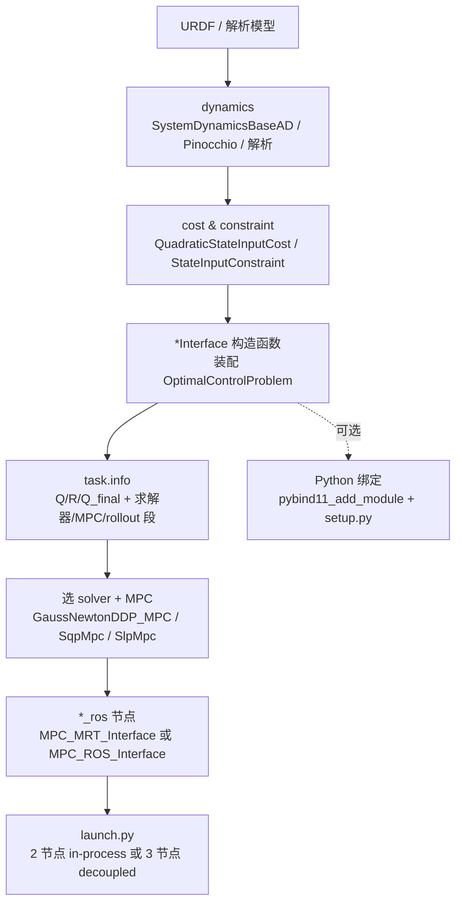

# 09 接入自己的系统

本章是收口章。前八章把架构、core 抽象、`OptimalControlProblem`、求解器、MPC、ROS 2 部署、示例对比、四足深度走读逐层铺开；这里把它们串成一条"从零到跑通一个新机器人 MPC"的可执行配方。脚手架参考是 [ocs2_ballbot](ocs2_robotic_examples/ocs2_ballbot/CMakeLists.txt#L1)——它是"单例练全栈"最小载体（见 ch07），维数小、装配完整、四类节点齐全，最适合做模板。

> 分支确认：本章基于 `ros2` 分支（Jazzy / colcon / `ament_cmake` / C++17）。构建用 `colcon`，启动用 `ros2 launch`。CLAUDE.md 末尾"Conventions"已列通用约定（C++17、`-pthread`、Boost 动态链接、CppAd 运行时编译），新包照搬即可。

## 学习目标

读完本章，你应该能回答：

1. 一个新机器人 OCS2 包的**最小文件骨架**是什么？哪几个文件是必须的、哪几个是可选的？
2. 自己的 `*Interface` 在构造函数里**按什么顺序装配** `OptimalControlProblem`？cost、dynamics、rollout、initializer、reference manager 各自怎么填？
3. `task.info` 的**顶层段结构**是什么样？矩阵用 `(i,j) value` 写法时，`loadEigenMatrix` 怎么读到内存？嵌套字段（如 `recompileLibraries`）的"点路径"从哪来？
4. **in-process MRT** 节点与 **decoupled ROS** 节点的写法差别在哪一行？为什么 DDP 构造要传 `getRollout()` 而 SQP 不用？
5. 调参卡住时，按什么 checklist 逐项排查？

## 关键概念：总流程图

从 URDF 到一个能 `ros2 launch` 跑起来的 MPC，链路如下。每一步对应一个文件或一段代码：



这张图是本章后面六步的目录。注意 `*Interface` 是中心枢纽：它把建模（dynamics/cost/constraint）与配置（`task.info`）捏成 `OptimalControlProblem`，再交给 solver/MPC；ROS 节点只是把 MPC 包成进程并接上 ROS 话题。Python 绑定是旁路，给离线脚本用。

## 代码走读

### Step 1 建模与状态/输入定义

**先定维数。** ballbot 在 [definitions.h](ocs2_robotic_examples/ocs2_ballbot/include/ocs2_ballbot/definitions.h#L37) 里用 `constexpr` 定三个量纲常量：

```cpp
constexpr size_t STATE_DIM = 10;     // 5 位置 + 5 速度
constexpr size_t INPUT_DIM = 3;      // 3 个轮子力矩
constexpr size_t JOINTS_DOF_NUM = 5;
```

这一组常量会被 `*Interface`、`*SystemDynamics`、`DefaultInitializer(INPUT_DIM)` 等多处引用，是全包的"维数合同"。换机器人时改这里一处。

**再取动力学。** ballbot 用解析 + CppAd 自动的混合路线：[BallbotSystemDynamics](ocs2_robotic_examples/ocs2_ballbot/include/ocs2_ballbot/dynamics/BallbotSystemDynamics.h#L49) 继承 [SystemDynamicsBaseAD](ocs2_core/include/ocs2_core/dynamics/SystemDynamicsBaseAD.h#L1)，在构造函数 [BallbotSystemDynamics.h#L52](ocs2_robotic_examples/ocs2_ballbot/include/ocs2_ballbot/dynamics/BallbotSystemDynamics.h#L52) 里接收 `libraryFolder` 与 `recompileLibraries` 两个参数——CppAd 把模型编成共享库，运行时加载并缓存。换机器人时有三条路线可选：

- **解析动力学**：直接继承 `SystemDynamicsBase`，手写 `computeFlowMap`（最简，线性系统可用 `LinearSystemDynamics(A,B)` 一步到位）。
- **CppAd 自动微分**：继承 `SystemDynamicsBaseAD`，写一次 `systemFlowMap`（标量版），自动生成 Jacobian 与编译库——ballbot 走这条。
- **Pinocchio 刚体动力学**：复杂臂/腿足机器人用 [ocs2_pinocchio_interface](ocs2_pinocchio/ocs2_pinocchio_interface/CMakeLists.txt#L1) 或 [ocs2_centroidal_model](ocs2_pinocchio/ocs2_centroidal_model/CMakeLists.txt#L1)，从 URDF 取动力学与雅可比（见 ch08 四足走读）。

### Step 2 装配 OCP：实现 *Interface

`*Interface` 是新机器人的"装配车间"，构造函数把 dynamics/cost/constraint 填进 `OptimalControlProblem`。它继承 [RobotInterface](ocs2_robotic_tools/include/ocs2_robotic_tools/common/RobotInterface.h#L48)——这个基类定了三个虚方法：纯虚的 [getOptimalControlProblem](ocs2_robotic_tools/include/ocs2_robotic_tools/common/RobotInterface.h#L66) 与 [getInitializer](ocs2_robotic_tools/include/ocs2_robotic_tools/common/RobotInterface.h#L72)，以及默认返回 `nullptr` 的 [getReferenceManagerPtr](ocs2_robotic_tools/include/ocs2_robotic_tools/common/RobotInterface.h#L60)。你的 `*Interface` 必须覆盖前两个、可选覆盖第三个。

[BallbotInterface](ocs2_robotic_examples/ocs2_ballbot/include/ocs2_ballbot/BallbotInterface.h#L53) 的构造函数签名 [BallbotInterface.h#L64](ocs2_robotic_examples/ocs2_ballbot/include/ocs2_ballbot/BallbotInterface.h#L64) 是 `(taskFile, libraryFolder)`——这是全包通用的二入参惯例。装配顺序在 [BallbotInterface.cpp](ocs2_robotic_examples/ocs2_ballbot/src/BallbotInterface.cpp#L50) 里清晰可见，分成五段：

1. **校验与建目录**（L52-61）：`boost::filesystem::exists` 查 taskFile，`create_directories` 建 CppAd 库目录。换机器人时这两段直接抄。
2. **读初始状态与求解器设置**（L64-71）：

   ```cpp
   loadData::loadEigenMatrix(taskFile, "initialState", initialState_);
   ddpSettings_ = ddp::loadSettings(taskFile, "ddp");
   mpcSettings_ = mpc::loadSettings(taskFile, "mpc");
   sqpSettings_ = sqp::loadSettings(taskFile, "sqp");
   slpSettings_ = slp::loadSettings(taskFile, "slp");
   ```

   每个求解器都有自己的 `loadSettings(taskFile, "段名")`，段名与 `task.info` 顶层段一一对应（见 Step 3）。
3. **cost 装配**（L82-93）：读 `Q`/`R`/`Q_final` 三矩阵，再用 `problem_.costPtr->add(...)` / `problem_.finalCostPtr->add(...)` 塞进 OCP：

   ```cpp
   problem_.costPtr->add("cost", std::make_unique<QuadraticStateInputCost>(Q, R));
   problem_.finalCostPtr->add("finalCost", std::make_unique<QuadraticStateCost>(Qf));
   ```

   有约束时再加 `problem_.inequalityLagrangianPtr->add(...)` 或 `constraintPtr->add(...)`（ballbot 无约束，四足示例更全，见 ch08）。
4. **dynamics 装配**（L96-98）：

   ```cpp
   ocs2::loadData::loadCppDataType(taskFile, "ballbot_interface.recompileLibraries", recompileLibraries);
   problem_.dynamicsPtr.reset(new BallbotSystemDynamics(libraryFolder, recompileLibraries));
   ```

   注意"点路径"`ballbot_interface.recompileLibraries`——`loadCppDataType` 用 `.` 当属性树层级分隔符，所以能读到 `ballbot_interface { recompileLibraries ... }` 里的值。
5. **rollout 与 initializer**（L101-105）：

   ```cpp
   auto rolloutSettings = rollout::loadSettings(taskFile, "rollout");
   rolloutPtr_.reset(new TimeTriggeredRollout(*problem_.dynamicsPtr, rolloutSettings));
   ballbotInitializerPtr_.reset(new DefaultInitializer(INPUT_DIM));
   ```

   `rollout` 是 DDP 必需的（DDP 是单轨迹方法），SQP/SLP/IPM 是多重打迹，内部按 `dt` 自建 rollout，不取这里的 `rolloutPtr_`。`DefaultInitializer` 用零初值，复杂系统可换自定义 `Initializer`。`ReferenceManager`（L76）在这里先 `new` 一个空壳，具体目标轨迹在节点里 `setTargetTrajectories` 填。

### Step 3 配 task.info

ballbot 的配置在 [config/mpc/task.info](ocs2_robotic_examples/ocs2_ballbot/config/mpc/task.info#L1)。这是 **Boost property-tree 的 INFO 格式**：顶层段名顶格写，下一行 `{`，字段缩进，`}` 闭合——不是 `[bracket]` 语法。矩阵用 `(行,列) 值` 逐元素写，由 `loadEigenMatrix` 解析。顶层段（行号见源码）：

| 段名 | 行 | 内容 | 谁来读 |
| --- | --- | --- | --- |
| `subsystemsSequence` / `templateSubsystemsSequence` / `templateSwitchingTimes` | L2/L7/L11 | 切换系统模式序列（ballbot 单模式，空体） | `ReferenceManager` |
| `slp` | [L16](ocs2_robotic_examples/ocs2_ballbot/config/mpc/task.info#L16) | SLP 设置（含嵌套 `pipg` 子段） | `slp::loadSettings` |
| `sqp` | [L39](ocs2_robotic_examples/ocs2_ballbot/config/mpc/task.info#L39) | SQP 设置（`dt`/`sqpIteration`/`useFeedbackPolicy`） | `sqp::loadSettings` |
| `ddp` | [L53](ocs2_robotic_examples/ocs2_ballbot/config/mpc/task.info#L53) | DDP 设置（`algorithm SLQ`/`lineSearch` 子段） | `ddp::loadSettings` |
| `rollout` | [L91](ocs2_robotic_examples/ocs2_ballbot/config/mpc/task.info#L91) | ODE 容差/步长 | `rollout::loadSettings` |
| `mpc` | [L101](ocs2_robotic_examples/ocs2_ballbot/config/mpc/task.info#L101) | `timeHorizon`/`solutionTimeWindow`/频率 | `mpc::loadSettings` |
| `ballbot_interface` | [L114](ocs2_robotic_examples/ocs2_ballbot/config/mpc/task.info#L114) | `recompileLibraries` 标志 | `loadCppDataType`（点路径） |
| `initialState` | [L121](ocs2_robotic_examples/ocs2_ballbot/config/mpc/task.info#L121) | 初始状态向量 | `loadEigenMatrix` |
| `Q` / `R` / `Q_final` | [L137](ocs2_robotic_examples/ocs2_ballbot/config/mpc/task.info#L137) / [L155](ocs2_robotic_examples/ocs2_ballbot/config/mpc/task.info#L155) / [L165](ocs2_robotic_examples/ocs2_ballbot/config/mpc/task.info#L165) | 状态/输入/末态权重矩阵 | `loadEigenMatrix` |

几个要点：

- **每个求解器段独立**。ballbot 同时配了 `slp`/`sqp`/`ddp` 三段，因为同包支持三种 launch。你只用一种求解器时，只留对应段即可。**ballbot 没有 `ipm` 段**——要用 ocs2_ipm 才加 `ipm { ... }`（字段语义见 ch04）。
- **矩阵写法**：`(0,0) 10.0` 表示第 0 行 0 列 = 10.0，未列出的元素由 `loadEigenMatrix` 填 0。`scaling` 是整矩阵的标量倍率（见 `Q` 段 L139）。`loadEigenMatrix` 的实现在 [LoadData.h#L132](ocs2_core/include/ocs2_core/misc/LoadData.h#L132)，空矩阵会抛异常（L139）。
- **标量读取**：`loadCppDataType` 签名在 [LoadData.h#L104](ocs2_core/include/ocs2_core/misc/LoadData.h#L104)，三个参数 `(filename, dataName, value)`，`dataName` 用点路径跨层。`.info` 字段语义与各 `*Settings` 的对应关系，ch02 已讲透，此处不重述。

### Step 4 选求解器与 MPC

求解器选型见 ch04 的对照表（SLQ/iLQR/SQP/SLP/IPM）。选定后在 `*MpcNode` 里实例化对应的 `*Mpc` 类。ballbot 给了两种节点写法，是两种部署模式的范本：

**A. in-process MRT（单进程，共享 solver 对象）** — [BallbotMpcMrtNode.cpp](ocs2_robotic_examples/ocs2_ballbot_ros/src/BallbotMpcMrtNode.cpp#L71)。MPC 与可视化/命令在同一个进程，通过 `MPC_MRT_Interface` 在线程间共享 solver 指针：

```cpp
ocs2::GaussNewtonDDP_MPC mpc(ballbotInterface.mpcSettings(),
                             ballbotInterface.ddpSettings(),
                             ballbotInterface.getRollout(),        // DDP 要传 rollout
                             ballbotInterface.getOptimalControlProblem(),
                             ballbotInterface.getInitializer());
// ... RosReferenceManager 装配见下 ...
ocs2::MPC_MRT_Interface mpcMrtInterface(mpc);   // L126：in-process 包装
mpcMrtInterface.getReferenceManager().setTargetTrajectories(...);  // L146
```

**B. decoupled ROS（独立进程，话题通信）** — [BallbotSqpMpcNode.cpp](ocs2_robotic_examples/ocs2_ballbot_ros/src/BallbotSqpMpcNode.cpp#L41)。MPC 单独成节点，经 ROS 话题与 dummy loop / target 通信：

```cpp
ocs2::SqpMpc mpc(ballbotInterface.mpcSettings(),
                 ballbotInterface.sqpSettings(),
                 ballbotInterface.getOptimalControlProblem(),
                 ballbotInterface.getInitializer());   // SQP 不传 rollout
mpc.getSolverPtr()->setReferenceManager(rosReferenceManagerPtr);   // L75
ocs2::MPC_ROS_Interface mpcNode(mpc, robotName);   // L78：ROS 包装
mpcNode.launchNodes(node);                          // L79
```

两个关键差别：

1. **构造参数**：DDP 要 `getRollout()`（第 3 参），SQP/SLP 不用——这是 ch04 的理论差别在 API 上的投影（DDP 单轨迹需显式 rollout，多重打迹法内部按 `dt` 自建）。换 SLP 时把 `SqpMpc` 换 `SlpMpc`、`sqpSettings()` 换 `slpSettings()` 即可，签名一致。
2. **接口类**：in-process 用 `MPC_MRT_Interface`（直接持 solver），decoupled 用 `MPC_ROS_Interface` + `launchNodes`（话题桥接）。MPC/MRT 的运行机制见 ch05。

两种节点都共用同一段 `RosReferenceManager` 装配（[BallbotMpcMrtNode.cpp#L114](ocs2_robotic_examples/ocs2_ballbot_ros/src/BallbotMpcMrtNode.cpp#L114) / [BallbotSqpMpcNode.cpp#L66](ocs2_robotic_examples/ocs2_ballbot_ros/src/BallbotSqpMpcNode.cpp#L66)）：

```cpp
auto rosReferenceManagerPtr = std::make_shared<ocs2::RosReferenceManager>(
    robotName, ballbotInterface.getReferenceManagerPtr());
rosReferenceManagerPtr->subscribe(node);
mpc.getSolverPtr()->setReferenceManager(rosReferenceManagerPtr);
```

它把 `*Interface` 里那个空壳 `ReferenceManager` 包成 ROS 可订阅版，让目标轨迹能从话题进 solver。`RosMsgConversions` 与 `ocs2_msgs` 见 ch06。

### Step 5 ROS 节点与 launch

`*_ros` 包只放节点与 launch，不放建模代码。对照 [ocs2_ballbot_ros/CMakeLists.txt](ocs2_robotic_examples/ocs2_ballbot_ros/CMakeLists.txt#L7)：

- **依赖**（L7-30）：`rclcpp`/`tf2_ros`/`sensor_msgs`/`urdf`/`kdl_parser`/`robot_state_publisher` 等 ROS 依赖，加 `ocs2_core`/`ocs2_mpc`/各 solver/`ocs2_ros_interfaces`/`ocs2_robotic_assets`，最后 `find_package(ocs2_ballbot REQUIRED)` 拉你自己的核心包。
- **exec 声明**（L64-84）：一个节点一个 `add_executable`：

  ```
  ballbot_ddp      src/BallbotDdpMpcNode.cpp     # decoupled DDP
  ballbot_sqp      src/BallbotSqpMpcNode.cpp     # decoupled SQP
  ballbot_slp      src/BallbotSlpMpcNode.cpp     # decoupled SLP
  ballbot_dummy_test src/DummyBallbotNode.cpp    # MRT dummy loop
  ballbot_target   src/BallbotTargetPoseCommand.cpp  # 目标发布
  ballbot_mpc_mrt  src/BallbotMpcMrtNode.cpp     # in-process MRT
  ```

- **install**（L99/L113/L117）：`install(TARGETS ...)`、`install(DIRECTORY launch rviz ...)`。

launch 拓扑有两套，对应 ch06 的两种部署：

- **2 节点 in-process**（[ballbot_mpc_mrt.launch.py](ocs2_robotic_examples/ocs2_ballbot_ros/launch/ballbot_mpc_mrt.launch.py#L1)）：`ballbot_mpc_mrt` + `ballbot_target`，外加 `visualize.launch.py` 起 robot_state_publisher + rviz。MPC 与 MRT 同进程。
- **3 节点 decoupled**（[ballbot_sqp.launch.py](ocs2_robotic_examples/ocs2_ballbot_ros/launch/ballbot_sqp.launch.py#L1)）：`ballbot_sqp`（MPC）+ `ballbot_dummy_test`（MRT dummy loop，发观测、收控制）+ `ballbot_target`。MPC 与 MRT 异进程、靠话题耦合。

所有 launch 都用 `ament_index_python.packages.get_package_share_directory` 定位 `task.info`，exec 名与 CMake `add_executable` 的目标名严格一致。

### Step 6 Python 绑定（可选）

要给离线脚本/Notebook 用 MPC，就加 Python 绑定。机制 ch06 已讲透，这里只列脚手架三件套：

1. **CMake**（[ocs2_ballbot/CMakeLists.txt#L56](ocs2_robotic_examples/ocs2_ballbot/CMakeLists.txt#L56)）：`pybind11_add_module(BallbotPyBindings ...)`，目标名 `BallbotPyBindings` 是 `LIB_NAME`。
2. **绑定源**（[pyBindModule.cpp#L4](ocs2_robotic_examples/ocs2_ballbot/src/pyBindModule.cpp#L4)）：

   ```cpp
   CREATE_ROBOT_PYTHON_BINDINGS(ocs2::ballbot::BallbotPyBindings, BallbotPyBindings)
   ```

   第二个参数 `LIB_NAME` **必须**与 `pybind11_add_module` 目标名一致（ch06 已核对 `#L56` vs `#L4`）。宏展开后生成完整 `mpc_interface` 模块，含 `TargetTrajectories` 与 MPC API。
3. **setup.py**（[setup.py](ocs2_robotic_examples/ocs2_ballbot/setup.py#L1)）：`ament_python_install_package` 装的 Python 包，`packages=['ocs2_ballbot']`、`package_dir={'': 'src'}`。配合 CMake 的 [L63](ocs2_robotic_examples/ocs2_ballbot/CMakeLists.txt#L63) `ament_python_install_package(${PROJECT_NAME} ...)`。

`PythonInterface` 基类与宏的内部机制、exec 映射、`RosMsgConversions` 见 ch06，此处不重述。

### CMake 脚手架要点

新包照 [ocs2_ballbot/CMakeLists.txt](ocs2_robotic_examples/ocs2_ballbot/CMakeLists.txt#L7) 抄，五件事：

1. **find_package**（L7-19）：`ament_cmake` + `ament_cmake_python` + `Python3` + `pybind11` + 你的 ocs2 依赖（`ocs2_core`/`ocs2_mpc`/用到的 solver/`ocs2_robotic_tools`/`ocs2_python_interface`）+ `Eigen3` + `Boost`。
2. **configure_file**（[L22-27](ocs2_robotic_examples/ocs2_ballbot/CMakeLists.txt#L22)）：把 [package_path.h.in](ocs2_robotic_examples/ocs2_ballbot/include/ocs2_ballbot/package_path.h.in#L1) 里的 `@PROJECT_SOURCE_DIR@` 替换成源码绝对路径，生成 `package_path.h`。运行时 `getPath()` 返回这串路径，用来定位 URDF/配置资源——这是全包定位资源的统一手法。`target_include_directories` 要同时加源码 `include` 与 `${PROJECT_BINARY_DIR}/include`（后者含生成的 `package_path.h`）。
3. **库与链接**（[L48](ocs2_robotic_examples/ocs2_ballbot/CMakeLists.txt#L48)）：`add_library(${PROJECT_NAME} ...)` + `target_link_libraries`。
4. **install**（L71-87）：`install(TARGETS ${PROJECT_NAME} ...)`、`install(DIRECTORY include/ config ...)`、pybind 模块单独 `install(TARGETS BallbotPyBindings ...)`。
5. **export**（[L92-97](ocs2_robotic_examples/ocs2_ballbot/CMakeLists.txt#L92)）：`ament_export_include_directories`、`ament_export_targets(export_${PROJECT_NAME} HAS_LIBRARY_TARGET)`、`ament_export_dependencies(...)`——让下游 `*_ros` 包能 `find_package` 到你。导出列表要与你实际依赖的 ocs2 包对齐。

### 调参 checklist

MPC 跑不通或效果差时，按这个顺序排查（每条都对应 `task.info` 一个段或一处代码）：

1. **初始可行状态**：`initialState` 段是否与机器人真实零位一致？DDP 对初值敏感，先确认 `loadEigenMatrix` 读到的向量与 `std::cerr` 打印（[BallbotInterface.cpp#L65](ocs2_robotic_examples/ocs2_ballbot/src/BallbotInterface.cpp#L65)）吻合。
2. **Q/R/Q_final 量纲与量级**：三矩阵要对齐状态/输入的物理量纲。`Q` 权重远大于 `R` 会过度追求状态误差、输入爆掉；反之跟踪松散。`scaling` 是整矩阵倍率，先调它再调单元素。`Q_final` 给末态约束。
3. **dt 与多重打迹节点数**：`sqp`/`slp` 段的 `dt`（[task.info#L18/L41](ocs2_robotic_examples/ocs2_ballbot/config/mpc/task.info#L18)）决定离散节点间距，`mpc.timeHorizon`（[L103](ocs2_robotic_examples/ocs2_ballbot/config/mpc/task.info#L103)）决定预测时域——节点数 = 时域/dt，过大则慢、过小则跟踪差。
4. **步长策略**：`ddp` 段的 `strategy` 与 `lineSearch` 子段（[L80-87](ocs2_robotic_examples/ocs2_ballbot/config/mpc/task.info#L80)）控制步长搜索；`minStepLength` 过小会发散、过大会跳过最优。
5. **约束松弛/容差**：`ddp.constraintTolerance`（[L61](ocs2_robotic_examples/ocs2_ballbot/config/mpc/task.info#L61)）、`inequalityConstraintMu`/`delta`（L73-74）管不等式约束的增广拉格朗日松弛；`rollout` 段的 `AbsTolODE`/`RelTolODE`（L93-94）管积分精度——发散时先放宽 ODE 容差定位是积分还是优化问题。
6. **CppAd 库重编译**：改了动力学模型后，把 `ballbot_interface.recompileLibraries`（[L116](ocs2_robotic_examples/ocs2_ballbot/config/mpc/task.info#L116)）置 1 强制重编 CppAd 库；跑通后改回 0 用缓存。库目录默认 `/tmp/ocs2_<robot>_auto_generated`（见节点 `libFolder` 参数），清不掉时直接删目录。

## 速查表

| 步骤 | 参考文件 | 关键 API / 段 |
| --- | --- | --- |
| 维数定义 | [definitions.h#L37](ocs2_robotic_examples/ocs2_ballbot/include/ocs2_ballbot/definitions.h#L37) | `constexpr STATE_DIM/INPUT_DIM` |
| 动力学（CppAd） | [BallbotSystemDynamics.h#L49](ocs2_robotic_examples/ocs2_ballbot/include/ocs2_ballbot/dynamics/BallbotSystemDynamics.h#L49) | `SystemDynamicsBaseAD` |
| 动力学（线性） | ocs2_core `LinearSystemDynamics(A,B)` | `SystemDynamicsBase` |
| 动力学（Pinocchio） | [ocs2_pinocchio_interface](ocs2_pinocchio/ocs2_pinocchio_interface/CMakeLists.txt#L1) / [ocs2_centroidal_model](ocs2_pinocchio/ocs2_centroidal_model/CMakeLists.txt#L1) | ch08 |
| Interface 基类 | [RobotInterface.h#L48](ocs2_robotic_tools/include/ocs2_robotic_tools/common/RobotInterface.h#L48) | `getOptimalControlProblem`/`getInitializer`/`getReferenceManagerPtr` |
| OCP 装配 | [BallbotInterface.cpp#L92](ocs2_robotic_examples/ocs2_ballbot/src/BallbotInterface.cpp#L92) | `problem_.costPtr->add` / `dynamicsPtr.reset` |
| 读矩阵 | [LoadData.h#L132](ocs2_core/include/ocs2_core/misc/LoadData.h#L132) | `loadData::loadEigenMatrix(taskFile, "Q", M)` |
| 读标量 | [LoadData.h#L104](ocs2_core/include/ocs2_core/misc/LoadData.h#L104) | `loadCppDataType(taskFile, "a.b", v)` 点路径 |
| 求解器设置 | task.info `slp`/`sqp`/`ddp` 段 | `*::loadSettings(taskFile, "段名")` |
| in-process MRT | [BallbotMpcMrtNode.cpp#L106](ocs2_robotic_examples/ocs2_ballbot_ros/src/BallbotMpcMrtNode.cpp#L106) | `GaussNewtonDDP_MPC` + `MPC_MRT_Interface` |
| decoupled ROS | [BallbotSqpMpcNode.cpp#L71](ocs2_robotic_examples/ocs2_ballbot_ros/src/BallbotSqpMpcNode.cpp#L71) | `SqpMpc` + `MPC_ROS_Interface.launchNodes` |
| ROS 参考管理 | [BallbotMpcMrtNode.cpp#L114](ocs2_robotic_examples/ocs2_ballbot_ros/src/BallbotMpcMrtNode.cpp#L114) | `RosReferenceManager` + `setReferenceManager` |
| launch 拓扑 | [ballbot_mpc_mrt.launch.py](ocs2_robotic_examples/ocs2_ballbot_ros/launch/ballbot_mpc_mrt.launch.py#L1) / [ballbot_sqp.launch.py](ocs2_robotic_examples/ocs2_ballbot_ros/launch/ballbot_sqp.launch.py#L1) | 2 节点 vs 3 节点 |
| CMake 脚手架 | [CMakeLists.txt#L7](ocs2_robotic_examples/ocs2_ballbot/CMakeLists.txt#L7) | `find_package`/`configure_file`/`ament_export_*` |
| 资源路径 | [package_path.h.in](ocs2_robotic_examples/ocs2_ballbot/include/ocs2_ballbot/package_path.h.in#L1) | `getPath()` 返回 `@PROJECT_SOURCE_DIR@` |
| Python 绑定 | [pyBindModule.cpp#L4](ocs2_robotic_examples/ocs2_ballbot/src/pyBindModule.cpp#L4) | `CREATE_ROBOT_PYTHON_BINDINGS` + `LIB_NAME` |

---

本章把前八章串成了配方：从 URDF 取动力学（ch01 架构、ch02 core 抽象、ch08 Pinocchio），装进 `OptimalControlProblem`（ch03），用 `task.info` 配求解器与权重（ch02 `loadData`、ch04 求解器选型），包成 `MPC_BASE`/`MRT_BASE`（ch05），经 `*_ros` 节点与 launch 上线（ch06），以 ballbot 为最小模板、四足为复杂范本（ch07/ ch08）。到这里，你已经能独立把 OCS2 接到自己的机器人上。遇到具体细节，回指对应章节即可——课程到此收口。
